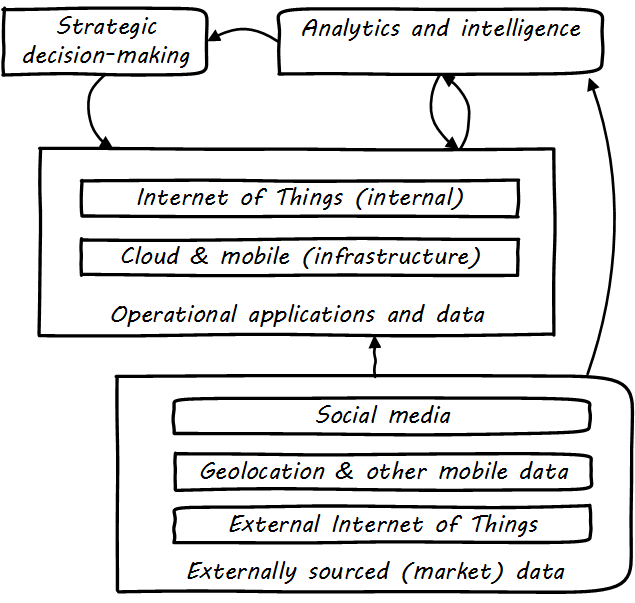
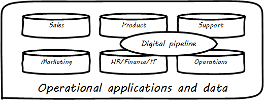

==== Information management topics

===== Social, Mobile, Analytics, and Cloud

Discussions of digital transformation often reference the algorithm SMAC:

* Social
* Mobile
* Analytics
* Cloud

Others would add the Internet of Things. These are not equivalent terms; in fact, they have relationships to each other (see <<fig-SMAC-500-c>>).

[[fig-SMAC-500-c]]
.Social, mobile, analytics, and Cloud

Social media is generally external to an organization and manifests as a form of xref:commercial-data[commercial data], that provide essential insights into bow a company's products are performing and being received.

Mobile (or mobility) has two distinct aspects: mobility as an engagement platform (e.g. for deployment of "apps" as one product form), versus the xref:commercial-data[commercial data] available from mobile carriers, notably geolocation data.

Internet of Things can be either an internal or external data source, often extremely high volume and velocity, requiring analysis services for sense-making and value extraction.

===== Big data

The term "Big Data" in general refers to data that exceeds the traditional data management and data warehousing approaches we have discussed above.
As proposed by analyst Doug Laney in 2001 cite:[Laney2001], its most well known definition identifies 3 dimensions of scale:

* Volume
* Variety
* Velocity

High volume data is seen for example in the search history logs of search engines such as Google.

High variety data encompasses rich media and unstructured data, such as social media interactions.

High velocity data includes telemetry from Internet of Things devices or other sources capable of emitting large volumes of data very quickly.

All of these dimensions require increasingly specialized techniques as they scale, and the data management product ecosystem has continued to diversify as a result.

===== Managing the information of digital delivery
 redundant w/chap 6

In terms of our previous data warehousing architecture, the digital pipeline can be seen as related to four areas (see <<fig-digitalPipeline-500-c>>):

* Product management
* IT
* Support
* Operations

[[fig-digitalPipeline-500-c]]
.The data architecture of digital management

Assume the primary product of the organization is an information-centric digital service, based ultimately on data. How do you manage data? How do you manage anything? In part, through collecting data about it. Wait - "data about data"? There's a word for that: *metadata*. We'll take some time examining it, and its broader relationships to the digital delivery pipeline.

We've talked about xref:commit-as-metadata[metadata] previously and you should review that section before continuing. The association of business definitions with particular data structures, is one form of metadata.

Data governance, records management, and ongoing support for digital consumers all require some layer of interpretation and context to enrich the raw data resource.

Consider the following list:

.Servers and databases
[cols="2*", options="header"]
|====
|Server|Database
|SRV001|DB0023
|SRV001|DB0045
|SRV002|DB0067
|====

Not very useful, is it? Compare it to:

.Servers, databases, product, and governance information
[cols="4*", options="header"]
|====
|Server|Database|Product|Regulatory
|SRV001|DB0023|Online reviews|Customer privacy
|SRV001|DB0045|Employee records management|HIPAA, PII
|SRV002|DB0067|Online sales|PCI, PII
|====

We could also include definitions of the tables and columns held in each of those databases. But what system would contain such data? There have been a couple primary answers over the years: metadata repositories and configuration management databases.

In terms of this book's general definition of xref:commit-as-metadata[metadata] as non-runtime information related to digital assets, both the metadata repository and the CMDB contain metadata. But they are not the only systems in which data related to digital services is seen. Other systems include monitoring systems, portfolio management systems, risk and policy management systems, and many more. All of these systems themselves can be aggregated into a data warehousing/BI closed-loop infrastructure.

This means that the digital organization, including organizations transforming from older IT-centric models, can apply Big Data, machine learning, text analytics, and the rest of the techniques and practices covered in this chapter.

NOTE: We will examine a full "business of IT/digital delivery pipeline" architecture in the next chapter.

ifdef::collaborator-draft[]

===== Additional topics
 ====== Data science
 ====== Semantic Web & ontologies
 ====== ERP systems (special section??)
 ====== Business rules management
 ====== Knowledge mgmt
 ====== Information lifecycle (POSMAD)
 McGilvary (based on English) pp 23-24 - perhaps into 4.11.03.
 ====== Non-invasive data governance (Seiner?)

 ===== Data and capacity
 [quote, Abbott & Fisher, The Art of Scalability]
 In our experience, most companies simply do not pay attention to the deteriorating value of data and the increasing cost of maintaining increasing amounts of data over time.

* Options value
* Strategic value
* Cost justification
* Transform/reduce

 Schema.org & phonetics transcription from CACM 02-2106

 Some database professionals still don’t like virtualization, that is, making them run Oracle RDBMS or Microsoft SQL Server on top of virtual servers, instead of directly on the host operating system. “The database IS virtualization” they will say.

endif::collaborator-draft[]
