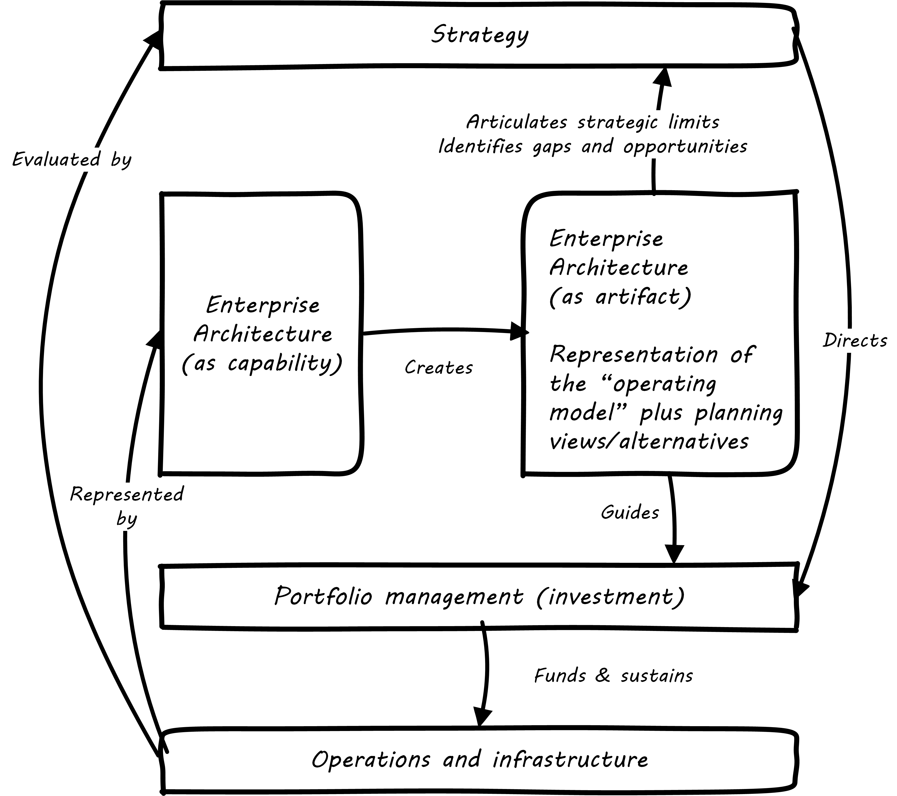
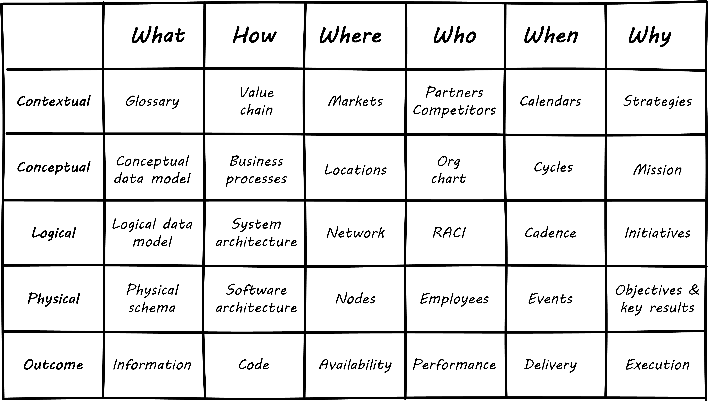
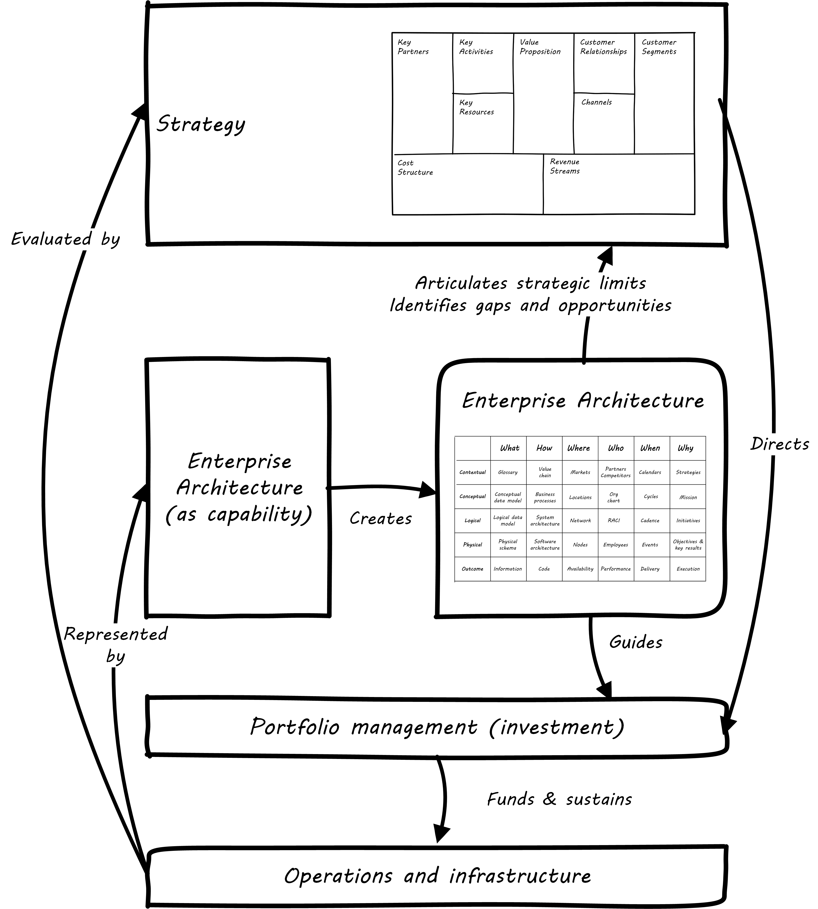
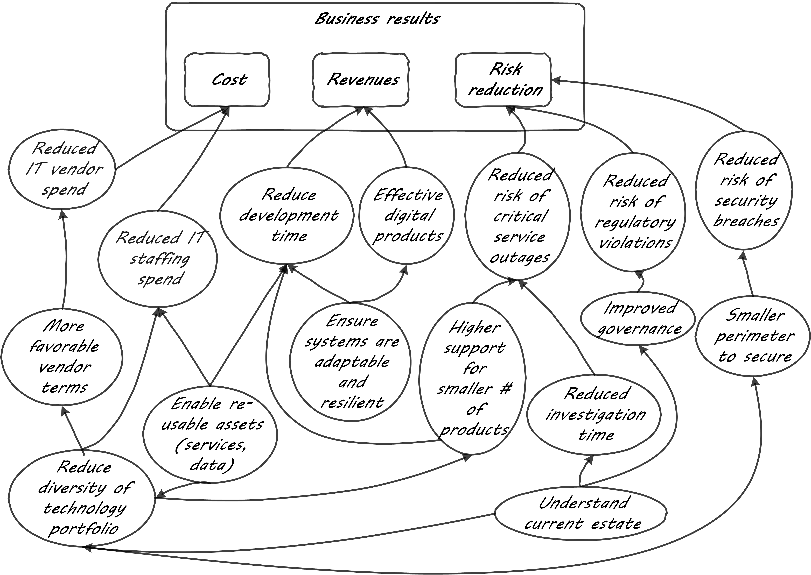

==== Why architecture?

.St. Vitus Cathedral, Prague footnote:[_Image credit https://www.flickr.com/photos/aigle_dore/6365091333, downloaded 2016-10-25, image copyrights Moyan Brenn, commercial use permitted_]
image::images/4_12-architecture.jpg[alt text, 900, , float=""]

[quote, Fred Brooks, Planning a Computer System: Project Stretch]
Computer architecture, like other architecture, is the art of determining the needs of the user of a structure and then designing to meet those needs as effectively as possible within economic and technological constraints. Architecture must include engineering considerations, so that the design will be economical and feasible; but the emphasis in architecture is upon the needs of the user, whereas in engineering the emphasis is upon the needs of the fabricator. [<<Buchholz1962>>, first published use of the term "architecture" with respect to computing system organization.]

The word "architecture" is usually associated with physical construction: buildings, landscapes, civil infrastructure, and so forth. It was appropriated by systems engineers at IBM around 1960 to describe the problems of designing complex information processing hardware and software. This leads to some confusion, and occasional questions from "real" architects as to why IT people are calling themselves "architects." Perhaps a different choice of word would have been advisable.

In our journey to date, we have covered:

* Business xref:what-is-IT-value[motivations] and xref:digital-context[context],
* xref:what-is-IT-infrastructure[Infrastructure]
* xref:chapter-app-deliv[Applications],
* xref:prod-mgmt-definition[Products] and/or services,
* xref:organization[Organization] and xref:chap-process-mgmt[process], and
* xref:chap-ent-info-mgmt[Data and information].

We have also covered the practices by which ideas and intentions are established and translated by investment into actions, including:

* Investment of time and resources towards digital objectives (e.g. through xref:project-mgmt[project management]),
* Acquisition of technologies and external services (i.e. xref:it-sourcing[sourcing]),
* xref:resource-mgmt[Hiring of employees],
* xref:gov-chap[Governance] of digital organizations for xref:risk-management[risk], xref:security[security], and other purposes.

As we have progressed in our journey, and scaled our company up, all these areas have continued to evolve. Specialization emerges. You have people with deep experience in Cloud architectures, and people with deep experience in e-records management and compliance. You don't have too many who are deep in both.

Your product portfolio (internal and external) is now in the hundreds or thousands. Some were built with the latest technology, and others run on older technologies now perceived to be dead ends. But investing in rewriting or replatforming them would not provide as much value as other uses of the funds, so you have to manage the risk of the older technology.

Investment decisions become harder. You're far beyond the days when you had a one-product focus. You have multiple interacting products and multiple interacting teams, and the relationship between the teams and products is not one to one. Understanding the business case for the investment gets harder; when you have a thousand services over multiple business units, how do you know if someone is proposing a redundant new one?

And then there are the big headaches. A major commercial product version is going off support, and it's the perfect time to think about a rewrite or replatform (say into the Cloud). But the moving pieces and interdependencies are formidably complex, and if you get the analysis wrong the business impact will be severe. You acquire another firm, with a lot of overlapping activities, and start to see the need for "Business Architecture" to clarify your understanding of business processes, organizations, and capabilities. Or a major outage hits the business hard, and all of a sudden the organizational priority (from the Board on down) is "fix this so it never happens again." Everything else is to go "on hold." Except, of course, it can't.

In response to these and a thousand other complexities of digital management as organizations scale up, a general purpose coordination capability emerges sometimes called Enterprise Architecture. In this chapter section, we will discuss its definition, organizational dynamics, and value proposition.

anchor:defining-ea[]

===== Defining Enterprise Architecture
[quote, ISO/IEC IEEE 42010]
The fundamental organization of a system embodied in its components, their relationships to each other, and to the environment, and the principles guiding its design and evolution.

[quote, Jeanne Weill and Peter Ross, Enterprise Architecture as Strategy]
The enterprise architecture is the organizing logic for business processes and IT infrastructure, reflecting the integration and standardization requirements of the company's operating model. The enterprise architecture provides a long-term view of a company's processes, systems, and technologies so that individual projects can build capabilities—not just fulfill immediate needs.

[quote, Bente et al, Collaborative Enterprise Architecture]
Enterprise architecture (EA) is the representation of the structure and behavior of an enterprise's IT landscape in relation to its business environment. It reflects the current and future use of IT in the enterprise and provides a roadmap to reach a future state. <<Bente2012>> p 35

"Architecture" as a term by itself is something you've encountered since your earliest days as a startup. Perhaps you used it to describe the choice of technologies you used for your products. Or the most important components in your application. Or the common services (e.g. authentication) you developed to support multiple products. The architecture concept is therefore not something new or foreign. But what does it mean to say we have an "enterprise" architecture? *Enterprise architecture is nothing but the unification of this book's topics into a common, formalized, scalable framework for understanding.* It means we are "doing architecture" comprehensively, considering the enterprise itself as a system to be architected. It also may mean we have a program for sustaining the work of those doing architecture in the technical, application, solution, data, process, or business domains.

In terms of our emergence model, enterprise architecture assumes multi-product, "team of teams" problems. As an overall domain of practice, enterprise architecture encompasses a variety of specialist domains (some of which we've already encountered) as we'll discuss in the next chapter section. Some of those domains *do* make sense at smaller, single-product contexts (e.g., software architecture.)

There are numerous definitions of _enterprise architecture_. The examples above are typical. It can be defined as:

* an organizational unit
* an organizational capability
* a formalized program
* a professional discipline or set of practices
* a process or process group; a ongoing activity or activities
* a large-scale artifact (i.e. an integrated model consisting of catalogs, diagrams, and matrices) maintained on an ongoing basis for communication and planning
* an integrated and standardized language for reasoning about complexity

In general, definitions of enterprise architecture characterize it as a coordination and problem solving discipline, suited to large scale problems at the intersection of digital technology and human organization. An important function of architecture is supporting a shared mental model of the complex organization; we were first introduced to the importance of xref:shared-mental-model[shared mental models] in Chapter 5 and this need has only increased as the organization became more complex. Enterprise Architecture provides the tools and techniques for sustaining shared mental models of complexity at scale.

.The terrain footnote:[_Image credit https://www.flickr.com/photos/endogamia/3979040177, downloaded 2016-10-16, commercial use permitted_]

.The mapmaker footnote:[_Image credit https://www.flickr.com/photos/perspective/8474999166, downloaded 2016-10-16, commercial use permitted_]

.The map footnote:[_Image credit https://www.flickr.com/photos/martye_green/2354576085, downloaded 2016-10-16, commercial use permitted_]

Confused? Consider the activity of map-making. In map-making you have:

* The actual terrain
* The capability of map making: surveying, drawing, etc.
* The process of surveying and mapping it
* The resulting map as a document

And once the map is made, you might use it for a wide variety of purposes, and you also might find that once you start to use the map, you wish it had more information. Similarly, in enterprise architecture, it's important to remember that there are different concerns:

* Operational reality
* The capability of representing it for planning and analysis ("being" an architect or an architecture organization; having the skills and tools)
* The process of representing and analyzing the operational reality ("doing" architecture)
* The actual representation (the "architecture" as a "thing" - a model, an artifact, etc.)

And, like a map, once you have the architecture, you can use it for a wide variety of purposes, but also you may find it incomplete in various ways.

===== Architecture organization

There are three major themes we'll discuss in terms of the overall organizational positioning of enterprise architecture:

* The line versus staff concept and its origins
* Contrasting the concepts of "business model" versus "operating model"
* The other major organizational units of interest to enterprise architecture

anchor:arch-as-staff[]

====== Architecture as staff function
[quote, Elihu Root, 1903 congressional testimony on US army re-organization (condensed)]
\... the organization is weak at the top because there is no coordination of the exercise of powers provided for in the system. That coordination can be done only by a body organized for that purpose and having no other duties to perform; and in all the armies of the civilized world that duty is performed by a General Staff. They are called this because their duties are staff duties pertaining to the general conduct of affairs, and not merely to the work [of specific departments].

We saw in xref:gov-chap[Chapter 10] how governance xref:gov-shop-example[emerges], as a xref:gov-as-env-resp[response] to scale and growth, and the concerns for xref:risk-management[risk] and xref:assurance[assurance] in the face of increasing pressures of the external environment.

Architecture has a comparable emergence story, but for somewhat different reasons. Consider the quote from Elihu Root, above. Root was tasked with re-organizing the US Army at the turn of the 20th century. There had been some embarrassing failures of coordination and organization, and it was clear that something was missing in the US military: a centralized coordination function responsible for planning and logistics.

These lessons had also been learned by the Austrian, Prussian, and French militaries.

.Franz Moritz Graf von Lacy footnote:[Image credit https://en.wikipedia.org/wiki/Franz_Moritz_von_Lacy#/media/File:Count_Franz_Moritz_von_Lacy_(oil_on_canvas_portrait_HGM).jpg, downloaded 2016-10-04, labeled as public domain by Wikipedia]

In previous ages, nobles would assemble and fight for their King, but their armies were poorly coordinated, and disputes over strategy would often arise. Each noble's army would have its own quartermaster, couriers, intelligence, supply chains, and the like. This was both inefficient, and ineffective: overall plans of battle often could not be made or executed, and military operations would be bungled.

As fighting wars became (unfortunately) a larger and larger scale endeavor, the need to centralize certain capabilities became more and more obvious. This culminated in the late 1700s and early 1800s with the creation of "general staffs" that were responsible for coordination of planning and execution across the increasingly complex military operations. The HQ "staff" and its shared services were deliberately distinguished from the warfighting "line." The Austrian field marshall  Franz Moritz Graf von Lacy was one of the pioneers of this new style of organization, which was soon copied by the French army under Napoleon Bonaparte.

For example, the role of Napoleon's staff officer Pierre-Joseph Bourcet under Napoleon is described thus:

_'On every occasion when an important decision had to be made Bourcet would write a memorandum in which he analyzed the situation and set forth in detail, with full explanations and reasons, the course which seemed to him best. In very many cases, his suggestions were adopted and were usually justified by success, and when they were rejected the results were seldom fortunate.'_ <<Kiley2001>>

Why do obscure French and Austrian military officers have to do with today's digital organizations? Because the line/staff distinction became the basis for large organizations of all kinds. As Christian Millotat (and many others) have noted, "[m]any elements that have become integral parts of managerial economics and organizing sciences can be traced back" to military staff systems (<<Millotat1992>>, p. 7). These include:

* Collecting and combining knowledge so that decisions are as well informed as possible
* Supporting specialized roles and functions (e.g. legal experts, engineers)
* Operating supply chains and other services that function best when shared

Staff functions in the enterprise include planning, coordination, and operations; broadly speaking, and with key differences depending on the industry, the following are considered "staff":

* Financial management
* Human resources management
* Legal services
* Purchasing & vendor management (varies w/company and industry; for example in retail "merchandising" is a line function)
* Information technology (however, with digital transformation this is increasingly overlapping with R&D and driven directly by line management)
* Facilities management
* Strategic planning & forecasting

While the following are considered "line" (analogous to the warfighting units in the military):

* Sales
* Marketing
* Operations
* Research and development (varies w/company and industry)

Enterprise architecture has as a key part of its mission the task of collecting and combining knowledge to support decision-making. Therefore, an Enterprise Architecture organization can be seen as a form of staff organization. Most often it is seen as a specialized staff function within the larger staff function of IT management, and with the increased role of digital technology there are corresponding pressures to "move EA out of IT" as we'll discuss below.

The classic line/staff division is a powerful concept, pervasive throughout organizational theory. But it has important limitations:

* Staff organizations can "lose touch," become insular and self-serving, and indeed accumulate power in dangerous and unaccountable ways. For this reason, officers are rotated between line and staff positions in the US military.
* Staff "expertise" may matter less and less in complex and chaotic environments requiring experimental and adaptive approaches.
* If a xref:feedback[feedback] loop involves both line and staff organizations, it risks being delayed. The delay waiting for "headquarters approvals" has been a common theme in line/staff organizations.

In the history of line versus staff relations, we see tensions similar to those between Enterprise Architecture and advocates of Agile methods. The challenges, debates, and conflicts have only changed in their content... not their essential form.

But in many cases, centralizing staff expertise and the definition of acceptable practices for a domain is still essential. See the discussion of xref:product-v-function[matrix organizations] and even xref:feature-v-component[feature versus component] teams.

====== Enterprise architecture and the operating model
[quote, Weill and Ross, Enterprise Architecture as Strategy]
The operating model is the necessary level of business process integration and standardization for delivering goods and services to customers. Different companies have different levels of process integration across their business units (i.e., the extent to which business units share data). Integration enables end-to-end processing and a single face to the customer, but it forces a common understanding of data across diverse business units.

In terms of overall positioning, Enterprise Architecture is often portrayed as mediating between strategy and portfolio management:

.EA context, based on <<Ross2006>>, fig 1-2, p.10.

Notice the distinction between Enterprise Architecture as a capability and as an artifact. The *practice* of Enterprise Architecture is not the same as the actual Enterprise Architecture. For the purposes of this textbook, we define enterprise architecture's concerns as essentially the enterprise operating model: process, data, organizational capabilities, and systems.

.Author's note
****
While the concept of an "operating model" is somewhat loose, I believe there is a general consensus that it is distinct from a "business model." I also do not think that there is much value in distinguishing between the "enterprise architecture" (as an artifact) and the "enterprise operating model," especially at the higher levels of the enterprise architecture.
****

Scott Bernard (author of _An Introduction to Enterprise Architecture_) claims that: [without enterprise architecture] "_...leadership will not have the ability to generate clear, consistent views of the overall enterprise on an ongoing basis, they won’t be able to effectively compare business units, and the locus of power for planning and decision-making will be at the line-of-business, program, and/or system owner levels-with significant differences in how things are done and high potential for overlapping or duplicative functions and resources._" <<Bernard2012>>, introduction.

Now, truth be told, corporations compare business units all the time, on profit and loss and other enterprise metrics, *without* an architecture. If an enterprise is a holding company, by definition it is not seeking a common operating model. So, it is important to understand the role of enterprise architecture within the context of the enterprise strategy and business model, which remain distinct.

But, assuming that some shared vision, intelligence, economies of scale, and shared services are part of the business model, the concept of an operating model is a powerful tool for categorizing critical information, and identifying redundancies, overlaps, and potential synergies.

anchor:Zachman[]

One of the most frequently used visualizations of enterprise architecture's concerns is the Zachman Framework:

.A variation on the Zachman framework

_(loosely based on <<Zachman1987>> and succeeding work.)_

We were exposed to the xref:data-modeling[data modeling] progression from conceptual to logical to physical data model in Chapter 11. The Zachman framework generalizes this progression to various views of importance to organizations, as shown in the columns:

* What
* How
* Where
* Who
* When
* Why

Overall, the Zachman framework represents the range of organizational operating model concerns well. Certainly, sustaining a large and complex organization requires attention to all its concerns. But what good does it do to simply document the contents of each cell? Such activity needs to have relevance for organizational planning and strategy; otherwise, it is just waste.

====== Peer organizations

It's reasonable to associate the xref:biz-model-canvas[Business Model Canvas]
 with strategy, and the Zachman framework with the enterprise architecture (as an artifact):

.Business model versus operating model

This distinction helps us position the Enterprise Architecture group with respect to key partner organizations:

* Organizational strategy
* Portfolio and investment management
* Infrastructure and operations

*Organizational strategy*

The operating model needs to support the business model, and so therefore Enterprise Architecture needs a close and ongoing relationship with organizational strategists, whether they are themselves line or staff.

Defining digital strategies is a challenging topic; we have touched on it in xref:digital-context[Chapter 1], xref:product-mgmt-chap[Chapter 4], and Chapter 8. Further discussion at the enterprise level will be deferred to a future edition of this book.

*Portfolio and investment management*

Architecture needs to be tied to the organization's investment management process. This may be easier said that done, given the silos that exist. As Scott Bernard notes, “Enterprise architecture tends to be viewed as a hostile takeover by program managers and executives who have previously had a lot of independence in developing solutions for their own requirements” (<<Bernard2012>>, case study scene 1).

Many organizations have a long legacy of project-driven development, in which the operational consequences of the project were too often given short shrift. The resulting xref:technical-debt[technical debt] can be crippling. Now that there is more of a move towards "you build it, you run it" the operability aspects of systems are (perhaps) improving. However, ongoing scrutiny and management are still needed at the investment front end, if the enterprise is to manage important objectives like vendor leverage, minimizing technical debt, reducing investment redundancy, controlling the security perimeter, and keeping skills acquisition economical (more on this below in section on Enterprise Architecture value).

xref:portfolio-management[Portfolio management] is discussed in depth in a subsequent chapter section.

*Infrastructure and operations*

Finally, the EA group often has a close relationship with xref:ops-mgmt[infrastructure and operations] groups. This is because in organizations where operations is a shared service, the risks and inefficiencies of technical fragmentation are often most apparent to the operations team.

In organizations where operations is increasingly distributed to the application teams ("you build it, you run it") the above may be less true.

Other staff organizations that may develop close relationships with enterprise architecture include xref:sourcing[vendor management and sourcing], xref:risk-management[risk management], xref:compliance[compliance]
, and xref:security[security]. Notice that some of these have strong xref:gov-chap[governance] connections (although we do not consider "governance" itself to be an organization, which is why it was not included in the discussion above.)

===== The value of EA

[quote, Scott Bernard]
On the value side, EA is unique in its ability to promote enterprise-wide thinking about resource utilization...EA promotes the development of more efficient enterprise-wide common operating environments for business and technology, within which more capable and flexible business services and systems can be hosted. This in turn makes an enterprise more agile and able to respond to internal and external drivers of change, which promotes greater levels of competitiveness in the marketplace. <<Bernard2012>>, chapter 3

[quote, Bente et al, Collaborative Enterprise Architecture]
As a hygiene factor, benefits from EA can be valued in terms of reduction in management escalations, emergency occurrences, and year-on-year operational expenses. As a strategic foundation, EA facilitates the deployment of new capabilities. <<Bente2012>>

Enterprise architecture often struggles to demonstrate clear, quantifiable value to the organization. Architects are usually among the most experienced and therefore expensive staff in the organization. While it may seem to make historical and intuitive sense that architecture as a staff function is necessary, demonstrating this takes some thought and effort. Statements like "promoting enterprise-wide thinking" easily provoke skepticism. What are the benefits of so-called "enterprise-wide thinking"? And who receives them?

The following outcomes are often asserted for enterprise architecture:

* Shortening planning & decision-making (e.g. through curating information)
* Curating a shared enterprise language and mental model
* Increased speed of delivering new functionality
* Reduced and simplified portfolios
* Reducing duplication and re-work
* Reducing headcount (e.g. in processes)

anchor:arch-impacts[]

The following model is a high level xref:impact-mapping[impact mapping] representation.

.Architecture impacts on enterprise value

The above diagram suggests a number of specific, measurable outcomes from typical enterprise architecture goals. Without exploring every line of value:

* A reduced technology portfolio can and should result in improved xref:it-sourcing[sourcing], improved support, improved security, reduced IT staffing spend, and potentially reduced development time. For example, vendors may offer more favorable terms when their products are preferred standards throughout an organization. A smaller product portfolio is easier to  xref:sourcing-and-security[secure].
* Better understanding of the current estate should reduce investigation times and outages, and reduce the risk of regulatory violations. For example, if regulators require evidence that employee medical xref:records-mgmt[records] have not been removed from the country, architecture's curating of that information will expedite xref:compliance[compliance] response.
* Ensuring systems are adaptable (e.g. they have service interfaces) and resilient (they are designed for operability) should improve both xref:cost-of-delay[time to market] and ultimately effectiveness in customer acquisition and retention.

These are not intangible suggestions. We have previously studied the work and influence of xref:lean-product-dev[Don Reinertsen], who emphasizes the critical importance of an economic model.

IMPORTANT: Some might say that architecture's value is "intangible." If you are tempted to say this, you should read Douglas Hubbard's _How to Measure Anything: Finding the Value of "Intangibles" in Business_ <<Hubbard2010>>.

We close this chapter section by discussing two current value concepts and how architecture contributes (or detracts) from them:

* Cost of Delay
* Technical Debt

anchor:portfolio-CoD[]

====== Reducing Cost of Delay

We have covered the concept of xref:cost-of-delay[Cost of Delay] previously, at the team and product level. However, this powerful concept can also be applied at higher levels. Cost of Delay is not a concept familiar to most architects. It poses two important challenges:

* How can architecture help reduce Cost of Delay within the product portfolio?
* How can architecture not, itself, *introduce* un-economical Cost of Delay?

As we've discussed previously, the definition of Cost of Delay is intuitive. It is the opportunity cost of *not* having a given product or service available for use: the foregone revenues, the cost of the workarounds and inefficiencies. If the Architecture process becomes the critical path for a product or service’s release (a common experience), then the Architecture process is responsible for that product’s or services’ Cost of Delay.

Cost of Delay can take various forms, some of the significant. For example: suppose there is a need to demonstrate a product to key clients at a trade show. This could be the company’s best opportunity to develop business; the sales team estimates $12 million in funnel opportunities based on previous experience that should result in at least $2 million in sales in the year, with projections of another $1 million in maintenance and renewals.
However, if the product is not ready, these benefits will not materialize. If everything else is ready, but the Architecture process is delaying product readiness, then the Architecture process is incurring $2 million in the cost of delay. This is bad.  The Architecture process is clearly impacting significant business objectives and revenue.

But the question still needs to be asked, “what benefits do we receive from having an Architecture process?” We discussed such benefits above. Are these benefits adding up to $2 million a year? No? Then your Architecture process does not make good economic sense.

On the other hand, what if the architects were kept out of the picture, and the product team chooses an untested technology, instead of re-using a well known and reliable approach already proven for that company? What if that decision were the cause of missing the trade show? What if it can be shown that re-usable components identified as architecture standards were increasing the speed of delivery, and reducing the Cost of Delay, because they are reducing the need for product teams to perform risky (and yet redundant) Research and Development activities?

Quantifying these benefits across a portfolio is difficult, but should be attempted. Cost of Delay can and should be calculated at the portfolio level, and this can provide "enterprise-level decision rules" that can help an organization understand the cost and value of operating model changes (<<Reinertsen1997>>, pp. 35-38) including instituting processes (such as Change Management or Technology Lifecycle Management), or even the establishment of Enterprise Architecture itself.

anchor:technical-debt[]

====== Technical debt revisited
[quote, Ward Cunningham, OOPSLA '92]
Although immature code may work fine and be completely acceptable to the customer, excess quantities will make a program unmasterable, leading to extreme specialization of programmers and finally an inflexible product. Shipping first time code is like going into debt. A little debt speeds development so long as it is paid back promptly with a rewrite... The danger occurs when the debt is not repaid. Every minute spent on not-quite-right code counts as interest on that debt. Entire engineering organizations can be brought to a stand-still under the debt load of an unconsolidated implementation...

We touched on xref:technical-debt-1[technical debt] in Chapter 3's discussion of refactoring. Technical debt is a metaphor first introduced by Ward Cunningham <<Cunningham1992>> in the context of software, widely discussed in the industry. It can be applied more broadly at the portfolio level, and in that sense is sometimes discussed in enterprise architecture. Debt exists in the form of obsolete products and technologies; redundant capabilities and systems; interfaces tightly coupled where they should be loose and open; and many other forms.

Technical debt, like Cost of Delay, can and should be quantified. We'll discuss approaches to that in the chapter section on xref:portfolio-management[portfolio management].

====== Scaling the enterprise mental model
[quote, Scott Bernard, Introduction to Enterprise Architecture]
"standard EA language and methodology is especially helpful in large, complex enterprises that are geographically dispersed, and which may have multiple social and work cultures that have promoted different ways of doing things." <<Bernard2012>>, chap.3.

We've often referred to the concept of xref:shared-mental-model[common ground] through this book. Architecture supports common ground understanding at scale, by curating a shared mental model for the organization. In doing so, it enables the "right emergent behaviors" (as xref:emergent-arch[Adrian Cockcroft suggests]). It also enables communication across diversity, and may improve staffing flexibility and mobility among teams.
