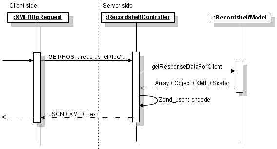
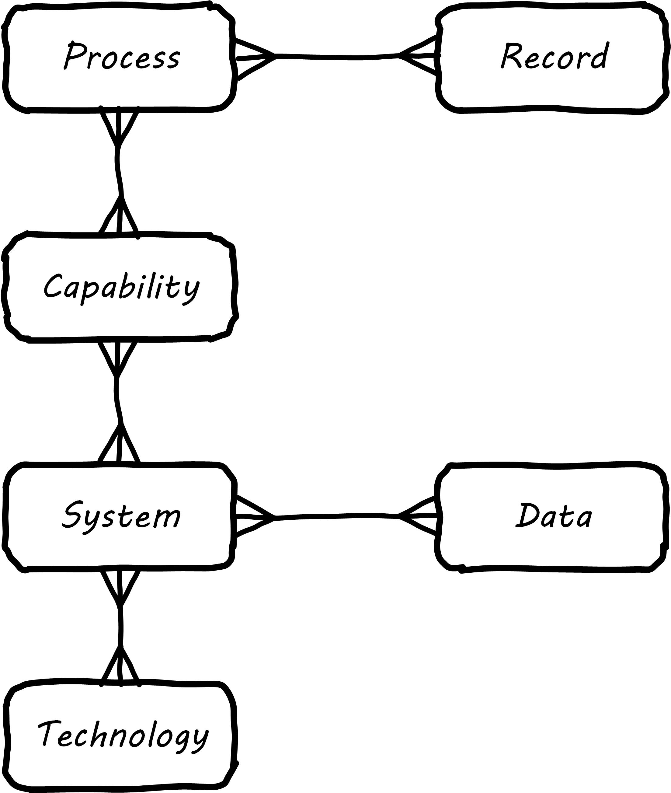

anchor:arch-practices[]

==== Architecture practices

Before we get into a detailed discussion of architecture domains, let's talk in general about what architects do and some common practices and themes.

As we mentioned xref:defining-ea[previously], architecture itself as a term shows up in many ways, as role, artifact, program, and organization.

In this chapter section, we will look at:

* The relationship of architecture and governance
* Architecture as a management program
* The importance of visualization as a practice in architecture
* Architecture and the quest for "rationalization"

.Author's corner
****
What do architects do, actually?

I was a Lead Architect (job class Systems Architect 6) for Wells Fargo for 6 years. This is a director-level position, and I was ultimately awarded the VP title, which in financial services tends to be honorary. (I never managed a large organization.) My assigned domain was the "business of IT," including systems management, service management, portfolio management, and the data, processes, and tools of architecture itself.

Across an annual IT spend of around $5 billion, many of course were involved in all these questions, but I was a nexus and was often called on to lead workshops and discussions with senior executives. These folks were typically at the "2-down" level from the CIO, that is, executives reporting to one of the CIO's direct reports, themselves leading large teams of teams. They called me in when they were struggling with managing one of the larger IT shops on the planet, especially when it came to processes, data, and systems *internal to the IT* organization. (I always admit, I never learned that much about banking; there was plenty to do just coordinating that IT pipeline and the thousands of systems it was delivering.)

Comparing my activities during those 6 years with how industry standards (such as TOGAF) describe architecture is interesting. Building models and "architectures" was only a small part of my work. I found myself involved in, or playing the role of:

* IT strategic planning
* IT portfolio management
* "Zoning authority," e.g. defining what systems are "xref:system-of-record[of record]" for what data
* Program architect, e.g. Application Decommissioning and Portfolio Rationalization for the Wells Fargo/Wachovia merger
* Internal consultant ("first line of defense before calling Accenture")
* Technology standards governance
* RFP owner for selecting new technologies
* Data governance
* Vendor product analysis (often in liaison with analyst firms such as Gartner Group)
* Center of Excellence for data, process (BPM), and systems analysis and modeling
* Solutions design standards and patterns
* Continuous service improvement (called "critical systems review")
* Major incident root cause analysis
* Project governance
* IT ombudsman and process troubleshooter ("you architects say the process should work this way, but it doesn't - help me")
* Shuttle diplomat - driving agreement between deeply conflicted business units or individuals, where relationships had broken down.

If I had to characterize the important skills for this role, they would start with communication and facilitation. In terms of the principles discussed in this book, the architecture team was a mechanism for synchronizing across the organization. It definitely fit the classic definition and value proposition of a xref:arch-as-staff[staff organization].
****

===== Architecture and governance

Enterprise architecture has a clear relationship to xref:gov-chap[governance] as we discussed it in Chapter 10. It provides a framework for managing xref:tech-prod-lifecycle[long-lifecycle concerns] and various forms of enterprise xref:risk-management[risk], especially as related to digital and IT systems.

Architecture is an important part of the governance equation. Architecture becomes the vehicle for technical standards that are essential risk controls; a risk management organization cannot achieve this alone.

EA therefore may have a role in defining xref:how-policy-begins[policies], especially at the mid-tier of the xref:policy-hierarchy[policy hierarchy] - neither the highest enterprise principles, nor the most detailed technical standards, but rather policies and standards related to:

* Choice of certain enterprise products expected to be heavily leveraged (e.g. common database and middleware products)
* Design patterns for solving recurring requirements (e.g. user authentication, load balancing, etc)
* xref:system-of-record[System of Record]
 identification and enforcement

As discussed in xref:policy-hierarchy[Chapter 10], there needs to be traceability from tactical standards to strategic codes and principles. The preference for a given database should not be a policy, but having a process that establishes such a preference *would* be -- that is, a policy should exist saying (for example) "there shall be a Technology Lifecycle Management process with the following objectives and scope." Where appropriate, such policies might also be linked to specific risks as xref:controls[controls] or xref:enablers[enablers].

As for all policies, it's important to have some sort of sunset mechanism for EA guidance. As Bente et al note, _Many EA-originated policies that appear obsolete today have not always been meaningless...A frequent example is the uncontrolled proliferation of newly hyped technologies by the IT crowd, and the EA group's rigid attempt to reinstitute order. Once the technology has matured, the EA rules often appear overly strict and suppress a flexible use of the appropriate technology._ <<Bente2012>> p19

The issue with the quote above is that the overall benefits of having (for example) a Technology Lifecycle Management process are not usually quantified in terms of cost and risk avoidance. Without an overall governance mandate and value proposition, Enterprise Architecture activities may seesaw in response to the "issue of the moment." This is not a recipe for sustainable architecture; whose most important value proposition lies in the long term. Architecture, as a component of coherent governance, requires no less.

As we discussed in Chapter 10 governance emerges in part as a response to xref:assurance-external-forces[external forces]. Architecture often plays a consultative role when external forces become governance issues, for example:

* Data custody and xref:system-of-record[Systems of Record], and relationship to xref:records-mgmt[records management]
* Vendor relationship strategies
* Security risks and controls

Governance is also concerned with efficiency, which also becomes a key architecture concern with associated practices:

* IT portfolio rationalization
* Business process optimization
* Shared services and APIs re-use
* Master and xref:reference-data[reference data management]

Finally, does enterprise architecture promote effectiveness? Effectiveness is often seen as the primary responsibility of "the line" in line/staff paradigms. However, as the xref:arch-impacts[impact] model suggests, establishing a foundation of re-usability and limiting technical choices can increase the speed with which new products and services are delivered.

===== Architecture as a management program

The above section discussed the relationship of architecture to governance. As we covered in chapter 10, xref:gov-v-mgmt[governance is not management]. Here, we will cover the topic of architecture as a management program of activity, in part through examining an example large-scale architecture program.

Architecture as a program refers to a coordinated set of

* processes,
* job roles,
* standards and practices,
* artifacts,
* organizations, and
* cadenced and ad-hoc activities

intended to serve a key xref:boundary-spanning[coordination] role. The below diagram represents a large scale, coordinated architecture program in a large enterprise. Notice that this is not a single organization. The Architecture Program in this example spans a centralized Enterprise Architecture group as well as teams of Line of Business architects.

.Large scale architecture program
image::images/4_12-archProgram.png[program, 800]

The Enterprise Architecture organization might report to a CTO, the Chief of Staff for the Office of the CIO, or the head of Corporate Strategy and Planning. It is a centralized organization with a small staff of domain architects and an Architecture Standards organization that owns two key cross-functional architecture processes.

Lines of Business have dedicated IT organizations, and these organizations have Chief Architects with their own staffs. In terms of our discussion of  xref:arch-as-staff[line/staff] organization, it is as if the line organization has its own staff function within it; another way to think about it is that the line/staff
division is _fractal_ (that is, it reproduces at different scales).

Within the central Enterprise Architecture organization, we have a number of director-level Domain Architects. These architects might focus on particular business problems (e.g. Supply Chain) or architectural domains (e.g. Data and Information, or Security).

It is the responsibility of the Domain Architects to create Domain Architectures, which are documents that lay out an overall point of view on a particular domain and often serve as standards. These architectures may be created according to a methodology such as TOGAF, with the support of a repository-based tool and language such as Archimate or various standards from the Object Management Group.

The domain architects also serve as a senior consulting pool and are assigned to significant programs and projects as needed.

The Architecture Standards organization is responsible for two organization-wide architecture processes:

* Architecture Review
* Technology Lifecycle Management

The *Architecture Review* process is part of the investment process, when initiatives are initially scoped and direction set. The process requires architects to review significant proposed investments in new systems for consistency with standards (e.g. the Domain Architectures and approved technologies). In terms of the previous section's xref:arch-impacts[impact] model, this process is attempting to support many of the lines of value through controlling redundancy, and ensuring re-use and application of previously learned architectural lessons.

The *Technology Lifecycle Management* process is the means by which new vendor and open source products are approved as fit for purpose and/or preferred within the organization. In terms of the previous section's xref:arch-impacts[impact] model, this process is tasked with reducing the portfolio of vendor products which reduces cost and risk as shown.

Both of these processes are enterprise-wide processes. They are owned, defined, and modified by the Architecture Standards organization, but projects and products across the enterprise follow these processes.

Finally, the *Architectural Governance Council* brings together the senior architects from the central EA organization and the LOB Chief Architects. It is a virtual organization operating on a quarterly cadence, responsible for setting direction and resolving the most difficult questions that may emerge from the architecture processes and domain architectures.

Overall, this may seem like a complex structure, but similar structures are in place in IT organizations with budgets of $1bn or more. It would be questionable to see comparable structures in much smaller organizations. However, this structure is useful to examine; organizations of various sizes might choose to use different parts of it.

anchor:arch-visualization[]

===== Modeling and visualization

.Gudea with blueprint, ~2140 BCE footnote:[_Image https://www.flickr.com/photos/daryl_mitchell/16189447931, downloaded 2016-10-10, commercial use permitted_]

[quote, Preston Smith and Don Reinertsen, Developing Products in Half the Time]
The true measure of the value of a model is whether it actually influences behavior.

We discussed the importance of visual management in Chapter 5. Making information visually available to help create xref:shared-mental-model[common ground], is an important Lean practice
(see xref:andon[Andon]).

The word "architect," whether in a building or digital context,  is often associated with visualizations: blueprints, sketches, specialized notations, and so forth. Drawings have been used to represent structures for likely as long as xref:writing-history[writing has existed]. The image at the beginning of this Part Is of Gudea, a Mesopotamian ruler known for building temples; on his lap is a blueprint.

Judging simply by its history, visualization is therefore an essential tool for humans dealing with large scale complexity (and erecting buildings has always been one of the more complex domains of human activity.) In digital and IT contexts, however, visualization has certain challenges and notable skeptics. Adrian Cockcroft, the former CTO of Netflix, stated: “Our architecture was changing faster than you can draw it... As a result, it wasn’t useful to try to draw it” <<Bloomberg2014>>.

.Whiteboard footnote:[_Image https://www.flickr.com/photos/simonov/15484240880, downloaded 2016-10-10, commercial use permitted_]
image::images/4_12-whiteboard.jpg[blueprint, 350, 200, float="left"]

Even in construction and engineering trades that rely on blueprints as a source of truth, keeping them up to date requires considerable discipline and process. In faster-moving digital organizations, visual models are almost always out of date unless they have been specifically refreshed for a purpose, or unless there is a strong formal process in place (and the value of such a process may be difficult to establish). That doesn't mean that diagrams will go away. Co-located teams use whiteboards and dry-erase markers and will continue to use them. There are important cognitive and human factors reasons for this that will not go away. Because of these facts, it is useful to understand some of the fundamentals of how humans interpret visual data.

====== Human visual processing
[quote, Dan Moody, The "Physics" of Notations]
Visual representations are effective because they tap into the capabilities of the powerful and highly parallel human visual system. We like receiving information in visual form and can process it very efficiently: around a quarter of our brains are devoted to vision, more than all our other senses combined [63]. In addition, diagrams can convey information more concisely [27] and precisely than ordinary language [8, 68]. Information represented visually is also more likely to be remembered due to the picture superiority effect [38, 70] ...Visual representations are also processed differently: according to dual channel theory [80], the human mind has separate systems for processing pictorial and verbal material. Visual representations are processed in parallel by the visual system, while textual representations are processed serially by the auditory system... <<Moody2009>>.

As the above quote shows, there are clear neurological reasons for diagramming as a communication form. To expand a bit more on the points Dan Moody is making:

.Fast recognition means survival footnote:[_Image https://www.flickr.com/photos/samiksha/2436037856, downloaded 2016-10-10, commercial use permitted_]
image::images/4_12-tiger.jpg[blueprint, 350, 200, float="right"]

* Human vision uses parallel processing. This means that a given image or visual stimulus is processed by many neurons simultaneously. This is how we can quickly recognize and act on threats, such as a crouching tiger.
* A large percentage of our brain is devoted to visual processing (you will see figures quoted from 25% to 66% depending on whether it's "pure" visual tasks or vision-driven tasks involving other brain areas)
* The old saying "a picture is worth a thousand words" is consistent with the science. Diagrams can be both faster and more precise at conveying information; however, this has limits.
* Pictures can be more memorable than words.

====== Visualization in digital systems

.The first software flowchart footnote:[_<<vonNeumann1947>>, figure 7.9, public domain assumed_]
image::images/4_12-neumann-flowchart.png[blueprint, 350, 200, float="left"]
Architects and architecture are known for creating diagrams -- abstract graphical representations of complex systems. The first known instance of applying graphical techniques to a digital problem was in 1947 <<vonNeumann1947>> and visual notations have evolved along with the field of computing ever since. Notable examples include:

* The IBM flowcharting template
* The Gane-Sarson data-flow diagram notation
* The Chen entity-relationship notation
* The Barker entity-relationship notation, including the "crow's foot" to indicate cardinality
* Harel state charts
* The Unified Modeling Language

and many more. (We touched on xref:data-modeling[data modeling] in Chapter 11.) We will examine Archimate, a current and widely used notation, in more detail in a future chapter section.

.IBM flowcharting template footnote:[_Image https://www.flickr.com/photos/mwichary/3249179483, , downloaded 2016-10-10, commercial use permitted_]
image::images/4_12-flowchart-template.jpg[blueprint, 350, 200, float="right"]

Research at Microsoft suggests that developers use diagrams for four purposes:

* Sharing
* Grounding (defining ambiguous interpretations)
* Manipulating
* Brainstorming

They argue "diagrams support communicating, capturing attention and grounding conversations [4]. They reduce the cognitive burden of evaluating a design or considering new ideas [13]" <<Cherubini2007>>.

But visual notations have been problematic in the Agile community; as Fowler notes in his classic essay Is Design Dead:

_[Agile method eXtreme Progamming] de-emphasizes diagrams to a great extent. Although the official position is along the lines of "use them if they are useful", there is a strong subtext of "real XPers don't do diagrams".... I think the issue comes from two separate causes. One is the fact that some people find software diagrams helpful and some people don't. The danger is that those who do think that those who don't should do and vice-versa. Instead we should just accept that some people will use diagrams and some won't._ <<Fowler2004>>

There is no question that some IT professionals, including perhaps some of the most skilled software engineers, find little of use in diagrams . As Martin Fowler says, "people like Kent [Beck, eXtreme Progamming originator] aren't at all comfortable with diagrams, indeed I've never seen Kent voluntarily draw a software diagram in any fixed notation." However, it seems likely that Kent Beck and others like him are members of a programming elite, with a well-honed mental ability to process source code in its "raw" form.

.UML sequence diagram footnote:[_Image https://www.flickr.com/photos/raphaelstolt/514643232, , downloaded 2016-10-10, commercial use permitted_]

However, if we're building systems to be operated and maintained by humans, it would seem that we should support the cognitive and perceptual strengths of humans.  Because diagrams are more readily processed, they are often used to represent high level system interactions - how a given service, product or application is related to peer systems and services. Building such depictions can be helpful to fostering a shared mental model of the overall system objectives and context. The more complex and highly scaled the environment, the more likely one will encounter such artifacts as a means to creating the mental model.

The strength of human visual processing is why we will (probably) always use graphical representation to assist in the building of shared mental models. Specialists in the syntax and semantics of such designs will therefore likely continue to play a role in complex systems development and maintenance. Currently, if one seeks to hire such a specialist, one recruits some kind of architect - that is the professional role with the skills.

Note that flowcharts, data models, and other such diagrams tend to be associated more with the idea of "solutions" or "software" architecture. We'll cover the xref:architecture-domains[architecture domains] in the next chapter section, including examples of business architecture diagrams.

====== Limitations of visualization
[quote, Bente et al, Collaborative Enterprise Architecture]
The big picture is part of the standard mindset of EA, which everyone immediately associates with the activities of an enterprise architect. However, many of these big pictures you meet in practice have been over-abstracted to the point of insignificance and no longer address any relevant question. <<Bente2012>>, p16.

Visualization has a number of limitations:

* It may be better suited for static structures than for dynamic processes,
* diagrams may have no real information content,
* diagrams are difficult to maintain, and there are diminishing returns the more they are elaborated and refined (e.g. for archival purposes)
* conversely, diagrams become less accessible the more complex they are,
* visualization can result in distorted understandings,
* ultimately, diagrams rely on deeper shared understandings that must be understood and managed.

Despite the familiarity of simple flowcharting, visual notations don't scale well in terms of representing program logic. Therefore, for dynamic or procedural problems, they tend to be used informally, as sketch or whiteboarding, or at the business analysis level (where the flowchart represents business logic, not detailed software). Dynamic processes also change more often than the static structures, and so must be updated more frequently.

More static structures, including data and class models and systems interactions, are still often represented visually and in the case of xref:data-modeling[data models] can be transformed from conceptual representations to physical schema.

However, any diagram, whether of a dynamic or static problem, can reach a level of density where it's no longer useful as a visual explanation. As diagrams become more complex, their audience narrows to those most familiar with them. Past a certain point they exceed the limits of human visual processing, and then are of little use to anyone.

For example, the diagram below, while intimidating, is likely useful to those who work with and study it. It would take some familiarization:

.Complex diagram footnote:[_Image https://www.flickr.com/photos/pushandplay/2968259379, downloaded 2016-10-10, commercial use permitted_]
image::images/4_12-obesity.jpg[blueprint, 550, 200]

However, this next diagram is essentially unusable, as visually tracing any given line is too difficult, and it would be easy to mistakenly identify one bubble as dependent on another:

.Another complex diagram footnote:[_Image https://www.flickr.com/photos/taedc/9614791576, downloaded 2016-10-10, commercial use permitted_]

This may seem like an obvious critique, but architectural diagrams of similar complexity and unusability have too often been produced. Another issue with some diagrams is that they do not give a good sense of perspective or scale. This is sometimes seen in the business architecture practice of "capability mapping." For example, suppose you see this diagram:

.Simple capability map
image::images/4_12-capabilities.png[capabilities, 600, ]

Diagrams like this are common, but what does it mean that all the boxes are equally sized? Are there as many lawyers as sales people? Operations staff? It's not clear what the advantage is to putting information like this into a graphical form; no interactions are seen and the eight areas could more easily be expressed as a list (or "catalog" in the terms we'll introduce below). This brings us to the final problem listed above: visualizations rely on some xref:shared-mental-model[common ground] understanding. If boxes and lines are used for communication, their meaning should be agreed upon - otherwise, there is risk of mis-understanding, and the diagram may do more harm than good.

Regardless of the pitfalls, many architecture diagrams are valuable. Whether drawn on a whiteboard, in Powerpoint or Omnigraffle, or in a repository-based architecture tool, the visualization concisely represents a shared mental model on how the organizations will undertake complex activities. The diagram leverages the human preference for visual processing, accessing the powerful parallel processing of the visual cortex. Ultimately, the discussions and negotiations the architect facilitates on the journey to drivng organizational direction are the real added value. The architect's role is to facilitate discussions by abstracting and visualizing powerfully so that decisions are illuminated and understood across the team, or broader organization.

anchor:arch-repos[]

===== Repositories and knowledge management
[quote, TOGAF Version 9]
Artifacts are generally classified as catalogs (lists of things), matrices (showing relationships between things), and diagrams (pictures of things).

The question was asked above, "why put things into a picture when a report is all that is needed?" We know that sometimes a picture is worth a thousand words, but not always. And sometimes the picture's components need more description than can conveniently fit on the actual diagram. This brings us to the topic of enterprise architecture as knowledge management.

Knowledge management is a broad topic, with a scope far beyond this book. But in the context of a digital organization, architecture can serve as an important component of an overall knowledge management strategy. Without some xref:shared-mental-model[common ground] of understanding, digital organizations struggle, and EA can help.

====== Catalogs, diagrams, matrics

As the quote from TOGAF above indicates, architecture can elegantly be represented as:

* Catalogs
* Diagrams
* Matrices

For example, consider this diagram:

.Process and function diagram

It can be read as saying that the "Quote to Cash" process depends on the following functions:

* Sales
* Contracts
* Accounts Receivable

Notice that the following matrix can be read in the same way:

.Process and function matrix

"Quote to cash," which appeared as a chevron in the diagram, is now one of a list:

* Quote to Cash
* Procure to Pay
* Hire to Retire

This list can be called a "catalog." Similarly, there is another catalog of functions:

* Sales
* Contracts
* Accounts Receivable
* Vendor Management
* Accounts Payable
* Human Resources
* Information Technology
* Payroll
* Benefits

The functions appeared as rounded rectangles in the diagram.

There are pros and cons to each approach. Notice that in about the same amount of space, the matrix also documented the dependencies for two other processes and six other functions. The matrix may also be easier to maintain; it requires a spreadsheet-like tool, where the diagram requires a drawing tool. But it takes more effort to understand the matrix.

Maintaining a catalog of the concepts in a diagram becomes more and more important as the diagram scales up. Over time, the IT operation develops significant data by which to manage itself. It may develop one or more definitive portfolio list, typically applications, services, assets, and/or technology products. Distinguishing and baselining high quality versions of these data sets can consume much resource, and yet managing the IT organization at scale is nearly impossible without them. In other words, there is a xref:data-quality[data quality] issue. What if the boxes on the diagram are redundant? Or inaccurate? This may not matter as much with a tight-knit team working on their whiteboard, but if the diagram is circulated more broadly, the quality expectations are higher.

Furthermore, it is convenient to have data such as a master lists or catalogs of processes, systems, functions, or data topics. We might also want to document various attributes associated with these catalogs. This data can then be used for operational processes, such as xref:risk-management[risk management], as we have discussed previously. For these reasons and others, enterprise architecture repositories emerge.

====== Architecture data management

When we establish a catalog of architectural entities, we are engaging in xref:system-of-record[master data management]. In fact, the architectural concepts can be represented as a form of xref:data-modeling[database schema]:

.A simple metamodel

NOTE: A data model that organizes data about data and its related systems can be called a _metamodel_.

Thus, material that we first saw in diagram form can be stored in a database. Systems that enable this are called enterprise architecture repositories.

Architecture repositories require careful management. A common anti-pattern is to acquire them without considering how the data will be maintained. The concepts in the repository can be subjective, and if it is intended that they be of high xref:data-quality[data quality], investments must be made. Some kind of registration process or decision authority must exist for the creation of (for example) a new, official "system" record. Misunderstandings and disagreements about the very meaning of terms like "system" or "technology." (We discussed some of the general issues in Chapter 11, with the xref:ontology-problem[ontology problem]). Such issues are especially difficult when enterprise architecture repositories and metamodels are involved. Frequent topics:

* Is an "application" different from a "service"? How?
* What is the relationship between a "capability" and a "function"? Or a "capability" and a "process?"
* How can we distinguish between "systems" and "technologies"?
* What is the relationship between a "product" and a "service," especially if the service is a market-facing digital one?
* What is the relationship between:
** Value chain
** Value stream
** Process
** Activity
** Task

And so on. One might expect that there would be industry standards clarifying such issues, and in some cases there are. In other cases, there are either no standards, or the standards are obsolete or conflicting.

Finally, there are a number of other systems that may interoperate with the architecture repository. The most important of these is the configuration management database (CMDB) or system (CMS) that underlies the IT service management tooling. These tools also need to know at least about systems and technologies, and may be interested in higher level concepts such as business capability. However, they usually do not include sophisticated diagramming capabilities or the ability to represent a system's future state.

Other tools may include project management systems, portfolio management systems, risk management systems, service level management systems, and others. Application and service master data in particular is widely used, and if the EA repository is xref:system-of-record[System of Record] for this data there will be many outbound interfaces.

anchor:repo-econ[]

====== An economic view

NOTE: The discussion below also applies to the Configuration Management Database (CMDB) as well as other similar repositories.

Part of the challenge of any repository is what data to manage. How do we think more systematically about this?
First, we need to understand why we want to assemble this data in a ready-to-query repository. There are two major reasons why we store data:

* There are no other sources for it. If we don’t establish a system of record, the data will go unmanaged. We won’t know what servers we have, or what applications we are running.
* There may be other sources for the data, even systems of record. But we need an operational data store to bring the various data sources together in a way that makes them more efficient to query.

For either kind of data, you need to have an economic understanding of why you want it. Suppose you need to find out what applications you are running, because you want to rationalize them. You could invest weeks of research into the question, costing perhaps tens of thousands of dollars worth of yours and others’ time, to create a one-time spreadsheet.

But what happens when there are multiple purposes for the data? You find out that the security group also wants a master list of applications and has been compiling a different spreadsheet, for example. What happens when the same engineers and managers are asked for the same data over and over again, because there is no repository to maintain this organizational memory?

The challenge is, when does it make economic sense to pre-aggregate the data? The following economic graph may help:

.Economic value of EA repository

The graph may be familiar to those of you who studied economics. On the left, you have the assumption of no architecture repository, and on the right you have a comprehensive architecture repository.
With a less comprehensive architecture repository, you are paying some cost in research and outage impacts. You also are incurring more risk, which can be quantified. On the other hand, with a comprehensive architecture repository, you incur more costs in maintaining it. You need processes that have direct cost to operate, as well as imposing indirect costs such as cost of delay (e.g. if updating the architecture repository slows down the release schedule).

But in the middle is a sweet spot, where you have “just enough” architecture repository data. This optimal architecture repository scope represents the real savings you might realize from instituting the architecture repository and the necessary processes to sustain it.
This is not a complete business case, of course. Your projected savings must be offset against the costs of acquisition and operations, and the remaining “benefit” needs to exceed your organization’s hurdle rate for investments.

A simple example:

Let’s say that you have identified a set of use cases indicating $250,000 maximum savings from an accurate and optimally scoped architecture repository. The implementation is projected to cost $200,000 over 3 years, for net benefits of $50,000. This means that you have an ROI of 25% ($50k/$200k). You can’t get 25% return on investment in the stock market, so the CFO sees this as a good use of money. On the other hand, if you only are projecting $15,000 in net benefits, for an ROI of 8%, the CFO may well say, “I can do better with other projects, or by leaving our money in the stock market.”

Of course, estimating benefits such as reducing redundant research are not simple. The book How to Measure Anything by Doug Hubbard <<Hubbard2010>> is a very useful resource for these kinds of problems. You may need to consider using techniques such as Monte Carlo Analysis for business benefits that are more probabilistic. But you do not need to throw up your hands and say it’s all just “intangible,” successfully making challenging business cases of this nature is possible.

===== The "rationalization" quest
[quote, Ralph Waldo Emerson]
A foolish consistency is the hobgoblin of little minds.

"Rationalization" is often listed as one of the major outcomes of enterprise architecture. What is meant by this? Let's return to our scenario of xref:how-policy-begins[one company acquiring another]. As the newly merged company takes stock of its combined assets, it becomes clear that decisions need to be made. Among other areas, redundant systems exist for:

* Marketing
* Human resources
* Accounting

The digital pipelines also are inconsistent, one being based on Github and Travis CI, the other being based on local git and Jenkins.

Decisions need to be made as to which systems will be "go-forward." While the teams involved will have strong input into the system decisions that affect them, and will do most of the work, there is concern that some overall view and coordination of the effort is required. What if teams cannot come to consensus? What if there is an opportunity to save money by standardizing on one vendor to support multiple diverse teams? For these reasons, the company assigns an architect to work closely with the overall merger program.

A merger is a dramatic example of a rationalization scenario. Established, ongoing companies, even without mergers, find that redundancy tends to accumulate. This is a normal outcome of the xref:innovation-cycle[innovation and commoditization cycle]; when technologies are new, organizations may experiment with several providers. When they become more standardized and commodity, the desire for efficiency drives rationalization.

One of the challenges for rationalization is whether the economics and business context of any given rationalization effort are well understood. Consistency as an end in itself is not necessarily valuable. The xref:arch-impacts[impacts] on enterprise value must be established: will the organization actually benefit from improved vendor leverage, operational integration, or a reduced security attack surface? If not, perhaps seeking "rationalization" is not the best use of organizational resources.

We close this section with some case studies on rationalization.

====== Application rationalization
[quote, Bente et al, Collaborative Enterprise Architecture]
One core question decided by governance is how much autonomy is granted to business units or geographical regions. In case this autonomy is high, would a quest for high IT integration and standardization not be like fighting windmills? <<Bente2012>> p.45

A large electronics retailer purchases a smaller chain of stores specializing in vinyl records and CDs, just as the market for these are declining. The decision is made to integrate all the systems: Point of Sale, inventory, HR & Payroll, etc, in the interest of efficiency and rationalization.

Work progresses on this effort for nearly a year, and then the surprising news is announced: the newly acquired company is to be sold off! All the work that went into rationalizing the systems is wasted, and the independent operating model for the smaller chain has to be completely restored. Clearly, in this case, rationalization was not rational.

====== Data and information
A large financial institution had allowed its computer systems to become fragmented. Acquisitions and independence among the lines of business meant that if a customer moved, they might need to contact customer service repeatedly to change their address. This was a failure of xref:system-of-record[master data management]; there was no clear system of record for the customer address.

While we first discussed this kind of issue in Chapter 11, solving the problem requires more than data architecture. Establishing one data source as "master" requires considerable engineering in such an environment: there are capacity, security, interface, and business process concerns to work through, that in this particular case tooks tens of millions of dollars of investment, in response to increasing customer unhappiness.

And once a system of record is established and the data interfaces have been constructed reflecting its status, its role needs to be preserved. Independent teams may once again start to master their own customer data, "just for now," because perhaps accessing the system of record seems to be too much work. Avoiding such scenarios is why some architecture organizations institute project reviews.

====== Technology rationalization case #1
.Airbus A-380 footnote:[_Image credit https://www.flickr.com/photos/44400809@N07/4081438180, downloaded 2016-10-11, commercial use permitted_]

In 2006, Airbus was in the midst of developing the gigantic A-380 aircraft. Because of the scale of the effort, multiple teams of engineers in different countries were working on the effort. As William Ulrich says of the German and French teams, "having failed to coordinate efforts to wire the world's largest plane, they were surprised to learn that they had used different approaches to designing the A380's wiring system" <<Ulrich2010>>, p. 32. This was because the teams were using different software for wiring design of the critical wiring design software <<Clark2006>>. The use of different software to fulfill the capability resulted in a year's delay, a $4.5bn order loss to Boeing, and a 26% drop in Airbus stock.

====== Technology rationalization case #2

Henrik Kniberg worked on the PUST project for the Swedish national police, which was a project to deploy laptops to the Swedish police. Because of its urgency, it was allowed to use Lean and Agile techniques, and received favorable media coverage and was generally deemed a success  <<Kniberg2011>>.

Unfortunately, a drive for technology "rationalization" resulted in the re-platforming of the system on a commercial platform (Siebel) <<Kniberg2013>>. Furthermore, an xref:open-loop[open loop] xref:Agile-history[waterfall] method was used to deliver the system. Kniberg reports that the result has been an unsuccessful rollout, unhappy users, and cost to the Swedish police department of about 1 biliion pounds ($1.6B).

As we have discussed, there can be an economic case for rationalization. It reduces support costs and increases vendor leverage. However, 1 billion pounds  would have bought a lot of support & vendor leverage for the "nonstandard" technologies. It is hard to see that this was an economically rational decision, especially given the particular risks of police work (the system in question is used by officers in the field, to keep records on criminal cases.) It does not take much imagination to think of scenarios where a difficult to use system for a police officer could have costly or even tragic results. In this case, the quest for rationalization appears misguided.

====== Service or technology rationalization?

A large US company with a robust architecture program found itself with a serious controversy. A request had been made of the Technology Lifecycle Management process for the Subversion version control system to be approved for use by development teams. A central version control team (what might now be called a Release Engineering team) was opposed to this, citing duplication of technologies.

Multiple version management systems already did exist, as different plaforms had different requirements. In general, the thinking was that  the approval process should simply verify that the tool was "fit for use" and not worry about redundancy.

However, as the discussion escalated, it became clear that the central release engineering team was worried not so much about the technical capabilities of Subversion, but rather a "loss of franchise" for their services - they had been established as the primary shared service for source control. Many teams did use their shared services, but there was also a regulatory issue - they were seen as an authoritative and auditable repository by regulators.

So the situation was complex; was the company "rationalizing" at the technology or service level? Ultimately, a solution (unsatisfactory to most) was arrived at that the Subversion-using team still had to use the central source repository as a system of record. They could develop locally using Subversion, but were still expected to archive their source in the central tool.

In the next chapter section we will go into a more thorough discussion of the service/application "level" versus the technology "level."
