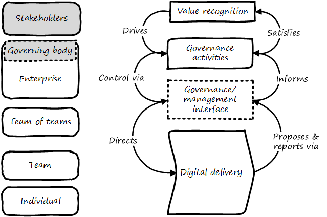

==== Governance

===== What is governance?
[quote, Cadbury Report]
The system by which organizations are directed and controlled.

[quote, COBIT 5 Framework, ISACA]
The COBIT 5 framework makes a clear distinction between governance and management. These two disciplines encompass different types of activities, require different organisational structures and serve different purposes . . . In most enterprises, governance is the responsibility of the board of directors under the leadership of the chairperson . . . In most enterprises, management is the responsibility of the executive management under the leadership of the CEO.

To talk about digital or IT governance, we must talk about governance in general.

Governance is a challenging and often misunderstood concept. First and foremost, it must be distinguished from "management." This is not always easy, but remains essential.

====== A governance example

Here is simple explanation of governance:

Suppose you own a small retail store. For years, you were the primary operator. You might have hired an occasional cashier, but that person had limited authority; they had the keys to the store and cash register, but not the safe combination, nor was their name on the bank account. They did not talk to your suppliers. They received an hourly wage and you gave them direct and ongoing supervision.

_Credit: I got this analogy from hearing Brian Barnier speak at an ISACA meeting around 2011._

In this case, you were a manager. Governance was not part of the relationship.

image::images/4.10-shopkeeper.jpg[]
_image credit https://www.flickr.com/photos/garryknight/11240024613, commercial use permitted._

Now, you wish to go on an extended vacation - perhaps a cruise around the world, or a trek in the Himalayas. You need someone who can count the cash and deposit it, and place orders with and pay your suppliers. You need to hire a professional manager.

They will likely draw a salary, perhaps some percentage of your proceeds, and you will not supervise them in detail as you did the cashier. Instead, you will set overall guidance and expectations for the results they produce. How do you do this? And perhaps even more importantly, how do you trust this person?

*Now, you need governance.*

As we see in the above quote, one of the most firmly reinforced concepts in the COBIT guidance (more on this and ISACA in the next chapter) is the need to distinguish governance from management. Governance is by definition a board-level. Management is the CEO's concern. In this distinction, we can still see the shop owner and his or her delegate.

IMPORTANT: There is too often a temptation to lump all of "management" in with governance. Sometimes it may be said that the VP of sales, or HR, "governs" their function, for example. While tempting to executives who want to elevate their status, this is not the intent of the term, as we will detail below.

====== Some theory of goverance

In political science and economics, the need for governance is seen as an example of the https://en.wikipedia.org/wiki/Principal%E2%80%93agent_problem[principal-agent problem] <<Eisenhardt1989>>. Our shopkeeper example illustrates this. The hired manager is the "agent," acting on behalf of the shop owner, who is the "principal."

In principal-agent theory, the agent may have different interests than the principal. The agent also has much more information (think of the manager running the shop day to day, versus the owner off climbing mountains).

The agent is in a position to do economic harm to the principal; to shirk duty, to steal, to self-deal. Mitigating such conflicts of interest is a part of governance.

In larger organizations (such as you are now), it's not just a simple matter of one clear owner vesting power in one clear agent. The corporation may be publicly owned, or in the case of a non-profit, it may be seeking to represent a diffuse set of interests (e.g. environmental issues). In such cases, a group of individuals (directors) is formed, often termed a "board," with ultimate authority to speak for the organization.

The principal-agent problem can be seen at smaller scale within the organization. Any manager encounters it to some degree, in specifying activities or outcomes for subordinates. But this does not mean that the manager is doing "governance," as governance is by definition an organization-level concern.

The fundamental purpose of boards of directors and similar bodies is to take the side of the principal. This is easier said than done; boards can become overly close to an organization's senior management - the senior managers are real people, while the "principal" may be an amorphous, distant body of shareholders and/or stakeholders.

Because governance is the principal's concern, and because the directors represent the principal, governance, including IT governance, is a board-level concern.

There are various principles of corporate governance we will not go into here, such as shareholder rights, stakeholder interests, transparency, and so forth. References on these topics are included in the chapter conclusion.

 todo

However, as we turn to our focus on digital and IT-related governance, there are a few final insights from principal-agent theory that are helpful to understanding governance. Consider:

_the heart of principal-agent theory is the trade-off between (a) the cost of measuring behavior and (b) the cost of measuring outcomes and transferring risk to the agent._ <<Eisenhardt1989>>

What does this mean?

Suppose the shopkeeper tells the manager, "I will pay you a salary of $50,000 while I am gone, assuming you can show me you have faithfully executed your daily duties."

The daily duties are specified in a number of checklists, and the manager is expected to fill these out daily and weekly, and for certain tasks, provide evidence they were performed (e.g. bank deposit slips, checks written to pay bills, photos of cleaning performed, etc.). That is a behavior-driven approach to governance. The manager need not worry if business falls off; they will get their money. The owner has a higher level of uncertainty; the manager might falsify records, or engage in poor customer service so that business is driven away. A fundamental conflict of interest is present; the owner wants their business sustained, while the manager just wants to put in the minimum effort to collect the $50,000.

When agent responsibilities can be well specified in this manner, it is said they are highly _programmable_.

Now, consider the alternative. Instead of this very scripted set of expectations, the shopkeeper might tell the manager, "I will pay you 50% of the shop's gross earnings, whether they may be. I'll leave you to follow my processes however you see fit. I expect no customer or vendor complaints when I get back."

In this case, the manager's behavior is more aligned with the owner's goals. If they serve customers well, they will likely earn more. There are any number of hard-to-specify behaviors (less _programmable_) that might be highly beneficial.

For example, suppose the store manager learns of an upcoming street festival, a new one that the owner did not know of or plan for. If the agent is managed in terms of their behavior, they may do nothing -- it's just extra work. If they are measured in terms of their outcomes, however, they may well make the extra effort to order merchandise desirable to the street fair participants, and perhaps hire a temporary cashier to staff an outdoor booth, as this will boost store revenue and therefore their pay.

(Note that we have considered similar themes in our discussion of xref:contract-mgmt[Agile and contract management], in terms of risk sharing.)

In general, it may seem that an outcome-based relationship would always be preferable. There is, however, an important downside. It transfers risk to the agent. And because the agent is assuming more risk, they will (in a fair market) demand more compensation. The owner may find themselves paying $60,000 for the manager's services, for the same level of sales, because the agent also had to "price in" the possibility of poor sales and the risk that they would only make $35,000.

Finally, there is a way to align interests around outcomes without going fully to performance-based pay. If the manager for cultural reasons sees their interests as aligned, this may mitigate the principal-agent problem. In our example, suppose the store is in a small, tight-knit community with a strong sense of civic pride and familial ties.

Even if the manager is being managed in terms of their behavior, their cultural ties to the community or clan may lead them to see their interests as well aligned with those of the principal. As noted in <<Eisenhardt1989>>, "Clan control implies goal congruence between people and, therefore, the reduced need to monitor behavior or outcomes. Motivation issues disappear." We have discussed this kind of motivation in Chapter 7, especially in our discussion of xref:failure-control-culture[control culture] and insights drawn from the military.

****
*Systems theory, feedback, control, and governance*
We've encountered systems theory and associated concepts such as xref:2.00.01-feedback[feedback] and xref:empirical-process-control[control] throughout this book. The idea of "governance" predates these, but in an interesting way.

The term "governance" originates from the Greek word κυβερνάω [kubernáo], which means "to steer," as in a ship. Nautical navigation is a process of feedback and correction. The same Greek word is also the basis for the term "cybernetics," another word closely associated with systems and control theory.

image::images/4.10-centrifugal_governor.png[]
_Centrifugal governor, public domain image via Wikipedia_

"Governors" have been part of mechanical systems for centuries. These mechanisms have the effect of automatically controlling a system so that it (for example) operates at the desired revolutions per minute. Without governors, steam engines tended to blow up, or go out; applying devices such as the https://en.wikipedia.org/wiki/Centrifugal_governor[centrifugal governor] to regulate them was an important step in the development of steam power. Importantly, such devices operated to control the process from variation on either side, whether too fast or too slow. They did not operate merely as brakes.

So, if you find yourself coping with arbitrary and bureaucratic "governance" processes, it might be good to remember the origins of the term. There is more to governance than just slowing a system down.

 more on Wiener & Beer

****

===== Analyzing governance

====== Governance and the emergence model

In terms of our xref:0.01-emergence[emergence model], the most important distinction between a "xref:Section-III-coordination[team of teams]" and an "xref:enterprise[enterprise]" is the existence of xref:formalization[formalized] organizational governance.

Corporate governance is a broad and deep topic, essential to the functioning of society and its organized participants. These include for-profit, non-profit, and even governmental organizations. Any legally organized entity of significant scope has governance needs.

One well known structure for organizational governance is seen in the regulated, publicly owned company (such as those listed on stock exchanges). In this model, shareholders elect a governing body (usually termed the Board of Directors), and this group provides the essential direction for the enteprise as a whole.

However, organizational governance takes other forms. Public institutions of higher education may have a Board of Regents or Board of Governors, perhaps appointed by elected officials. Nonprofits and incorporated private companies still require some form of governance, as well. These are well known topics in law, finance, and social organization, and there are many sources you can turn to if you have further interest. If you are taking any courses on Finance or Accounting, you will likely cover governance objectives and processes.

Here is a more detailed visual representation of the relationship of governance and management in a digital context:

image::images/4.10-govArch.png[]

Reading from the top down:

*Value recognition* is the fundamental objective of the stakeholder. We  discussed in Chapter 4 the value objectives of xref:impact-mapping[effectiveness, efficiency, and risk] (aka top line, bottom line, and risk). These are useful final targets for impact mapping, to demonstrate that lower level perhaps more "technical" product capabilities do ultimately contribute to organization outcomes.

NOTE: The term "value recognition" as the stakeholder goal is chosen over "value creation" as "creation" requires the entire system. Stakeholders do not "create" without the assistance of management, delivery teams, and the individual.

Here, we see them from the stakeholder perspective of

* Benefits realization
* Cost optimization
* Risk optimization

(Adapted from <<ISACA2012a>>, p. 23)

Both ISO 38500 <<ISO2008>> as well as COBIT <<ISACA2012a>> specify that the fundamental *governance activities* of governance are:

* Direct
* Evaluate
* Monitor

Evaluation is the analysis of current state and the development of direction, including approving proposals and plans.  Directing is the establishment of organizational intent as well as the authorization of resources. Monitoring is the ongoing attention to organizational status, as an input to evaluation and direction.

Direct, Evaluate, and Monitor may also be ordered as Evaluate, Direct, and Monitor. These are highly general concepts that in reality are performed simultaneously, not as any sort of strict sequence.

The *governance/management interface* is an essential component. The information flows across this interface are typically some form of the following:

*From the governing side*

* Goals (e.g. product and go-to-market strategies)
* Resource authorizations (e.g. organizational budget aprovals)
* Principles and policies (e.g. personnel and expense policies)

*From the governed side*

* Plans & proposals (at a high level, e.g. budget requests)
* Performance reports (e.g. sales figures)
* Conformance/compliance indicators (e.g. via audit and assurance)

Notice also the dotted line cycle "Iterative Negotation" in the Governance/Management interface. Governance is not a one-way street. Its principles may be stable, but approaches, tools, practices, processes, and so forth (what we will discuss below as "enablers," in COBIT terminology) are variable, and require ongoing evolution.

We often hear of "bureaucratic" governance processes. But the problem is not "governance" per se. It is more often the failure to correctly manage the governance/management interface. Of course, if the board is micro-managing, demanding many different kinds of information, then governance and its management response is all much the same thing. In reality, however, burdensome organizational "governance" processes may be an overdone, bottom-up management response to *perceived* Board-level mandates.

Or they may be point-in-time requirements no longer needed. The policies of 1960 are unsuited to the realities of 2020. But if policies are always dictated top-down, they may not be promptly corrected or retired when no longer applicable. Hence, the scope and approach of governance in terms of its enablers must always be a topic of ongoing, iterative negotiation between the governed and the governing.

====== Digital governance

What does all this have to do with information technology and the lowermost  *digital delivery* chevron?

If "corporate governance" is "The system by which organizations are directed and controlled," then it is reasonable that "corporate governance of IT" is "The system by which the *current and future use of IT is directed and controlled*." This is how ISO 38500, the IT Governance standard, defines it <<ISO2008>>.

In today's digital governance there is a greater concern for outcome and effectiveness, especially in terms of time to market (minimizing xref:cost-of-delay[Cost of Delay]). Previously, concerns for efficiency might lead a company to overburden its staff, resulting in queuing gridlock, too much work in process, destructive multitasking, and ultimately failure to deliver timely results (or deliver at all).

Such failure to deliver was tolerated because it seemed to be a common problem across most IT departments, and because digital transformation had not taken hold yet. IT systems were often back office and delays in delivering them (or significant issues in their operation) were not *quite* as damaging.

Now, effectiveness of delivery is essential. The interesting, and to some degree unexpected result, is that both efficiency and risk seem to be benefiting as well. Cross-functional, focused teams are both more effective and more efficient, and able to manage risk better as well. Systems are being built with both increased rapidity as well as improved stability, and the automation enabling this provides robust audit support.

****

*The DevOps Audit Toolkit*

The DevOps Audit Toolkit <<DeLuccia2015>> provides an important set of examples demonstrating how modern DevOps toolchain automation can fulfill audit objectives as well or better than "traditional" approaches.

****

Finally, consider the "programmability" criteria above. A highly "programmable" position is one where the responsibilities can be specified in terms of their activities. *And what is the fundamental dynamic of digital transformation?* It is no accident that such positions are called "programmable." In fact, they *are* being "programmed away" or "eaten by software"- leaving only higher-skill positions that are best managed by objective, and which are more sensitive to cultural dynamics.

Preoccupation with "efficiency" fades as a result of the decreasingly "programmable" component of work. The term "efficiency" signals a process that has been well defined (is "programmable") to the point where it is repeatable and scalable. Such processes are ripe for automation, commoditization, and outsourcing, and this is in fact happening. And when such repetitive concerns become a matter of sourcing rather than execution, the emphasis shifts to risk management and governance of the supplier.

Ultimately, governance is about managing results and risk. It's about objectives and outcomes. It's about "what," not "how." In terms of practical usage, it is advisable to limit the "governance" domain -- including use of the term -- to a narrow scope of board or director-level concerns, and the existence of certain capabilities, including:

* organizational policy management
* external and internal assurance and audit
* risk management, including security aspects
* compliance

We turn to specific discussions of these topics, in the context of digital delivery.
