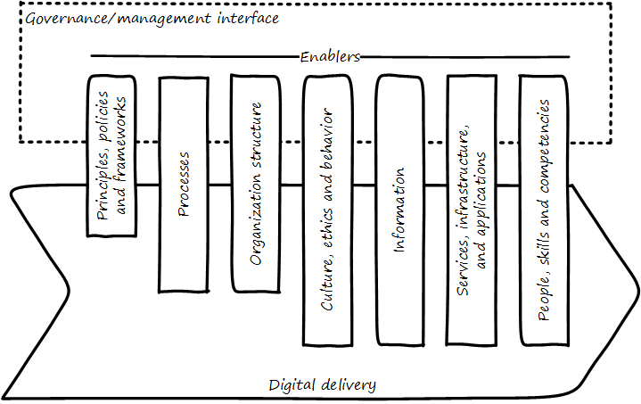

==== Policy, assurance and audit

ifdef::collaborator-draft[]

****
*Collaborative*

 Status: This intro section is in active development as of Jun 27 2016. Expect volatility.

include::../../../collab-links.adoc[]

****

endif::collaborator-draft[]

===== An introduction to the concept of enablers
 move this to 4.10.01 when done

[quote, Cobit 5 Framework, ISACA]
Enablers are factors that, individually and collectively, influence whether something will work — in this case, governance and management over enterprise IT.

As we explore the goverance/management interface further, we encounter the COBIT concept of _enablers_.

Enablers are the fundamental components of any purposeful organization. They are the core topics of interest for both management and governance. COBIT has a detailed structure that positions enablers in a broader context of stakeholder objectives, enterprise and IT goals, and various quality criteria. One easy to understand example of a governance-level enabler concern is when processes serve as risk controls; we will discuss this further in the next section.

COBIT's 7 enablers are:

* Principles, Policies, and Frameworks
* Processes
* Organizational Structures
* Culture, Ethics and Behavior
* Information
* Services, Infrastructure, and Applications
* People, Skills, and Competencies

The varying lengths of the enablers is deliberate. The further downward the bar extends, the more they are day to day concerns for digital teams and their members.

All of the enablers are discussed elsewhere in the book.

[cols="2*", options="header"]
|====
|Enabler|Covered here
|Principles, Policies, and Frameworks|Principles & policies covered in this chapter. Frameworks covered in Chapter 8 (xref:PMBOK[PMBOK] and xref:Agile-frameworks[Agile frameworks]), Chapter 9 (xref:CMMI[CMMI], xref:ITIL[ITIL], xref:COBIT[COBIT], xref:TOGAF[TOGAF]), Chapter 11 (xref:DMBOK[DMBOK]), Chapter 12 (xref:deeper-TOGAF[further TOGAF]).
|Processes|xref:chap-process-mgmt[Chapter 9]
|Organizational Structures|xref:3.07.00-Chap-7[Chapter 7]
|Culture, Ethics and Behavior|xref:culture[Chapter 7]
|Information|xref:chap-ent-info-mgmt[Chapter 11]
|Services, Infrastructure, and Applications|xref:Sec-I[Section I]
|People, Skills, and Competencies|xref:resource-mgmt[Chapter 8]
|====

Here, we are concerned with their aspect as presented to the governance interface.

we are not going to talk about all of them in this chapter

where else in book - make a table

We will discuss enablers in the next section on risk and control. A control is a role that an enabler may play.

committee structures - cross-org - mentioned in Ch 7

===== Policy management

Example: It's not a good day at your company. Bad Thing happened. Someone says, "we need a policy to make sure this never happens again"

Policy as org scar tissue

Board-level concern

Draw pic & restate for compliance and security

Principles
Policies
Processes

Don't overcomplicate

Lifecycle/sunset!

Example?

Variety of policies:

* Information security
* Human resources
* Fraud risk
* Compliance

In a non-IT example, a compliance policy might identify the Foreign Corrupt Practices act and make it clear that bribery of foreign officials is unacceptable. Similarly, an HR policy might spell out acceptable and unacceptable side jobs (e.g., someone in the banking industry might be forbidden from also being a mortgage broker on their own account).

Policies
Master vs issue
Standards
Baselines
Guidelines
Procedures (check CISSP as source)

===== Assurance
[quote, Max Ehrmann, "Desiderata"]
Exercise caution in your business affairs;
for the world is full of trickery.

[quote, Latin for "Who watches the watchers?"]
Quis custodiet ipsos custodes?

intro

All audit is assurance, but not all assurance is audit. (Blurry boundary in practice, as an assurance engagement may be undertaken by auditors, and might be casually called an "audit" by the parties involved)

We can understand audit through understanding the general principles of assurance first.

[quote, Cobit 5 for Assurance]
Assurance means that, pursuant to an accountability relationship between two or more parties, an IT audit and assurance professional may be engaged to issue a written communication expressing a conclusion about the subject matters to the
accountable party.

====== Three party foundation

re-draw p15 cobit5 assurance

====== Examples (non-audit)
[quote, James DeLuccia, "Successfully Establishing and Representing DevOps in an Audit"]
Businesses must find a level of trust between each other  . . .  3rd party reports provide that confidence. Those issuing the reports stake their name & liability with each issuance.

Assurance and industry standards
manufacturing tolerance examples

Data center evaluations of cloud providers are a form of *assurance*.
SAS 70

IaaS assurance
SaaS assurance

Data safe harbor -to be discussed in next section

"Dynamic certification of Cloud services: Trust, but verify!" Lins et al, computing edge

===== Audit
[quote, Scott Ambler, Disciplined Agile Delivery]
Agile or not, a team ultimately has to meet legal and essential organizational needs, and audits help to ensure this.

Types of audit

* External
* Internal

Scope and bounds

* Finance
* IT

Recipient is key

controls vs enablers

====== External audit

"The Committee therefore recommends that all listed companies should establish an audit committee."  <<Cadbury1992>>, 4.35

An external auditor is chartered by a regulatory authority to visit an
enterprise or entity and to review and independently report the results of that review. <<Moeller2013>> p 319

Phoenix project example

====== Internal audit
[quote, Institute of Internal Auditors]
Internal auditing is an independent appraisal function established within an organization to examine and evaluate its activities as a service to the organization.

Usually reports to audit committee

"The function of the internal auditors is complementary to, but different from, that of the outside auditors." <<Cadbury1992>>, 4.39

the typical internal audit process requires scheduling a review, perform
ing a risk assessment and necessary audit procedures, and then reporting the results
of an audit to management and the audit committee.<<Moeller2013>> p 324

Institute of Internal Auditors

Auditing of areas other than security e.g. performance reporting

====== Audit practices
derived from <<ISACA2013a>>

Lifecycle

Scoping
* ID users of report (e.g. board audit committee)
* ID accountable/responsible parties
* ID Objectives
* ID controls/enablers

Performance

Fundamental: expected vs actual

* Enquire/confirm
Documentation, interviews, transactional validation

* Inspect
Process flows - trace tx thru system
Physical inspection/walkthroughs

* Observe

Attempt what is prevented

Embedded tooling/modules
Inspect the security protocols around them

 DevOps Audit Defense Toolkit discussion
 Evidence p 17
