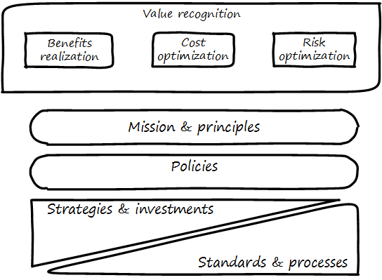

==== Policy and compliance

===== Policy management

ifdef::collaborator-draft[]

anchor:how-policy-begins[]
****
*Collaborative*

 Status: This section is first draft as of 27 June 2016. Comments appreciated.

include::../../../collab-links.adoc[]

****

endif::collaborator-draft[]

****
*How policy begins*

Your company was incorporated long ago, but the "board" was always a bit of a joke. The three people who started the company were the directors of record, and they would have an annual "meeting" at the local bar where enough paperwork would be done to satisfy the company lawyer.

Your company did well, and accumulated enough cash to purchase another company, run in much the same way. The people who owned the company being acquired were good, and your company didn't want to lose them, so in addition to senior management positions, they were offered equity -- a share of ownership in the new combined firm.

This raised the topic, "how is the new firm directed?" One of the incoming shareholders wanted a seat on the "board," even though neither company had done much with board-level governance.

The lawyer and accountant hired to assist with the merger also recommended that as part of the acquisition, a formal audit be conducted of both firms (which had never been done).

This audit came back generally clean, but shone a light on differences in how the companies had operated, and unearthed some irregularities.

For example, your company had started to purchase phones for all employees, while the acquired company was pure BYOD (Bring Your Own Device). One company had corporate credit cards, while the other was requiring people to carry their own expenses for reimbursement. One company had an informal "understanding" that first class travel was OK for Asian trips at least, while the other didn't, but neither had written anything down. And so on.

The lawyer said, "I think you need some policies," and everybody groaned. One person said, "I just read about Nordstrom. All they say is "Use Good Judgment." Why do we need anything more?"

The lawyer said, "Um, that's an urban legend. The actual Nordstrom Code of Business Conduct and Ethics, while it starts off with that, runs about 8,000 words and covers a variety of topics such as handling customer information, using technology, social media, and so forth."

And the new CFO said, "Look, I get that we want to stay agile, and keep our informal culture. I'm no fan of policy for the sake of policy. But I need those policies to keep *my* staff costs down. Two different expense approaches alone is going to kill me, and that's only one of twenty issues we've uncovered here. \'Do the right thing' doesn't cut it. We've got to have some means for establishing a baseline with new employees, someplace people can turn to when they don't know what the expectation is."

The HR director chimed in. "If we don't document our official position on things like  harassment we are going to have problems. We could fire someone who has done something really bad, and they could sue us for wrongful termination. Or their victims could sue us for failing to prevent the issue. That could cost us real money." The lawyer nodded and the company owners looked thoughtful.

Another person spoke up. "I came from a company that had a 500-page policy manual. It went down into way too much detail and was always out of date. No-one could find anything in it, and there would be stuff that was just wrong because the revision process was broken."

The lawyer said, "You need to keep your policies light and on the general side (like Nordstrom), and cover more detailed topics elsewhere. For example, the exact approach on how to reimburse employee expenses probably doesn't belong in the policy manual. Of course, that means that somewhere you need to lay out how your principles inform your policies which are implemented by processes, procedures, guidelines, and so forth. Your actual employee handbook will probably be thirty or forty pages - sorry. You also should take advantage of your internal intranet and make sure people can find just the policy they need, with related guidance, instead of having to page through a huge document."

Another said, "This is all getting complicated."

"Yes, complexity is to some extent unavoidable as you move to this new scale. I'm a big fan of sunset dates on policies and supporting materials, so you are periodically questioning whether something is still needed. Of course, this drives demand for someone to analyze and update policies - please don't forget that.

"Overall, you need to always keep your outcomes in mind, and continue to push as much decision making down to individuals as you can. COBIT recognizes that culture is one of the critical enablers for governance, and so \'use good judgment' is still a great place to start -- IF you can hire people with good judgment, and continually reinforce them in using it."

see <<Nordstrom2015>>, <<Lucas2014>>
****

ifdef::collaborator-draft[]

****
*Collaborative*

 Status: This section is in active development as of Jun 27 2016. Expect volatility.

include::../../../collab-links.adoc[]

****

endif::collaborator-draft[]

===== The policy ecosystem
[quote, Michael Griffin, "How To Write a Policy Manual"]
Carefully drafted and standardized policies and procedures save the company countless hours of management time. The consistent use and interpretation of such policies, in an evenhanded and fair manner, reduces management's concern about legal issues becoming legal problems.

The above illustration should one way to think about policy. The size of each rectangle corresponds to its detail and extensiveness.

The organization's *Mission and vision* should be terse and high level, perhaps something that could fit on a business card. It should express the organization's reason for being in straightforward terms.

The *Principles and codes* should also be brief. ("Codes" can include codes of ethics or codes of conduct.) For example, Nordstrom's is about 8,000 words, perhaps about 10 pages.

*Policies* are more extensive. There are various kinds of policies:

In a non-IT example, a compliance policy might identify the Foreign Corrupt Practices act and make it clear that bribery of foreign officials is unacceptable. Similarly, an HR policy might spell out acceptable and unacceptable side jobs (e.g., someone in the banking industry might be forbidden from also being a mortgage broker on their own account).

Policies are often independently maintained documents, perhaps organized along lines similar to:

* Employment and HR policies
* Whistleblower policy (non-retaliation)
* Records retention
* Privacy
* Workplace guidelines
* Travel and expense
* Purchasing and vendor relationships
* Use of enterprise resources
* Information security
* Conflicts of interest
* Regulatory

(not a comprehensive list)

Policies, even though more detailed than codes of ethics/conduct, still should be written fairly broadly. In many organizations, they must be approved by the governing board. They should therefore be independent of  technology specifics. An information security policy may state that the hardening guidelines must be followed, but the hardening guidelines (stipulating for example what services and ports are allowable on Debian Linux) are *not* policy.

There may be various levels or classes of policy.

Finally, policies reference *Standards and processes* and other xref:enablers[enablers] as appropriate. This is the management level, where documentation is specific and actionable. Guidance here may include:

* Standards
* Baselines
* Guidelines
* Processes and procedures

These concepts may vary according to organization, and can become quite detailed. In general, standard and baselines refer to some intended or documented state the organization uses as a reference point. An example might be "we run Debian Linux 16.10 unless there is a compelling business reason to do otherwise." Even more detail is seen in hardening guidelines. A behavioral baseline might be "Guests are expected to sign in and be accompanied when on the data center floor."

We will discuss technical baselines further in the chapter section on security, and also in our discussion of the technology product lifecycle in Chapter 12. See also Shon Harris' excellent CISSP Exam Guide <<Harris2013>> for much more detail on these topics.

 examine competing texts for the level they go on this topic in particular

===== Policy lifecycle

Don't overcomplicate

Lifecycle/sunset!

===== Compliance
[quote, COBIT for Risk]
The enterprise function responsible for insight into the enterprise risk related to regulations, legal mandates and internal policies and standards.

===== Regulations of note
* HIPAA
* SOX
* FERPA
* PCI DSS
* GLBA PII (NIST)

(summarize each of these)

Note that some of these regulations call for policy management.

NOTE: Some companies need to institute formal policies quite early. Even a startup may need written policies, if it is concerned with regulations such as HIPAA. However, this may be done on an ad-hoc basis, perhaps outsourced to a consultant. (A startup cannot afford a dedicated VP of Policy and Compliance.) This topic is covered in detail in this section because at enterprise scale, ongoing policy management and compliance must be formalized.

===== Compliance practices
discuss how they play out in terms of GRC

 Policy is not just about risk. That's why risk comes later. Policy is also about effectiveness, e.g. understanding cost of delay, not overburdening ... we understand risk as risk of loss, not ineffectiveness... but we still control for our policies that are intended to promote effectiveness...

Overlaps with enablers

Assurance and audit next up
