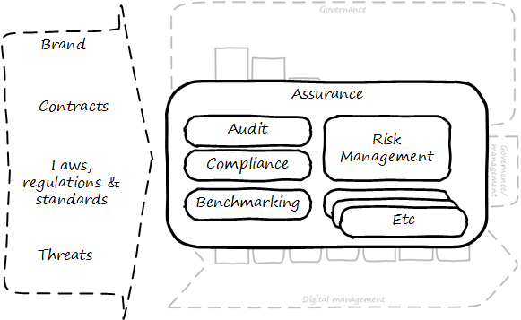

==== Assurance and audit

ifdef::collaborator-draft[]

****
*Collaborative*

 Status: This section is first draft as of 5 July 2016. Comments appreciated.

include::../../../collab-links.adoc[]

****

endif::collaborator-draft[]

===== Assurance

[quote, Russian proverb]
Trust, but verify.

Assurance is a broad term. In this book, it is associated with governance. It represents a form of additional confirmation that management is performing its tasks adequately.

Go back to the xref:gov-shop-example[example] that started the chapter, of the shop owner hiring a manager. Suppose that this relationship has continued for some time, and while things seem to be working OK, the owner has doubts about the arrangement.

Over time, things have gone well enough that the owner does not worry about the shop being opened on time, having sufficient stock, or paying suppliers. But are any number of doubts the owner might retain:

* Is money being accounted for honestly and accurately?
* Is the shop clean? Is it following local regulations? For example, fire, health and safety codes?
* If the manager selects a new supplier, are they trustworthy? Or is the shop at risk of selling counterfeit or tainted merchandise?
* Are the shop's prices competitive? Is it still well regarded in the community? Or has its reputation declined with the new manager?
* Is the shop protected from theft and disaster?

These kinds of concerns remain with the owner, by and large, even with a reliable and trustworthy manager. If not handled correctly, the owner's entire investment is at risk. The manager may only have a salary (and perhaps a profit share) to worry about, but if the shop is closed due to violations, or lawsuit, or lost to a fire, the owner's entire life investment may be lost.

These concerns give rise to the general concept of assurance, which applies to digital business just as it does to small retail shops.

The following diagram, derived from previous illustrations, shows how this book views assurance: as a set of practices overlaid across the enablers, and in particular concerned with external forces.

As ISACA stipulates,

_The IS audit and assurance function shall be independent of the area or activity being reviewed to permit objective completion of the audit and assurance engagement._ <<ISACA2014>>, p.9. Assurance can be seen as an external, additional mechanism of control and feedback. This independent, out-of-band aspect is essential to the concept of assurance.

image::images/Assurance.png[]

****
*Assurance is like out-of-band management*

In terms of the governance-management interface, assurance is fundamentally distinct from the information provided by management and must travel through distinct communication channels. This is why auditors (for example) forward their reports directly to the audit committee, and do not route them through the executives who have been audited.

Technologists, especially those with a background in networking, may have heard of the concept of "out of band control." With out of band management or control of IT resources, the channel over which management commands travel is distinct from the channel over which the system provides its services.

This channel separation is done to increase security, confidence, and reliability, and is analogous to assurance.
****

anchor:3-party-model[]

====== Three party foundation

[quote, ISAE 3000 (Revised),Assurance Engagements Other than Audits or Reviews of Historical Financial Information]
Assurance engagement―An engagement in which a practitioner aims to obtain sufficient appropriate evidence in order to express a conclusion designed to enhance the degree of confidence of the intended users other than the responsible party about the subject matter information (that is, the outcome of the measurement or evaluation of an underlying subject matter against criteria).

[quote, Cobit 5 for Assurance]
Assurance means that, pursuant to an accountability relationship between two or more parties, an IT audit and assurance professional may be engaged to issue a written communication expressing a conclusion about the subject matters to the
accountable party.

There are broader and narrower definitions of assurance. But all reflect some kind of three-party arrangement:

image::images/4.10-3Party.png[]

_reflects concepts from <<ISACA2013b>> and <<IAASB2013>>_

The above diagram is *one* common scenario:

The stakeholder (e.g. the audit committee of the board of directors) engages an assurance professional (e.g. an audit firm). The scope and approach of this is determined by the engaging party, although the accountable party in practice often has input as well.

The accountable party, at the direction responds to  the assurance professional's inquiries on the audit topic.

The assurance professional provides the assessment back to the engaging party, and/or other users of the report (potentially including the accountable party).

This is a simplified view of what can be a more complex process and set of relationships. The ISAE3000 standard states that there must be at least three parties to any assurance engagement:

* The responsible (accountable) party
* The practitioner
* The intended users (of the assurance report)

But there may be additional parties:

* The engaging party
* The measuring/evaluating party (sometimes not the practitioner, who may be called on to render an opinion on someone *else's* measurement)

ISAE3000 goes on to stipulate a complex set of business rules for the allowable relationships between these parties <<IAASB2013>>, pp 95-96. Perhaps the most important rule is that the practitioner *cannot* be the same as either the responsible party, or the intended users. There must be some level of professional objectivity.

What's the difference between assurance and simple consulting? There are two major factors:

* Consulting can be simply a two-party relationship - a manager hires someone for advice
* Consultants do not necessarily apply strong assessment criteria. Indeed, with complex problems, there may not be any such criteria. Assurance in general presupposes some existing standard of practice, or at least some benchmark external to the organization being assessed.

Finally, the concept of assurance criteria is key. Some assurance is executed against the responsible party's own criteria. In this form of assurance, the primary questions are "are you documenting what you do, and doing what you document?" That is, for example, do you have formal process management documentation (as discussed in xref:process-def[Chapter 9])? And are you following it?

Other forms of assurance use *external* criteria. A good example is the Uptime Institute's data center tier certification criteria, discussed below.

If criteria are weak or non-existent, the assurance engagement may be more correctly termed an advisory effort. Assurance requires clarity on this topic.

====== Types of assurance
[quote, Max Ehrmann, "Desiderata"]
Exercise caution in your business affairs; for the world is full of trickery.

The general topic of "assurance" implies a spectrum of activities.

In the strictest definitions, assurance is provided by licensed professionals under highly formalized arrangements. However, *while all audit is assurance, not all assurance is audit.* As noted in COBIT for Assurance, "assurance also covers evaluation activities not governed by internal and/or external audit standards." <<ISACA2013a>> p15.

This is a blurry boundary in practice, as an assurance engagement may be undertaken by auditors, and then might be casually called an "audit" by the parties involved. And there is a spectrum of organizational activities that seem at least to be related to formal assurance:

* Brand assurance
* Quality assurance
* Vendor assurance
* Capability assessments
* Attestation services
* Certification services
* Compliance
* Risk management
* Benchmarking
* Other forms of "due diligence"

Some of these activities may be managed primarily internally, but even in the case of internally-managed activities, there is usually some sense of governance, some desire for objectivity.

From a purist perspective, internally directed assurance is a contradiction in terms. There is a conflict of interest in that in terms of the xref:3-party-model[three-party model] above, the accountable party is the practitioner.

However, it may well be less expensive for an organization to fund and sustain internal assurance capabilities and get much of the same benefits as from external parties. This requires sufficient organizational safeguards be instituted. Internal auditors typically report directly to the Board-level audit committee, and generally are not seen as having a conflict of interest.

In another example, an internal compliance function might report to the corporate general counsel (chief lawyer), and not to any executive whose performance is judged based on their organization's compliance -- this would be a conflict of interest. However, because the internal compliance function is ultimately under the CEO, their concerns can be overruled.

The various ways that internal and external assurance arrangements can work, and can go wrong, is a long history. If you are interested in the topic, review the histories of Enron, Worldcom, the 2008 mortgage crisis, and other such failures.

====== Non-audit assurance examples

[quote, James DeLuccia, "Successfully Establishing and Representing DevOps in an Audit"]
Businesses must find a level of trust between each other  . . .  3rd party reports provide that confidence. Those issuing the reports stake their name & liability with each issuance.

Before we turn to a more detailed discussion of audit, we'll discuss some specifically non-audit examples of assurance seen in IT and digital management.

*Example 1: Due diligence on a Cloud provider*

Your company is considering a major move to Cloud infrastructure for its systems. The agility value proposition -- the ability to minimize xref:cost-of-delay[Cost of Delay] -- is compelling, and there may be some cost structure advantages as well.

But you are aware of some Cloud failures:

* In 2013, UK Cloud provider 2e2 went bankrupt and customers were given "24 to 48 hours to get ... data and systems out and into a new environment" <<duPreez2015>>. Subsequently, the provider demanded nearly £1 million pounds (roughly $1.5 million) from its customers in order for their uninterrupted access to services (i.e., their data.) <<Venkatraman2013>>
* Also in 2013, Cloud storage provider Nirvanix went bankrupt and its customers also had a limited time to remove their data. MegaCloud went out of business with no warning two months later and all customers lost all data. <<Butler2013>>, <<Butler2014>>
* In mid-2014, online source code repository Cloud Spaces (an early Github competitor) was taken over by hackers and destroyed. All data was lost. <<Venezia2014>>, <<Marks2014>>

The question is, how do you manage the risks of trusting your data and organizational operations to a Cloud provider? This is not a new question, as computing has been outsourced to specialist firms for many years. You want to be sure that their operations meet certain standards:

* Financial standards
* Operational standards
* Security standards

Data center evaluations of cloud providers are a form of *assurance*. Two well known approaches are:

* The Uptime Institute's Tier Certification
* The American Institute of Certified Public Accountants' (AICPA) SOC 3 "Trust Services Report" certifying "Service Organizations" (based in turn on the SSAE-16 standard)

The Uptime Institute provides the well-known "Tier" concept for certifying data centers, from Tier I to Tier IV. In their words, "Certification provides assurances that there are not shortfalls or weak links anywhere in the data center infrastructure." <<Uptime2016>>. The Tiers progress as follows <<Uptime2014>>:

* Tier I: Basic Capacity
* Tier II: Redundant Capacity Components
* Tier III: Concurrently Maintainable
* Tier IV: Fault Tolerance

Uptime Institute certification is a generic form of assurance in terms of the xref:3-party-model[3-party model]; the data center operator must work with the Uptime Institute who provides an independent opinion based on their criteria as to the data center's tier (and therefore effecctiveness).

The SOC 3 report is considered an "assurance" standard as well. However, as mentioned above, this is the kind of "assurance" done in general by licensed auditors, and which might casually be called an "audit" by the participants. A qualified professional, again in the 3-party model, examines the data center in terms of the SSAE 16 reporting standard.

Your internal risk management organization might look to both Uptime Institute and SOC 3 certification as indicators that your Cloud provider risk is mitigated. (More on this in chapter section on Risk Management.)

*Example 2: Internal process assessment*

You may also have concerns about your internal operations. Perhaps your process for selecting technology vendors is unsatisfactory in general; it takes too long and yet vendors with critical weaknesses have been selected. More generally, the actual practices of various areas in your organization may be assessed by external consultants using the related guidance:

* Enterprise Architecture with TOGAF
* Project Management with PMBOK
* IT processes such as Incident Management, Change Management, and Release Management with ITIL or CMMI-SVC

These assessments may be performed through using a maturity scale, e.g. CMM-derived. The CMM-influenced ISO/IEC 15504 standard may be used as a general process assessment framework. (Remember that we have discussed the xref:problem-statisical-process[problems] with the fundamental CMM assumptions on which such assessments are based.)

*Example 3: Competitive benchmarking*

Finally, you may wonder, "how does my digital operation compare to other companies?" Now, it is difficult to go to a competitor and ask this. It's also not especially practical to go and find some non-competing company in a different industry you don't understand well. An entire industry has emerged to assist with this question.

We talked about the role of xref:industry-analysts[industry analysts] in chapter 8. Benchmarking firms play a similar role, and in fact some analyst firms provide benchmarking services.

There are a variety of ways benchmarking is conducted, but it is similar to assurance in that it often follows the xref:3-party-model[3-party model]. Some stakeholder directs an accountable party to be benchmarked within some defined scope. For example, the number of staff required to managed a given quantity of servers (aka admin:server) has been a popular benchmark. (Note that with cloud, virtualization, and containers, the usefulness of this metric is increasingly in question.)

An independent authority is retained. The benchmarker collects, or has collected, information on similar operations; for example, they may have collected data from 50 organizations of similar size on admin:server ratios. This data is aggregated and/or anonymized so that competitive concerns are reduced. Wells Fargo will not be told "JP Morgan Chase has an overall ratio of 1:300;" they will be told "Average for financial services is 1:250."

In terms of formal assurance principles, the benchmark data becomes the assessment criteria. A single engagement might consider dozens of different metrics, and where simple quantitative ratios do not apply, the benchmarker may have a continuously maintained library of case studies for more qualitative analysis. This starts to shade into the kind of work also performed by industry analysts. As the work becomes more qualitative, it also becomes more advisory, and less about "assurance" per se.

===== Audit
[quote, Cadbury Report]
The Committee therefore recommends that all listed companies should establish an audit committee.

[quote, Scott Ambler, Disciplined Agile Delivery]
Agile or not, a team ultimately has to meet legal and essential organizational needs, and audits help to ensure this.

If you look up "audit" online or in a dictionary, you will see it mainly defined in terms of finance: an audit is a formal examination of an organization's finances (sometimes termed "books"). Auditors look for fraud and error, so that investors (like our xref:gov-shop-example[shop owner]) have confidence that accountable parties (e.g. the shop manager) are conducting business honestly and accurately.

Audit is critically important to the functioning of the modern economy, because there are great incentives for theft and fraud, and owners (in the form of shareholders) are remote from the business operations.

But what does all this have to do with information technology and digital transformation?

Digital organizations of course have budgets and must account for how they spend money. Since financial accounting and associated audit practices is a well established practice, we won't discuss it here. (We discussed IT financial management and service accounting in xref:financial-mgmt[Chapter 8].)

Money represents a form of information, that of value. Money once was stored as precious metal. When carrying large amounts of precious metal became impossible, it was stored in banks and managed through paper record keeping.

image::images/4.10-money-compute.png[]
_Money, from physical to virtual_

https://www.flickr.com/photos/tao_zhyn/442965594
https://www.flickr.com/photos/peagreenchick/396463634/
https://www.flickr.com/photos/intelfreepress/6722296265/

_All commercial use allowed_

Paper record keeping migrated onto computing machines, which now represent the value once associated with gold and silver. Bank deposits (our xref:what-is-IT-value[digital user's] bank account balance from Chapter 1) are now no more than a computer record -- digital bits in memory -- made meaningful by tradition and law, and secured through multiple layers of protection and assurance.

Because of this, auditors became increasingly interested in information technology. Clearly, these new electronic computers could be used to commit fraud in new and powerful ways. Auditors had to start asking, "How do you know the data in the computer is correct?"

This led to the formation in 1967 of the Electonic Data Processing Auditors Association (EDPAA), which eventually became ISACA (developer of xref:COBIT[COBIT]).

It also became clear that computers and their associated operation were a notable source of cost and risk for the organization, even if they were not being directly used for financial accounting. This has led to the direct auditing of information technology practices and processes, as part of the broader assurance ecosystem we are discussing in this chapter section.

A wide variety of IT practices and processes may be audited. Auditors may take a general interest in whether the IT organization is "documenting what it does and doing what it documents" and therefore this author has seen nearly every IT process audited.

IT auditors may audit projects in particular, checking that the expected project methodology is being followed. They may audit IT performance reporting, such as claims of meeting Service Level Agreements. And they audit the organization's security approach - both its definition of security policies and controls, as well as their effectiveness.

====== External versus internal audit

There are two major kinds of auditors of interest to us:

* External auditors
* Internal auditors

Here is a definition of external auditor:

_An external auditor is chartered by a regulatory authority to visit an
enterprise or entity and to review and independently report the results of that review._ <<Moeller2013>>, p. 319.

Many accounting firms offer external audit services, and the largest accounting firms (such as PriceWaterhouse Coopers and Ernst & Young) provide audit services to the largest corporations. External auditors are usually certified public accountants, licensed by their state, and following industry standards (e.g. from the American Institute of Certified Public Accountants).

By contrast, internal auditing is housed internally to the organization, as defined by the Institute of Internal Auditors:

_Internal auditing is an independent appraisal function established within an organization to examine and evaluate its activities as a service to the organization._ <<Moeller2013>>, p. 320. Internal audit is considered a distinct but complementary function to external audit. <<Cadbury1992>>, 4.39. The internal audit function usually reports to audit committee. As  with assurance in general, independence is critical - auditors must have organizational distance from those they are auditing, and must not be restricted in any way that could limit the effectiveness of their findings.

====== Audit practices
As with other forms of assurance, audit follows the xref:3-party-model[3-party model]. There is a stakeholder, an accountable party, and an independent practitioner. The typical internal audit lifecycle consists of (derived from <<ISACA2013a>>):

* Planning/scoping
* Performing
* Communicating

In the scoping phase, the parties are identified (e.g. the board audit committee, the accountable and responsible parties, the auditors, and other stakeholders.)

The scope of the audit is very specifically established, including objectives, controls, and enablers (e.g. processes) to be tested. Appropriate frameworks may be utilized as a basis for the audit, and/or the organization's own process documentation.

The audit is then performed.

A variety of techniques may be used by the auditors:

* Performance of processes or their steps
* Inspection of previous process cycles and their evidence (e.g. documents, recorded transactions, reports, logs, etc.)
* Interviews with staff
* Physical inspection or walkthroughs of facilities
* Direct inspection of system configurations and validation against expected guidelines
* Attempting what should be prevented (e.g. trying to access a secured system, or view data over the authorization level)

A fundamental principle is, "expected versus actual." There must be some expected result to a process step, a calculation, etc, that the actual result can be compared to.

Finally, the audit results are reported to the agreed users (often with a preliminary "heads up" cycle so that people are not blindsided). Deficiencies are identified in various ways, and typically are taken into system and process improvement projects.
