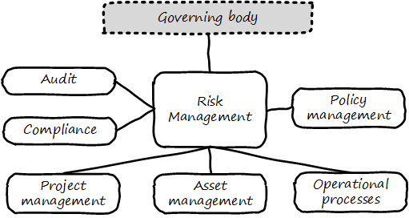

==== Risk management

ifdef::collaborator-draft[]

****
*Collaborative*

 Status: This section is active development as of 5 July 2016. Expect volatility.

include::../../../collab-links.adoc[]

****

endif::collaborator-draft[]

===== Risk management fundamentals

[quote, Committee of Sponsoring Organizations of the Treadway Commission, Internal Control - Integrated Framework]
Risk is defined as the possibility that an event will occur and adversely affect the achievement of objectives.

Risk is a fundamental concern of governance. Management may focus on effectiveness and efficiency well enough, but too often disregards risk. As we noted above, the shop manager may have incentives to maximize income, but usually does not stand to lose their life savings. The owner, however, does. Fire, theft, disaster - without assurance, including risk management, the owner does not sleep well.

For this reason, risk management is a large element of governance, as indicated by the popular GRC acronym: Governance, Risk, and Compliance.

Risk management may be seen as part of the broader assurance ecosystem as discussed in the last chapter section (for evidence of this, consider that the Institute of Internal Auditors offers a certificate in Risk Management Assurance). Assurance in practice may seem to be biased towards risk management, but (as with governance in general) assurance as a whole relates to all aspects of IT and digital governance, including effectiveness and efficiency.

Audit practices may be informed by known risks and particularly concerned with their mitigation, but risk management remains a distinct practice. Audits may have scope beyond risks, and audits are only one tool used by risk management.

image::images/4.10-AssuranceRisk.png[]

In short, and as shown in the above diagram, assurance plays a role across value recognition, while risk management specifically targets the value recognition objective of risk optimization.

****
*Defining "Risk"*

The definition of "risk" is surprisingly controversial. The ISO 31000 standard <<ISO2009>> and the Project Management Institute's PMBOK <<PMI2013>>  both define risk as including positive outcomes (benefits).  This definition has been strongly criticized by (among others) Douglas Hubbard in _The Failure of Risk Management_ <<Hubbard2009>>. Hubbard points out that traditionally, risk has meant the chance and consequences of loss.

As this is an an overview text, we will use the more pragmatic, historical definition. Practically speaking, Operational Risk Management  as a function focuses on loss. The possibility ("risk") of benefits is eagerly sought by the organization as a whole and does not need "management" by a dedicated function.

"Loss," however, can also equate to "failure to achieve anticipated gains." This form of risk applies (for example) to product and project investments.
****

Risk management can be seen as both a xref:process-function[function and a process]. As a function, it may be managed by a dedicated organization (perhaps called Enterprise Risk Management or Operational Risk Management.) As a process, it conducts the following activities:

* Identifying risks
* Assessing and prioritizing them
* Coordinating effective responses to risks
* Ongoing monitoring and reporting of risk management

Risk impacts some asset. Examples in the digital and IT context would include:

* Operational IT systems
* Hardware (e.g. computers) and facilities (e.g. data centers)
* Information (customer or patient records)

It is commonly said that organizations have an "appetite" for risk (<<ISACA2013>>, p. 79), in terms of the amount of risk the organization is willing to accept. This is a strategic decision, usually reserved for organizational governance.

Risk management typically has strong relationships with the following organizational capabilities:

* Enterprise governance (e.g. board-level committees)
* Security
* Compliance
* Audit
* Policy management

For example, security requires risk assessment as a input, so that security resources focus on the correct priorities.

Risk additionally may interact with:

* Project management
* Asset management
* Processes such as Change Management

and other digital activities.

More detail on core risk management activities follows, largely adopted from the COBIT for Risk publication (<<ISACA2013>>).

====== Risk identification

There are a wide variety of potential risks, and many accounts and anecdotes constantly circulating. It is critical that risk identification start with a firm understanding of the organization's objectives and context.

Risk identification can occur both in a "top down" and "bottom up" manner. Industry guidance can assist the operational risk management function in identifying typical risks. For example, the COBIT for Risk publication includes a useful 8 page "Generic Risk Scenarios" section (<<ISACA2013>>, pp. 67-74) identifying risks such as

* "Wrong programmes are selected for implementation and are misaligned with corporate strategy and priorities"
* "There is an earthquake."
* "Sensitive data is lost/disclosed through
logical attacks."

These are only three of dozens of scenarios. A wide variety of scenario areas are suggested:

* Investment
* Sourcing
* Operations
* Availability
* Continuity
* Security

and so forth. The same guidance also strongly cautions against over-reliance on these generic scenarios.

====== Risk assessment

Risk management has a variety of concepts and techniques both qualitative and quantitative. Risk is often assumed to be the product of probability * impact. For example, if the chance of a fire in a facility is 5% over a given year, and the damage of the fire is estimated at $100,000, the annual risk is $5,000. An enterprise risk management function may attempt to quantify all such risks into an overall portfolio.

Where quantitative approaches are perceived to be difficult, risk may be assessed using simple ordinal scales (e.g. 1-5, where 1 is low risk and 5 is high risk.) COBIT for Risk expresses concern regarding "The use of ordinal scales for expressing risk in different categories, and the mathematical difficulties or dangers of using these numbers to do any sort of calculation." <<ISACA2013>>, p. 75. Such approaches are criticized by Doug Hubbard in _The Failure of Risk Management_ as misleading and potentially more harmful than not managing risk at all <<Hubbard2009>>.

Hubbard instead suggests that quantitative techniques such as Monte Carlo analysis are rarely infeasible, and recommends their application instead of subjective scales.

The enterprise can also consider evaluating scenarios that have a chance of occurring simultaneously. This is frequently referred to as ‘stress’ testing.

====== Risk response
[quote, Menander, 342 BC - 291 BC]
He who fights and runs away, lives to fight another day.

Risk response includes several approaches:

* Avoidance
* Acceptance
* Transference
* Mitigation

*Avoidance* means ending the activities or conditions causing the risk; e.g., not engaging in a given initiative or moving operations away from risk factors.

*Acceptance* means no action is taken. Typically, such "acceptance" must reside with an executive.

*Transference* means that some sharing arrangement, usually involving financial consideration, is established. Common transfer mechanisms include outsourcing and insurance. (Recall our discussion of Agile approaches to xref:contract-mgmt[contract management] and risk sharing.)

*Mitigation* means that some compensating mechanism -- one or more "controls" is established. This topic is covered in the next section, and comprises the remainder of the material on risk management.

_The above discussion was largely derived from <<ISACA2013>>_.

===== Controls
[quote, Committee of Sponsoring Organizations of the Treadway Commission, Internal Control - Integrated Framework]
Internal control is a process, effected by an entity's board of directors, management, and other personnel, designed to provide reasonable assurance regarding the achievement of objectives relating to operations, reporting, and compliance.

[quote, ISACA, COBIT 5 for Assurance]
The term 'control objective' is no longer a mainstream term used in COBIT 5, and the word 'control' is used only rarely. Instead, COBIT 5 uses the concepts of process practices and process activities.

Management controls are the organization, policies, and procedures used by agencies to reasonably ensure that

• programs achieve their intended results;
• resources are used consistent with agency mission;
• programs and resources are protected from waste, fraud, and mismanagement;
• laws and regulations are followed; and
• reliable and timely information is obtained, maintained, reported and used
for decision making.-'
Have existed from ancient times

****
The loaded term "control"
Controls language can be a barrier - it's a technical term of art

A "controlling" relationship

The technical term from control theory - error deliberately introduced to a function to move it in a desired direction (check Tunde)

COBIT no longer uses term. "" <<ISACA2013a>> p. 57.
****

====== COSO

Because it is so essential, official statements defining control carry much influence. The leading definition of internal control and its related practices is published by the Council of Sponsoring Organizations of the Treadway Commission (COSO).

*What is COSO?*

The Council of Sponsoring Organizations of the Treadway Commission (COSO) has a non-intuitive name, especially given its global influence.

COSO is a "private sector initiative," funded by:

* Institute of Certified Public Accountants (AICPA),
* American Accounting Association (AAA),
* Financial Executives International (FEI),
* Institute of Internal Auditors (IIA)
* Institute of Management Accountants (IMA).

It was founded in 1985 to support the National Commission on Fraudulent Financial Reporting, and has published various reports and guidance mostly concerned with the topic of internal control.

****
Control activities are the actions established through policies and procedures that help ensure that management's directives to mitigate risks to the achievement of objectives are carried out. Control activities are performed at all levels of the entity, at various stages within business processes, and over the technology environment. They may be preventive or detective in nature and may encompass a range of manual and automated activities such as authorizations and approvals, verifications, reconciliations, and business performance reviews.

Ongoing evaluations, separate evaluations, or some combination of the two are used to ascertain whether each of the five components of internal control, including controls to effect the principles within each component, is present and functioning. Ongoing evaluations, built into business processes at different levels of the entity, provide timely information. Separate evaluations, conducted periodically, will vary in scope and frequency depending on assessment of risks, effectiveness of ongoing evaluations, and other management considerations. Findings are evaluated against criteria established by regulators, recognized standard-setting bodies or management and the board of directors, and deficiencies are communicated to management and the board of directors as appropriate.
<<COSO2013>>

Concern: "recognized standard-setting bodies" - who? ISACA? Axelos?

****

====== Control categories
In this section we'll continue to use the generic term control as ultimately COBIT did not provide a good, terse substitute. "Testing enablers" is not how auditors talk.

Ultimately, controls are Lines of defence (COBIT for Risk)

Control functions (CISSP)
Deterrent
Preventive
Corrective
Recovery
Detective
Compensating

Typical general control types

* Separation of duties
* Audit trails
* Confidentiality and integrity
* Documentation

"Separation of duties" is very general and might be specified by activity type, e.g.

* Purchasing
* System development
* Sales revenue recognition

All of these would require distinct approaches to separation of duties. Some of this may be explicitly defined; if there is no policy or control specific to a given activity, an auditor may identify this as a deficiency.

Policies may set overall control objectives, but typically not at an operational level.

****
audit reports on the status of internal controls have been an ongoing issue between external auditors, the SEC, and other interested parties going back to at least 1974.

Under SOx, a separate and independent function within the enterprise—often internal or IT audit—reviews and documents the internal controls covering key processes, identifies key control points, and then tests those identified controls. External audit would then review that work and attest to their adequacy. For many enterprises, IT audit can be a key resource for performing these internal controls reviews for technology-based processes.

Internal and external auditors have historically been separate and independent resources. External auditors were responsible for assessing the fairness of an enter prise's internal control systems and the resultant published financial reports, while internal auditors served management in a wide variety of other areas.

Understanding Control Selection Processes
An enterprise needs to understand the costs and implications of various controls that it may establish as a response to various identified risks

While there have been many definitions of internal controls in past years,a good general definition for IT governance is that internal control is a process, effectedby an entity's board of directors, management, and other personnel, and designed toprovide reasonable assurance regarding the achievement of objectives in the effectiveness and efficiency of operations, the reliability of an enterprise's financial reporting, andan enterprise's IT systems and processes, all in compliance with laws and regulations.

An enterprise unit or process has good Internal controls If It (1) accomplishes Its statedmission In an ethical manner, (2) produces accurate and reliable data, (3) complies withapplicable laws and enterprise policies, (4) provides for the economical and efficient usesof Its resources, and (5) provides for appropriate safeguarding of assets. All members ofan enterprise are responsible for the Internal controls In their area of operation and foroperating them effectively.

That is. if a standard says that "management should monitor" some process or activity, the enterprise group supporting this area should be in a posi tion to demonstrate this monitoring activity through some level of documentation. [or automated event stream that is actionable]  <<Moelle2013>>
****

"Working to rule" - when they proliferate - demand implications

controls theater - cargo cult controls

==== Compliance

compliance is an information problem as well as a risk problem - ongoing stream of regs....

===== Compliance fundamentals
discuss how they play out in terms of GRC

 Policy is not just about risk. That's why risk comes later. Policy is also about effectiveness, e.g. understanding cost of delay, not overburdening ... we understand risk as risk of loss, not ineffectiveness... but we still control for our policies that are intended to promote effectiveness...

 governance & innovation

 governance & efficiency

 governance & risk

 Overlaps with enablers

 Contracts - vendor & customer

===== Regulations of note
 * HIPAA
 * SOX
 * FERPA
 * PCI DSS
 * GLBA PII (NIST)

 (summarize each of these)

 Note that some of these regulations call for policy management.

 NOTE: Some companies need to institute formal policies quite early. Even a startup may need written policies, if it is concerned with regulations such as HIPAA. However, this may be done on an ad-hoc basis, perhaps outsourced to a consultant. (A startup cannot afford a dedicated VP of Policy and Compliance.) This topic is covered in detail in this section because at enterprise scale, ongoing policy management and compliance must be formalized.

===== Ethics
