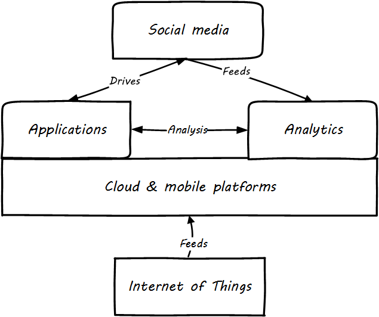

==== Analytics

ifdef::instructor-ed[]
****
Instructor's note:

This is a brief discussion, because many aspects of big data, analytics, and data science are specific forms of product development. This book for example has avoided detailed discussion of programming languages or current vendor products. Similarly, the intent here is to explore the background and management implications of big data, analytics, and data science, not to discuss specific techniques or products in any detail.

****
endif::instructor-ed[]

===== Analytics in context

[quote, Tom Davenport and Jeanne Harris, Competing on Analytics]
...analytical competitors wring every last drop of value from business processes and key decisions.

One important aspect of digital product development is data analytics. Analysis of organizational records has always been a part of any concern large enough to have formal records management. The word for this originally was simply "reporting." A set of files or ledgers would be provided to one or more clerks, who would manually review them and extract the needed figures.

_Reporting and analytics, old style_ footnote:[_Image credit https://www.flickr.com/photos/seattlemunicipalarchives/3347281230, commercial use permitted_]

The compilation of data from physical sources, and its analysis for the purposes of organizational strategy, was distinct from the day to day creation and use of the data. The clerk who attended to the customer and updated their account records, had a different role than the clerk who added up the figures across dozens or hundreds of accounts for the annual corporate report.

What do we mean by the words "analysis" or "analytics" in this older context? Just compiling totals and averages was expensive and time-consuming. Cross-tabulating data (e.g. to understand sales by region) was even more so.

As information became more and more automated, the field of "Decision Support" (and its academic partner "Decision Sciences") emerged. The power of extensively computerized information, that could support more and more ambitious forms of analysis, gave rise to the concept and practice of "Data Warehousing" <<Inmon1992>>.

A robust profession and set of practices emerged around data warehousing and analytics. And as infrastructure became more powerful and storage less expensive, the idea of full-lifecycle or closed-loop analytics originated.

When analyzing data is costly and slow, the data analysis can only affect large, long-cycle decisions. It is not a form of fast feedback. The annual report may drive next year's product portfolio investment decisions, but it cannot drive the day to day behavior of sales, marketing, and customer service:

anchor:analytics-context[]

image::images/4.11-oldCycle.png[]

However, as analysis becomes faster and faster, it can inform operational decisions.

image::images/4.11-newCycle.png[]

And, for certain applications (such as an online traffic management application on your smartphone), analytics is such a fundamental part of the application that it becomes operational. Such pervasive use of analytics is one of the hallmarks of digital transformation.

===== Data warehousing and business intelligence
[quote, Data Management Body of Knowledge]
A Data Warehouse (DW) is a combination of two primary components. The first is an integrated decision support database. The second is the related software programs used to collect, cleanse, transform, and store data from a variety of operational and external sources...Data warehousing is a technology solution supporting Business Intelligence (BI).

[quote, Paul Westerman, Data Warehousing: Using the Wal-Mart Model]
The reason to build a data warehouse is to have the ability to make better decisions faster based on information using current and historic data.

The vision of an integrated data warehouse for decision support is compelling and has provided enough value to support an industry sector of specialized hardware, software, training, and consulting. It can be seen as a common architectural pattern, in which disparate data is aggregated and consolidated for purposes of analysis, reporting, and for feedback into strategy, tactics, and operational concerns.

Here is an illustration of an data warehousing/business intelligence (DW/BI) implementation pattern:

image::images/4.11-DW-BI.png[]

The above diagram expands on the above xref:analytics-context[contextual diagrams], showing the major business areas (Sales etc) as data sources. (In a large organization this might be dozens or hundreds of source systems.) These systems feed a "data services layer" that both aggregates data for analytics, as well as providing direct services such as data cleansing and master data management.

It's important to understand that in terms of this book's emphasis on product-centric development that *the data services layer itself is an internal product.* Some might call it more of a xref:feature-v-component[component than a feature], but it is intended in any case as a general-purpose platform that can support a wide variety of use cases.

"Factoring out" data services in this way may or may not be optimal for any given organization, depending on maturity, business objectives, and a variety of other concerns. However, at scale the skills and practices do become specialized, and so it's anticipated we'll continue to see implementation strategies similar to the above figure.

Notice also that the data services layer is not solely for analytics; it also supports direct operational services.

Here are discussions of the diagrams's various elements:

====== Operational applications

====== Quality analysis

====== Extraction and archiving

====== Master data reconciliation

====== Transformation and load

====== Sourcing and archiving

====== Integrated data warehouse

====== Schema-less lake

====== Mart(s)

====== Statistics

====== Machine learning

====== Visualization

====== Ontology and inference

====== Agile methods meet DW/BI

The need to analyze

iterative/incremental

increase feedback

===== Social, mobile, analtyics and cloud: the next generation
Digital transformation often references the algorithm SMAC:

* Social
* Mobile
* Analytics
* Cloud

Others would add the Internet of Things.

These are not equivalent terms; in fact, they have certain relationships to each other:

