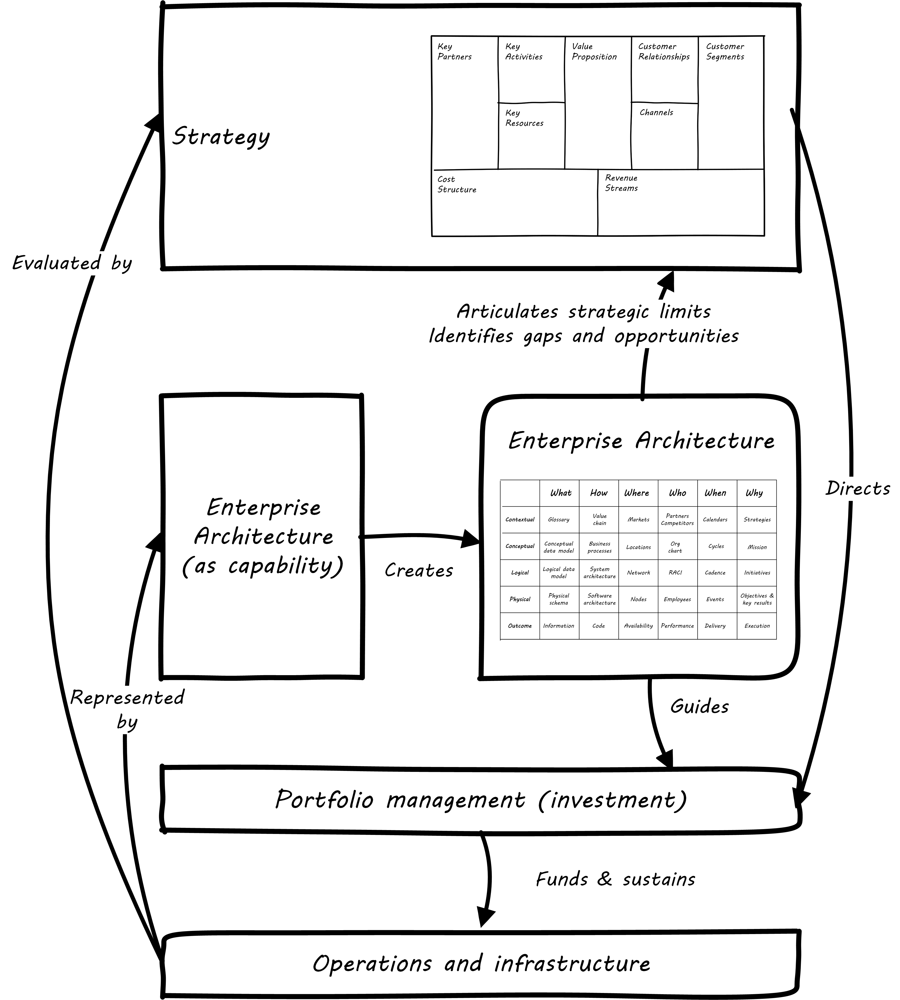

==== Why architecture?
[quote, Fred Brooks, Planning a Computer System: Project Stretch]
Computer architecture, like other architecture, is the art of determining the needs of the user of a structure and then designing to meet those needs as effectively as possible within economic and technological constraints. Architecture must include engineering considerations, so that the design will be economical and feasible; but the emphasis in architecture is upon the needs of the user, whereas in engineering the emphasis is upon the needs of the fabricator. [1962, first published use of the term "architecture" with respect to computing system organization.]

[quote, Grady Booch]
Architecture represents the significant design decisions that shape a system, where significant is measured by cost of change.

"Architecture" is of course a word usually associated with physical construction: buildings, landscapes, etc. It was appropriated by systems engineers at IBM around 1960 to describe the problems of designing complex information processing hardware and software.

This leads to some confusion, and occasional questions from "real" architects as to why IT people are calling themselves "architects." Perhaps a different choice of word would have been advisable.

Regardless, the architecture concept is not something new or foreign. In our journey to date, we have covered:

* Business xref:what-is-IT-value[motivations] and xref:digital-context[context],
* xref:what-is-IT-infrastructure[Infrastructure]
* xref:chapter-app-deliv[Applications],
* xref:prod-mgmt-definition[Products] and/or services,
* xref:organization[Organization] and xref:chap-process-mgmt[process], and
* xref:chap-ent-info-mgmt[Data and information].

We have also covered the practices by which ideas and intentions are established and translated by investment into actions, including:

* Investment of time and resources towards digital objectives (e.g. through xref:project-mgmt[project management]),
* Acquisition of technologies and external services (i.e. xref:it-sourcing[sourcing]),
* xref:resource-mgmt[Hiring of employees],
* xref:gov-chap[Governance] of digital organizations for xref:risk-management[risk], xref:security[security], and other purposes.

*Enterprise architecture is nothing but the unification of these topics into a common, formalized, scalable framework for understanding.*

As we have progressed in our journey, and scaled our company up, all these areas have continued to evolve. Specialization emerges. You have people with deep experience in Cloud architectures, and people with deep experience in e-records management and compliance. You don't have too many who are deep in both.

Your product portfolio (internal and external) is now in the hundreds or thousands. Some were built with the latest technology, and others run on older technologies now perceived to be dead ends. But investing in rewriting them would not provide as much value as other uses of the funds, so you have to manage the risk of the older technology.

Investment decisions become harder. You're far beyond the days when you had a one-product focus. You have multiple interacting products and multiple interacting teams, and the relationship between the teams and products is not one to one. Understanding the business case for the investment gets harder; when you have a thousand services over multiple business units, how do you know if someone is proposing a redundant new one?

And then there are the big headaches. A major commercial product version is going off support, and it's the perfect time to think about a rewrite or replatform (say into the Cloud). But the moving pieces and interdependencies are formidably complex, and if you get the analysis wrong the business impact will be severe. Or a major outage does impact the business, and all of a sudden the organizational priority (from the Board on down) is "fix this so it never happens again." Everything else is to go "on hold." Except, of course, it can't.

In response to these and a thousand other complexities of digital management as organizations scale up, a general purpose coordination capability emerges sometimes called Enterprise Architecture. In this chapter section, we will discuss its definition, organizational dynamics, and value proposition.

===== Defining Enterprise Architecture
[quote, Jeanne Weill and Peter Ross, Enterprise Architecture as Strategy]
The enterprise architecture is the organizing logic for business processes and IT infrastructure, reflecting the integration and standardization requirements of the company's operating model. The enterprise architecture provides a long-term view of a company's processes, systems, and technologies so that individual projects can build capabilities—not just fulfill immediate needs.

[quote, Bente et al, Collaborative Enterprise Architecture]
Enterprise architecture (EA) is the representation of the structure and behavior of an enterprise's IT landscape in relation to its business environment. It reflects the current and future use of IT in the enterprise and provides a roadmap to reach a future state. <<Bente2012>> p 35

There are numerous definitions of enterprise architecture. It can be defined as:

* an organizational unit
* an organizational capability
* a professional discipline or set of practices
* a process or process group; a ongoing activity or activities
* a large-scale artifact (i.e. an integrated model consisting of catalogs, diagrams, and matrices) maintained on an ongoing basis for communication and planning
* an integrated and standardized language for reasoning about complexity

Enterprise architecture in the whole covers organizational as well as technical domains; we will discuss this in more detail in the next chapter section.

In general, definitions of enterprise architecture characterize it as a coordination and problem solving discipline, suited to large scale problems at the intersection of digital technology and human organization. It has a variety of specialist domains, as we'll discuss in the next chapter section. Its definition can be extended pragmatically through looking at its relationships to other significant capabilities in the large organization.

===== Architecture organization

There are three major themes we'll discuss in terms of the overall organizational positioning of enterprise architecture:

* The military concept of a "general staff" and line versus staff concept generally
* Contrasting the concepts of "business model" versus "operating model"
* The other major organizational units of interest to enterprise architecture, and some typical organizational approaches

====== Architecture as staff function
[quote, Elihu Root, 1903 congressional testimony on US army re-organization]
\... the organization is weak at the top ... because there is ... no coordination of the exercise of powers provided for in the system. That coordination ... can be done only by a body ... organized for that purpose and having no other duties to perform; and in all the armies of the civilized world that duty is ... performed by a ... General Staff ... because their duties are staff duties ... pertaining to the general conduct of affairs, and not merely to the work [of specific departments].

We saw in xref:gov-chap[Chapter 10] how governance xref:gov-shop-example[emerges], as a xref:gov-as-env-resp[response] to scale and growth, and the concerns for xref:risk-management[risk] and xref:assurance[assurance] in the face of increasing pressures of the external environment.

Architecture has a similar emergence story, but for somewhat different reasons. Consider the quote from Elihu Root, above. Root was tasked with re-organizing the US Army at the turn of the 20th century. There had been some embarassing failures of coordination and organization, and it was clear that something was missing in the US military: a centralized coordination function responsible for planning and logistics.

Nearly 100 years earlier, similar lessons had been learned by the Austrian, Prussian, and French militaries.

.Franz Moritz Graf von Lacy footnote:[Image credit https://en.wikipedia.org/wiki/Franz_Moritz_von_Lacy#/media/File:Count_Franz_Moritz_von_Lacy_(oil_on_canvas_portrait_HGM).jpg, downloaded 2016-10-04, labeled as public domain by Wikipedia]
image::images/4.12-moritz.jpg[Moritz,300, float="left" ]

In previous ages, nobles would assemble and fight for their King, but their armies were poorly coordinated, and disputes over strategy would often arise. Each army would have its own quartermaster, couriers, intelligence, supply chains, and the like. This was both inefficient, and ineffective: overall plans of battle could not be made or executed, and military operations were too often bungled.

As fighting wars became (unfortunately) a larger and larger scale endeavor, the need to centralize certain capabilities became more and more obvious. This culminated in the late 1700s and early 1800s with the creation of "general staffs" that were responsible for coordination of planning and execution across the increasingly complex military operations. The Austrian field marshall  Franz Moritz Graf von Lacy was one of the pioneers of staff/line organization, which was soon copied by the French army under Napoleon Bonaparte.

For example, the role of Napoleon's staff officer Pierre-Joseph Bourcet under Napoleon is described thus:

_'On every occasion when an important decision had to be made Bourcet would write a memorandum in which he analyzed the situation and set forth in detail, with full explanations and reasons, the course which seemed to him best. In very many cases, his suggestions were adopted and were usually justified by success, and when they were rejected the results were seldom fortunate.'_ <<Kiley2001>>

Why do obscure French and Austrian military officers have to do with today's digital organizations? Because, as Christian Millotat notes, "[m]any elements that have become integral parts of managerial economics and organizing sciences can be traced back" to military staff systems (<<Millotat1992>>, p. 7). These include:

* Collecting and combining knowledge so that decisions are as well informed as possible
* Supporting specialized roles and functions (e.g. military engineers)
* Operating supply chains and other services that function best when shared

Of these reasons, EA clearly has a mission of collecting and combining knowledge to support decisionmaking. Therefore, an Enterprise Architecture organization can be seen as a form of staff organization. Staff functions in the enterprise include planning, coordination, and operations; broadly speaking, and with key differences depending on the indsutry, the following are considered "staff":

* Financial management
* Human resources management
* Legal services
* Purchasing & vendor management (varies w/company and industry; for example in retail "merchandising" is a line function)
* Information technology (however, with digital transformation this is increasingly overlapping with R&D and driven directly by line management)
* Facilities management
* Strategic planning & forecasting

While the following are considered "line" (analogous to the warfighting units in the military):

* Sales
* Marketing
* Operations
* Research and development (varies w/company and industry)

EA most often is seen as a specialized staff function within the larger staff function of IT management, and with the increased role of digital technology there are corresponding pressures to "move EA out of IT" as we'll discuss below.

The classic line/staff division is a powerful concept, pervasive throughout organizational theory. But it has important limitations:

* Staff organizations can become insular and self-serving, and indeed can accumulate power in dangerous and unaccountable ways. For this reason, officers are rotated between line and staff positions in the US military.
* Staff "expertise" may matter less and less in complex and chaotic environments requiring experimental and adaptive approaches.
* If a feedback loop involves both line and staff organizations, it risks being delayed.

In the history of line versus staff relations, we see tensions similar to those between Enterprise Architecture and advocates of Agile methods. The challenges, debates, and conflicts have only changed in their content... not their essential form.

But in many cases, centralizing staff expertise and the definition of acceptable practices for a domain is still essential. See the discussions of xref:product-v-function[matrix organizations] and even xref:feature-v-component[feature versus component]
teams.

====== Enterprise architecture and the operating model
[quote, Weill and Ross, Enterprise Architecture as Strategy]
The operating model is the necessary level of business process integration and standardization for delivering goods and services to customers. Different companies have different levels of process integration across their business units (i.e., the extent to which business units share data). Integration enables end-to-end processing and a single face to the customer, but it forces a common understanding of data across diverse business units.

For the purposes of this textbook, we define enterprise architecture's concerns as essentially the enterprise operating model: process, data, organizational capabilities, and systems.

.Author's note
****
While the concept of an "operating model" is somewhat loose, I believe there is a general consensus that it is distinct from a "business model." I also do not think that there is much value in distinguishing between the "enterprise architecture" and the "enterprise operating model," especially at the higher levels of the enterprise architecture.
****

Scott Bernard (author of _An Introduction to Enterprise Architecture_) claims that: [without enterprise architecture] "_...leadership will not have the ability to generate clear, consistent views of the overall enterprise on an ongoing basis, they won’t be able to effectively compare business units, and the locus of power for planning and decision-making will be at the line-of-business, program, and/or system owner levels-with significant differences in how things are done and high potential for overlapping or duplicative functions and resources._" <<Bernard2012>>, introduction.

Now, truth be told, corporations compare business units all the time, on P&L and other enterprise metrics, *without* an architecture. If an enterprise is a holding company, by definition it is not seeking a common operating model. So, it is important to understand the role of enterprise architecture within the context of the enterprise strategy and business model, which remain distinct.

But, assuming that some shared vision, intelligence, and services are part of the business model, the concept of an operating model is a powerful tool for categorizing critical information, and identifying redundancies, overlaps, and potential synergies.

One of the most frequently used visualizations of enterprise architecture's concerns is the Zachman Framework:

.A variation on the Zachman framework
image::images/4.12-zachman.png[]
_(loosely based on <<Zachman1987>> and succeeding work.)_

We were exposed to the xref:data-modeling[data modeling] progression from conceptual to logical to physical data model in Chapter 11. The Zachman framework generalizes this progression to various views of importance to organizations, as shown in the columns:

* What
* How
* Where
* Who
* When
* Why

We'll discuss the various types of architecture views and concerns in more detail in the next chapter section.

====== Peer organizations

The Zachman framework can be contrasted with the Business Model Canvas:

.Business model versus operating model

This distinction helps us position the Enterprise Architecture group with respect to key partner organizations:

* Organizational strategy
* Program and investment management
* Infrastructure and operations

*Organizational strategy*

The operating model needs to support the business model, and so therefore Enterprise Architecture needs a close and ongoing relationship with organizational strategists, whether they are themselves line or staff.

Defining digital strategies is a challenging topic; we have touched on it in xref:digital-context[Chapter 1], xref:product-mgmt-chap[Chapter 4], and Chapter 8. Further discussion at the enterprise level will be deferred to a future edition of this book.

*Program and investment management*

Architecture and portfolio management need to be tied to the organization's investment management process. This may be easier said that done, given the silos that exist. As Scott Bernard notes, “Enterprise architecture tends to be viewed as a hostile takeover by program managers and executives who have previously had a lot of independence in developing solutions for their own requirements” (<<Bernard2012>>, case study scene 1).

Many organizations have a long legacy of project-driven development, in which the operational consequences of the project were too often given short shrift. The resulting xref:technical-debt[technical debt] can be crippling. Now that there is more of a move towards "you build it, you run it" the operability aspects of systems are (perhaps) improving. However, ongoing scrutiny and management are still needed at the investment front end, if the enterprise is to manage important objectives like vendor leverage, minimizing technical debt, reducing investment redundancy, controlling the security perimeter, and keeping skills acquisition economical (more on this below in section on Enterprise Architecture value).

*Infrastructure and operations*

Finally, the EA group often has a close relationship with infrastructure and operations groups. This is because in organizations where operations is a shared service, the risks and inefficiencies of technical fragmentation are often most apparent to the operations team.

In organizations where operations is increasingly distributed to the application teams ("you build it, you run it") the above may be less true.

Other staff organizations that may develop close relationships with enterprise architecture include xref:sourcing[vendor management and sourcing], xref:risk-management[risk management], and xref:security[security].

===== The value of EA

[quote, Scott Bernard]
On the value side, EA is unique in its ability to promote enterprise-wide thinking about resource utilization. EA replaces the systems-level approaches to IT resource development that have characterized the last several decades, and has left many enterprises with stovepipe and/or duplicative IT resources. EA promotes the development of more efficient enterprise-wide common operating environments for business and technology, within which more capable and flexible business services and systems can be hosted. This in turn makes an enterprise more agile and able to respond to internal and external drivers of change, which promotes greater levels of competitiveness in the marketplace. <<Bernard2012>>

Bernard, Scott A. (2012-08-13). An Introduction to Enterprise Architecture: Third Edition (Kindle Locations 1113-1117). AuthorHouse. Kindle Edition.

[quote, Bente et al, Collaborative Enterprise Architecture]
Whether EA is perceived as a hygiene factor for the IT landscape or as a strategic foundation for business enablement, it is obliged to deliver value. As a hygiene factor, benefits from EA can be valued in terms of reduction in management escalations, emergency occurrences, and year-on-year operational expenses. As a strategic foundation, EA facilitates the deployment of new capabilities. This way it helps IT gain more business trust—and hence more funding for new IT projects. Unfortunately, these benefits are difficult to quantify on a short-term base. Therefore they need to be tracked over a sufficient time period and then be normalized to a common baseline. Only then can they serve as a sensible benchmark for measuring the success of EA. <<Bente2012>>

Enterprise architecture often struggles to demonstrate clear, quantifiable value to the organization. Architects are usually among the most experienced and therefore expensive staff in the organization. While it may seem to make historical and intuitive sense that architecture as a staff function is necessary, demonstrating this takes some thought and effort.

.Author's note
****
Some might say that architecture's value is "intangible." If you are tempted to say this, you should read Douglas Hubbard's _How to Measure Anything: Finding the Value of "Intangibles" in Business_ <<Hubbard2010>>.
****

The following model is a high level representation:

Barnard asserted value:

* Shorting planning & decision-making
* Reducing duplication
* Reducing re-work
* Reducing headcount (e.g. in processes)
* Improved communication

"work not done"

limiting options

arch is poorly quantified, limited line of sight to revenue & profitability

Critical importance of an economic model

Present master impact map & discuss step by step

Flexibility at high levels in the architecture comes from standardization at low levels in the architecture. Paradoxically, structure is the key to freedom. ibid 120

Architecture HIPPOS

====== Reducing Cost of Delay
need baseline COD (should we introduce this in Chapter 8? probably.)

architecture can reduce CoD. architecture can increase CoD.

anchor:technical-debt[]

====== Technical debt

reinertsen critique of the concept

Instead of tapping into the existing knowledge of the organization the autonomous team is prone to reinvent the wheel, and the wheel that they reinvent will not always be superior to the one we are currently using. <<Reinertsen1997>> p 104

Scrum vs XP - Scrum as promoter of tech debt - inattention to practices... (blogs was reading 9/28/16 PM)

how does it monetize?
