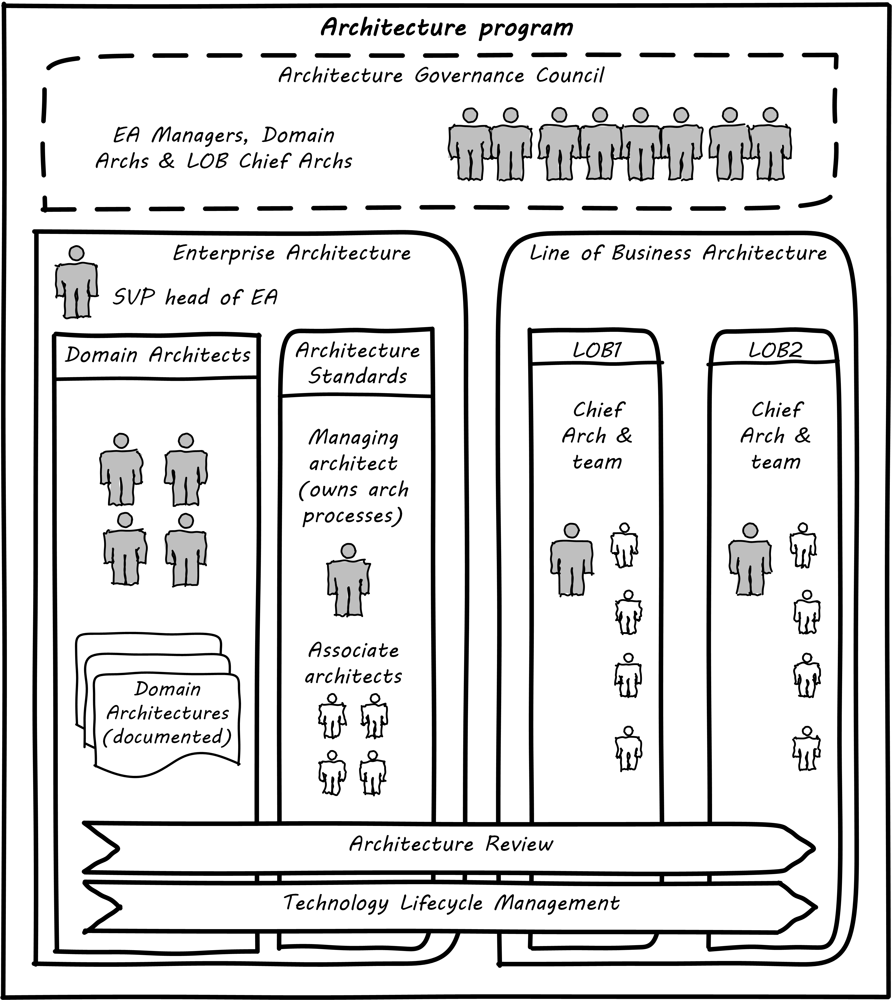
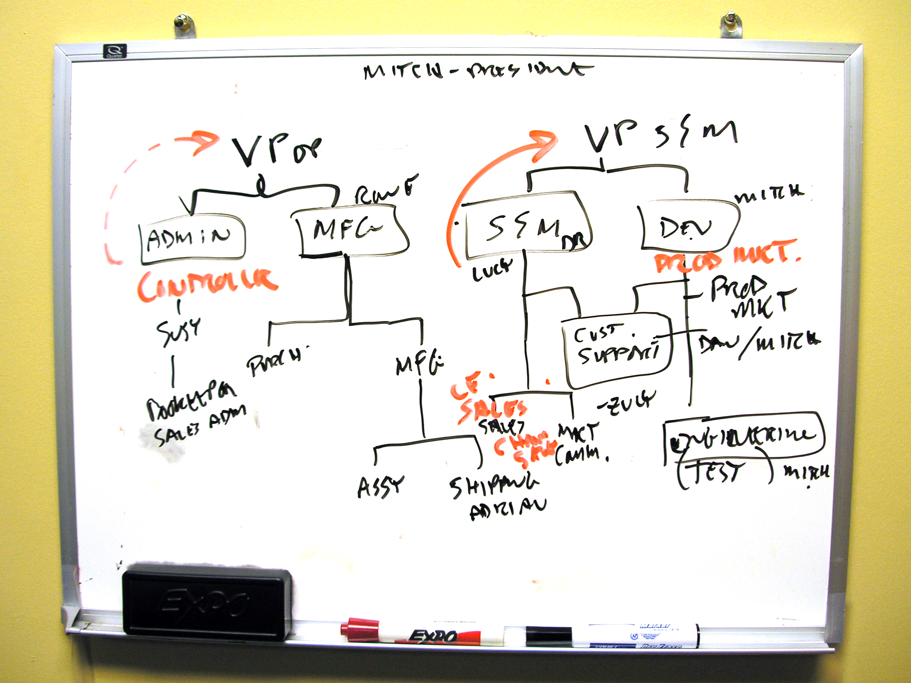
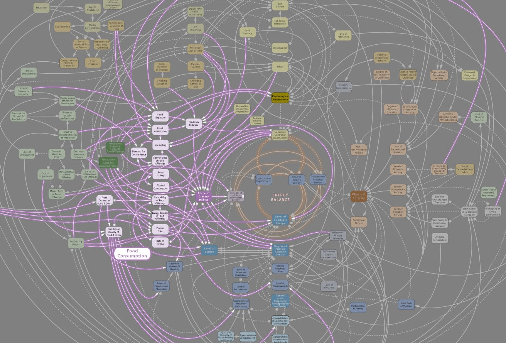

==== Architecture practices

Before we get into a detailed discussion of architecture domains, let's talk in general about what architects do and some common practices and themes.

As we mentioned xref:defining-ea[previously], architecture itself as a term shows up in many ways, as role, artifact, program, and organization.

In this chapter section, we will look at:

* The relationship of architecture and governance
* Architecture as a management program
* The importance of visualization as a practice in architecture
* Architecture and the quest for "rationalization"

.Author's corner
****
What do architects do, actually?

I was a Lead Architect (job class Systems Architect 6) for Wells Fargo for 6 years. This is a director-level position, and I was ultimately awarded the VP title, which in financial services tends to be honorary. (I never managed a large organization.) My assigned domain was the "business of IT," including systems management, service management, portfolio management, and the data, processes, and tools of architecture itself.

Across an annual IT spend of around $5 billion, many of course were involved in all these questions, but I was a nexus and was often called on to lead workshops and discussions with senior executives. These folks were typically at the "2-down" level from the CIO, that is, executives reporting to one of the CIO's direct reports, themselves leading large teams of teams. They called me in when they were struggling with managing one of the larger IT shops on the planet, especially when it came to processes, data, and systems *internal to the IT* organization. (I always admit, I never learned that much about banking; there was plenty to do just coordinating that IT pipeline and the thousands of systems it was delivering.)

Comparing my activities during those 6 years with how industry standards (such as TOGAF) describe architecture is interesting. Building models and "architectures" was only a small part of my work. I found myself involved in, or playing the role of:

* IT strategic planning
* IT portfolio management
* "Zoning authority" e.g. defining what systems are "xref:system-of-record[of record]" for what data
* Program architect (e.g. Application Decommissioning and Portfolio Rationalization for the Wells Fargo/Wachovia merger)
* Technology standards governance
* RFP owner for selecting new technologies
* Data governance
* Vendor product analysis (often in liaison with analyst firms such as Gartner Group)
* Center of Excellence for data, process (BPM), and systems analysis and modeling
* Solutions design standards and patterns
* Continuous service improvement (called "critical systems review")
* Major incident root cause analysis
* Project governance
* IT ombudsman and process troubleshooter ("you architects say the process should work this way, but it doesn't - help me")
* Shuttle diplomat - driving agreement between deeply conflicted business units or individuals, where relationships had broken down.

If I had to characterize the important skills for this role, they would start with communication and facilitation. In terms of the principles discussed in this book, the architecture team was a mechanism for synchronizing across the organization. It definitely fit the classic definition and value proposition of a xref:arch-as-staff[staff organization].
****

===== Architecture and governance

Enterprise architecture has a clear relationship to xref:gov-chap[governance] as we discussed it in Chapter 10. It provides a framework for managing xref:tech-prod-lifecycle[long-lifecycle concerns] and various forms of enterprise xref:risk-management[risk], especially as related to digital and IT systems.

Architecture is an important part of the governance equation. Architecture becomes the vehicle for technical standards that are essential risk controls; a risk management organization cannot achieve this alone.

EA therefore may have a role in defining xref:how-policy-begins[policies], especially at the mid-tier of the xref:policy-hierarchy[policy hierarchy] - neither the highest enterprise principles, nor the most detailed technical standards, but rather policies and standards related to:

* Choice of certain enterprise products expected to be heavily leveraged (e.g. common database and middleware products)
* Design patterns for solving recurring requirements (e.g. user authentication, load balancing, etc)
* xref:system-of-record[System of Record]
 identification and enforcement

As discussed in xref:policy-hierarchy[Chapter 10], there needs to be traceability from tactical standards to strategic codes and principles. The preference for a given database should not be a policy, but having a process that establishes such a preference *would* be -- that is, a policy should exist saying (for example) "there shall be a Technology Lifecycle Management process with the following objectives and scope." Where appropriate, such policies might also be linked to specific risks as xref:controls[controls] or xref:enablers[enablers].

As for all policies, it's important to have some sort of sunset mechanism for EA guidance. As Bente et al note, _Many EA-originated policies that appear obsolete today have not always been meaningless...A frequent example is the uncontrolled proliferation of newly hyped technologies by the IT crowd, and the EA group's rigid attempt to reinstitute order. Once the technology has matured, the EA rules often appear overly strict and suppress a flexible use of the appropriate technology._ <<Bente2012>> p19

The issue with the quote above is that the overall benefits of having (for example) a Technology Lifecycle Management process are not usually quantified in terms of cost and risk avoidance. Without an overall governance mandate and value proposition, Enterprise Architecture activities may seesaw in response to the "issue of the moment." This is not a recipe for sustainable architecture; whose most important value proposition lies in the long term. Architecture, as a component of coherent governance, requires no less.

As we discussed in Chapter 10 governance emerges in part as a response to xref:assurance-external-forces[external forces]. Architecture often plays a consultative role when external forces become governance issues, for example:

* Data custody and xref:system-of-record[Systems of Record], and relationship to xref:records-mgmt[records management]
* Vendor relationship strategies
* Security risks and controls

Governance is also concerned with efficiency, which also becomes a key architecture concern with associated practices:

* IT portfolio rationalization
* Business process optimization
* Shared services and APIs re-use
* Master and xref:reference-data[reference data management]

Finally, does enterprise architecture promote effectiveness? Effectiveness is often seen as the primary responsibility of "the line" in line/staff paradigms. However, as the xref:arch-impacts[impact] model suggests, establishing a foundation of re-usability and limiting technical choices can increase the speed with which new products and services are delivered.

===== Architecture as a management program

The above section discussed the relationship of architecture to governance. As we covered in chapter 10, xref:gov-v-mgmt[governance is not management]. Here, we will cover the topic of architecture as a management program of activity, in part through examining an example large-scale architecture program.

Architecture as a program refers to a coordinated set of

* processes,
* job roles,
* standards and practices,
* artifacts,
* organizations, and
* cadenced and ad-hoc activities

intended to serve a key xref:coord-struct[coordination] role. The below diagram represents a large scale, coordinated architecture program in a large enterprise. Notice that this is not a single organization. The Architecture Program in this example spans a centralized Enterprise Architecture group as well as teams of Line of Business architects.

.Large scale architecture program

The Enterprise Architecture organization might report to a CTO, the Chief of Staff for the Office of the CIO, or the head of Corporate Strategy and Planning. It is a centralized organization with a small staff of domain architects and an Architecture Standards organization that owns two key cross-functional architecture processes.

Lines of Business have dedicated IT organizations, and these organizations have Chief Architects with their own staffs. In terms of our discussion of  xref:arch-as-staff[line/staff] organization, it is as if the line organization has its own staff function within it; another way to think about it is that the line/staff
division is _fractal_ (that is, it reproduces at different scales).

Within the central Enterprise Architecture organization, we have a number of director-level Domain Architects. These architects might focus on particular business problems (e.g. Supply Chain) or architectural domains (e.g. Data and Information, or Security).

It is the responsibility of the Domain Architects to create Domain Architectures, which are documents that lay out an overall point of view on a particular domain and often serve as standards. These architectures may be created according to a methodology such as TOGAF, with the support of a repository-based tool and language such as Archimate or various standards from the Object Management Group.

The domain architects also serve as a senior consulting pool and are assigned to significant programs and projects as needed.

The Architecture Standards organization is responsible for two organization-wide architecture processes:

* Architecture Review
* Technology Lifecycle Management

The *Architecture Review* process is part of the investment process, when initiatives are initially scoped and direction set. The process requires architects to review significant proposed investments in new systems for consistency with standards (e.g. the Domain Architectures and approved technologies). In terms of the previous section's xref:arch-impacts[impact] model, this process is attempting to support many of the lines of value through controlling redundancy, and ensuring re-use and application of previously learned architectural lessons.

The *Technology Lifecycle Management* process is the means by which new vendor and open source products are approved as fit for purpose and/or preferred within the organization. In terms of the previous section's xref:arch-impacts[impact] model, this process is tasked with reducing the portfolio of vendor products which reduces cost and risk as shown.

Both of these processes are enterprise-wide processes. They are owned, defined, and modified by the Architecture Standards organization, but projects and products across the enterprise follow these processes.

Finally, the *Architectural Governance Council* brings together the senior architects from the central EA organization and the LOB Chief Architects. It is a virtual organization operating on a quarterly xref:cadence[cadence], responsible for setting direction and resolving the most difficult questions that may emerge from the architecture processes and domain architectures.

Overall, this may seem like a complex structure, but similar structures are in place in IT organizations with budgets of $1bn or more. It would be questionable to see comparable structures in much smaller organizations. However, this structure is useful to examine; organizations of various sizes might choose to use different parts of it.

===== Modeling and visualization

.Gudea with blueprint, ~2140 BCE footnote:[_Image https://www.flickr.com/photos/daryl_mitchell/16189447931, downloaded 2016-10-10, commercial use permitted_]
image::images/4.12-gudea.jpg[blueprint, 350, 200, float="right"]

[quote, Preston Smith and Don Reinertsen, Developing Products in Half the Time]
The true measure of the value of a model is whether it actually influences behavior.

The word "architect," whether in a building or digital context,  is often associated with visualizations: blueprints, sketches, specialized notations, and so forth. Drawings have been used to represent structures for likely as long as xref:writing-history[writing has existed]. The image at the beginning of this section is of Gudea, a Mesopotamian ruler known for building temples; on his lap is a blueprint.

Judging simply by its history, visualization is therefore an essential tool for humans dealing with large scale complexity (and erecting buildings has always been one of the more complex domains of human activity.) In digital and IT contexts, however, visualization has certain challenges and notable skeptics. Adrian Cockcroft, the former CTO of Netflix, stated: “Our architecture was changing faster than you can draw it... As a result, it wasn’t useful to try to draw it” <<Bloomberg2014>>.

.Whiteboard footnote:[_Image https://www.flickr.com/photos/simonov/15484240880, downloaded 2016-10-10, commercial use permitted_]

Even in construction and engineering trades that rely on blueprints as a source of truth, keeping them up to date requires considerable discipline and process. In faster-moving digital organizations, visual models are almost always out of date unless they have been specifically refreshed for a purpose, or unless there is a strong formal process in place (and the value of such a process may be difficult to establish). That doesn't mean that people won't continue to use them. Co-located teams use whiteboards and dry-erase markers and will continue to use them. There are important cognitive and human factors reasons for this that will not go away.

Because of these facts, it is useful to understand some of the fundamentals of how humans interpret symbolic data.

====== Human visual processing
[quote, Dan Moody, The "Physics" of Notations]
Visual representations are effective because they tap into the
capabilities of the powerful and highly parallel human visual
system. We like receiving information in visual form and can
process it very efficiently: around a quarter of our brains are
devoted to vision, more than all our other senses combined [63].
In addition, diagrams can convey information more concisely
[27] and precisely than ordinary language [8, 68]. Information
represented visually is also more likely to be remembered due
to the picture superiority effect [38, 70] ...Visual representations are also processed differently: according to dual channel theory [80], the human mind has separate systems for processing pictorial and verbal material. Visual representations are processed in parallel by the visual system, while textual representations are processed serially by the auditory system... <<Moody2009>>.

As the above quote shows, there are clear neurological reasons for diagramming as a communication form. To expand a bit more on the points Dan Moody is making:

.Fast recognition means survival footnote:[_Image https://www.flickr.com/photos/samiksha/2436037856, downloaded 2016-10-10, commercial use permitted_]

* Human vision uses parallel processing. This means that a given image or visual stimulus is processed by many neurons simultaneously. This is how we recognize threats, such as a crouching tiger.
* A large percentage of our brain is devoted to visual processing (you will see figures quoted from 25% to 66% depending on whether it's "pure" visual tasks or visual-driven tasks involving other brain areas)
* The old saying "a picture is worth a thousand words" is consistent with the science. Diagrams can be both faster and more precise at conveying information; however, this has limits.
* Pictures can be more memorable than words.

====== Visualization in digital systems

.The first software flowchart footnote:[_<<vonNeumann1947>>, figure 7.9, public domain assumed_]
image::images/4.12-neumann-flowchart.png[blueprint, 350, 200, float="left"]
Architects in general don't write code; instead the most visible aspect of their work takes the form of diagrams -- abstract graphical representations of complex systems. The first known instance of applying graphical techniques to a digital problem was in 1947 <<vonNeumann1947>> and visual notations have evolved along with the field of computing ever since. Notable examples include:

* The IBM flowcharting template
* The Gane-Sarson data-flow diagram notation
* The Chen entity-relationship notation
* The Barker entity-relationship notation, including the "crow's foot" to indicate cardinality
* The Unified Modeling Language

and many more. (We touched on xref:data-modeling[data modeling] in Chapter 11.) We will examine Archimate, a current and widely used notation, in more detail in a future chapter section.

.IBM flowcharting template footnote:[_Image https://www.flickr.com/photos/mwichary/3249179483, , downloaded 2016-10-10, commercial use permitted_]
image::images/4.12-flowchart-template.jpg[blueprint, 350, 200, float="right"]

But visual notations have been problematic in the Agile community; as Fowler notes in his classic essay Is Design Dead:

_XP de-emphasizes diagrams to a great extent. Although the official position is along the lines of "use them if they are useful", there is a strong subtext of "real XPers don't do diagrams".... I think the issue comes from two separate causes. One is the fact that some people find software diagrams helpful and some people don't. The danger is that those who do think that those who don't should do and vice-versa. Instead we should just accept that some people will use diagrams and some won't._ <<Fowler2004>>

There is no question that some IT professionals, including perhaps some of the most skilled software engineers, find little of use in diagrams . As Martin Fowler says, "people like Kent [Beck, eXtreme Progamming originator] aren't at all comfortable with diagrams, indeed I've never seen Kent voluntarily draw a software diagram in any fixed notation." However, it seems likely that Kent Beck and others like him are members of a programming elite, with a well-honed ability to process source code in its "raw" form.

.UML sequence diagram footnote:[_Image https://www.flickr.com/photos/raphaelstolt/514643232, , downloaded 2016-10-10, commercial use permitted_]
image::images/4.12-sequence-diagram.png[blueprint, 450, 200, float="left"]

If we're building systems to be operated and maintained by humans, it would seem that we should support the cognitive and perceptual strengths of humans.  Because diagrams are more readily processed, they are often used to represent high level system interactions - how a given service, product or application is related to peer systems and services. Building such depictions can be helpful to fostering a shared mental model of the overall system objectives and context. The more complex and highly scaled the environment, the more likely one will encounter such artifacts as a means to creating the mental model.

The strength of human visual processing is why we will (probably) always have graphical design to assist in the building of shared mental models. Specialists in the syntax and semantics of such designs will therefore likely continue to play a role in complex systems development and maintenance. Currently, if one seeks to hire such a specialist, one recruits some kind of architect - that is the professional role with the skills.

Note that flowcharts, data models, and other such diagrams tend to be associated more with the idea of "solutions" or "software" architecture. We'll cover the xref:architecture-domains[architecture domains] in the next chapter section, including examples of business architecture diagrams.

====== Limitations of visualization
[quote, Bente et al, Collaborative Enterprise Architecture]
The big picture is part of the standard mindset of EA, which everyone immediately associates with the activities of an enterprise architect. However, many of these big pictures you meet in practice have been over-abstracted to the point of insignificance and no longer address any relevant question. <<Bente2012>>, p16.

Visualization has a number of limitations:

* It is better for static structures than for dynamic processes,
* diagrams become less accessible the more complex they are, and
* it can result in distorted understandings,
* ultimately, diagrams rely on deeper shared understandings that must be understood and managed.

Despite the familiarity of simple flowcharting, visual notations don't scale well in terms of representing program logic. Therefore they tend to be used informally, as sketch or whiteboarding, or at the business analysis level (where the flowchart represents business logic, not detailed software).

More static structures, including data models and systems interactions, are still often represented visually and in the case of xref:data-modeling[data models] can be transformed from conceptual representations to physical schema.

However, any diagram, whether of a dynamic or static problem, can reach a level of density where it's no longer useful as a visual explanation. As diagrams become more complex, their audience narrows to those most familiar with them. Past a certain point they exceed the limits of human visual processing, and then are of little use to anyone.

For example, the diagram below, while intimidating, might be useful to those who work with and study it. It would take some familiarization:

.Complex diagram footnote:[_Image https://www.flickr.com/photos/pushandplay/2968259379, downloaded 2016-10-10, commercial use permitted_]

However, this next diagram is essentially unusable, as visually tracing any given line is too difficult, and it would be easy to mistakenly identify one bubble as dependent on another:

.Another complex diagram footnote:[_Image https://www.flickr.com/photos/taedc/9614791576, downloaded 2016-10-10, commercial use permitted_]
image::images/4.12-complex-network.jpg[blueprint, 550, 200]

Another issue with some diagrams is that they do not give a good sense of perspective or scale. This is sometimes seen in the business architecture practice of "capability mapping."
formalisms don't give a good sense of scale. For example, suppose you see this diagram:

.Simple capability map
image::images/4.12-capabilities.png[capabilities, 500, ]

Diagrams like this are common, but what does it mean that all the boxes are equally sized? Are there as many lawyers as sales people? Operations staff? It's not clear what the advantage is to putting information like this into a graphical form; no interactions are seen and the eight areas could more easily be expressed as a list. This brings us to the final problem listed above: visualizations rely on some common ground understanding. If boxes and lines are used for communication, their meaning should be agreed upon - otherwise, there is risk of mis-understanding, and the diagram may do more harm than good.

===== Repositories and knowledge management

why draw boxes when a textual report is all that is needed (e.g. Bente p52)

EA needs catalogs and matrices maintained. diagrams? it's questionable.

every so often there is a ritual expression of a catalog as nested boxes. Of questionable utility. The graph complexity bogs down representation of the matrices.

next: intersection of visualization and master data management. semantics of the visualization.

enterprise architecture does not solely consist of diagrams; per TOGAF, the basic artifacts are catalogs, diagrams, and matrices and the act of drawing pictures itself may be the least important thing the architect does . The picture, if valuable, concisely represents a shared mental model on how the enterprise will undertake complex activities, and the discussions and negotiations the architect facilitates on the journey to such agreement are the real added value.

the EA's role is to facilitate discussions by abstracting and visualizing powerfully so that decisions are illuminated.

usually, the resulting diagrams are only good tactically.

illustrate: diagrams vs reporting, isometric catalog/matrix/diagram

backref to ch 11?

Agile & docs "In an agile project, explicit care must be taken to ensure proper documentation—for example, by stating it as part of the condition of satisfaction of a user story or in the definition of done" <<Bente2012>> p 170

Catalogs - Need for registration process for subjective concepts - decision authority

====== The repository question

CMDBs, metadata, EA

====== Metamodels and ontologies
app v svc def'n
runs into domain driven design problems if not careful

Canon law disputes

"standard EA language and methodology is especially helpful in large, complex enterprises that are geographically dispersed, and which may have multiple social and work cultures that have promoted different ways of doing things." <<Bernard

Bernard, Scott A.. An Introduction to Enterprise Architecture: Third Edition (Kindle Locations 1147-1149). AuthorHouse. Kindle Edition.

====== DevOps assets to architecture

If you started from day 1 with source, build, & package mgmt, and have kept it clean, you have a great asset

===== The "rationalization" quest
are the economics well understood?
One core question decided by governance is how much autonomy is granted to business units or geographical regions. In case this autonomy is high, would a quest for high IT integration and standardization not be like fighting windmills? <<bente2012>> p.45 and cross ref ch 1

====== application rationalization

====== Data & info

====== TLM
****
*Bad times at Airbus*

In 2006, (Ulrich)

TLM governance

****

****
[quote, Anonymous]
A foolish consistency is the hobgoblin of little minds.

*The folly of letting TLM dominate*

Henrik Kniberg tells the story of one of his most successful projects — a system built for the Swedish police that allowed them to use laptops in the field — and what happened afterwards <<Kniberg2011>>. Because the project was extremely urgent, the group was allowed to use an agile approach and break out of the traditional organizational culture. Everything went well, the police organization viewed it as a success, and the project even won a “project of the year” award.

What came next, however, was even more interesting. A high-level decision was made to rebuild from scratch that same system police had used in the field, using Siebel. This was part of a standardization effort to reduce the complexity and number of systems. Not only was the decision made to use a technology that the development team didn’t agree with, but it was decided to use a more traditional, sequential project-management approach to development. Development took a couple years and when it finally rolled out, it was a disaster because the police found it to be slow and clumsy and basically unusable. Making the change even more difficult was that the police preferred their existing system, which worked. Kniberg estimates that this cost the Swedish police more than £1 billion.

in http://www.infoq.com/resource/minibooks/why-agile-works/en/pdf/InfoQ-Why-Agile-Works-Mini-book.pdf
****

1 billion pounds ($1.6B) would have bought a lot of support & vendor leverage for the "nonstandard" technologies.

Lifecycle management can extend to internal products/services

EA provides guidance about what technologies are a strategic fit, which ones are deprecated, and which are emerging. <<Bente2012>> p8

Case study: The version control controversy: service vs TLM

if enterprise architects claim to be the only decision-making body
in technical matters, there is a huge risk that they create a bottleneck, if decisions take ages due to pending strategic issues, imminent changes in the business model, and so forth, IT projects can be seriously delayed. The practical consequence is that projects deliberately circumvent the enterprise architects—for example, by choosing less suitable technologies not managed by the EA group.<<Bente2012>> p19

Note that we compensate developers with money AND experience. Developer pressure to use a new technology should be seen in part as a demand for increased compensation. developers seeking experience, it is in part how they are compensated. this leads to conflicts over choice of tools. (good blog as well). rational framework for deciding. might go to chapter 8, resource mgmt. intersection between that & tech lifecycle is key.

EA makes the decision to insource or outsource
