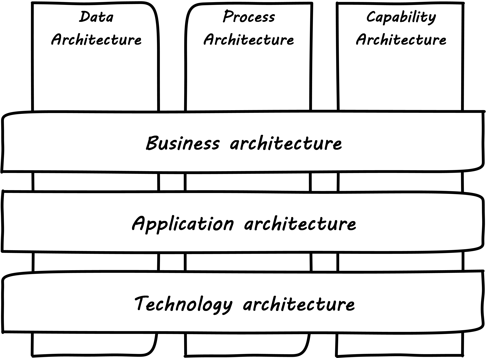
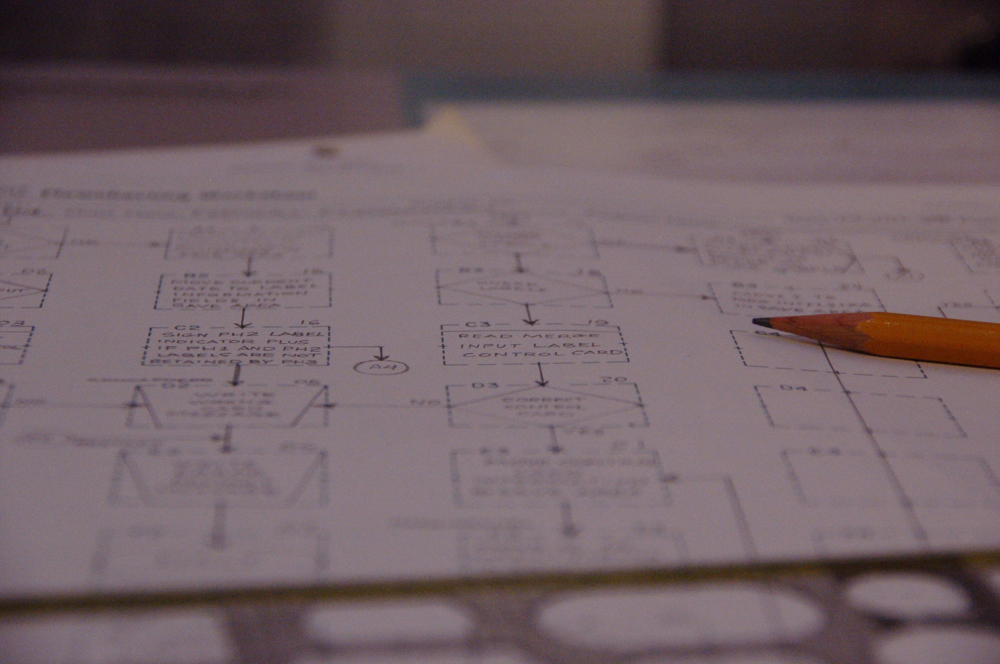

anchor:architecture-domains[]

==== Architecture domains

In the last section, we discussed what architects *do*. The focus was primarily architects in a "team of teams" environment, not strictly at the level of a single product team. However, while this chapter has a strong Enterprise Architecture orientation, it is also about the practice of "architecture" more generally. In this chapter, we will break down the different practices of architecture and their relationships.

We have seen the xref:Zachman[Zachman Framework] previously. The higher levels are considered "business" or "operating model" concerns, while the lower levels are more technical. In discussing the various domains of architecture, however, a simpler structure is useful. The numerous columns in the Zachman framework don't necessarily translate to specific architecture domains (for example, there are many data architects representing  the "what" column, but not many who specialize strictly in questions of timing -- the "when" column.) Similarly, we can simplify the number of rows by consolidating them into three.

ArchimateⓇ is a modeling language and standard of The Open Group, which we will discuss more later in the chapter. It uses a framework that can be viewed as a simplification of the Zachman model:

.Similar to <<Open2012>>, section 2.6

As we look at the overall structure of the architecture disciplines, we have three disciplines that correspond to the columns. We'll call these "perspectives":

* Data Architecture
* Process Architecture
* Capability Architecture

And three disciplines that correspond to the hierarchical layers:

* Business architecture
* Application architecture
* Technology architecture

And

Does this mean that we have nine flavors of architecture, one for each intersection? Not necessarily. Some intersections make more sense than others, and some tend to merge with their neighbors.

For evidence, see the Data Management Body of Knowledge <<DAMA2009>>, which covers the gamut of information and data topics from high level glossaries all the way down to physical database administration.

===== Architecture perspectives

====== Data architecture

From top to bottom, the data architecture ("what") perspective includes concepts such as :

* The universe or domain of discourse
* Ontologies, semantics, and conceptual models
* Logical data models
* Data subjects & records
* Classes
* Entities/attributes/relationships
* Tables/columns/constraints

We covered data architecture in depth in xref:chap-ent-info-mgmt[Chapter 11].

====== Process architecture

.A flowchart footnote:[_Image credit https://www.flickr.com/photos/lespetitescases/16715406524, downloaded 2016-10-16, commercial use permitted_]

Process architecture is concerned with why and how activities are performed. It includes the detailed, step by step understanding of activities, in a transparent way. From top to bottom, it includes concepts such as:

* xref:value-chain[Value chain]
* Value stream
* Business process
* Algorithm
* Workflow
* Activity
* Procedure
* Task
* Step

Importantly, xref:process-function[processes CROSS organizations]. An "onboard employee" process, as we have seen, may require participation from multiple organizations. We covered process management in depth in xref:chap-process-mgmt[Chapter 9].

====== Capability architecture

The last column represents steady state activities. "Hire employee" is a process; "Manage Human Resources" is a capability. We do not necessarily know all the steps or details; we just know that if we ask the function or capability for some result, it can produce it. This perspective includes:

* Function and its relatives
* Function
* Capability
* Service (sometimes)

We defined function previously in xref:process-function[Chapter 9]. Note that there is little consensus (and as of 2016 much industry debate) around whether functions are the same as capabilities; this textbook sees them as at least similar.

Capability is an important concept in business architecture, as it has emerged as the preferred concept for investment. We do not invest in data, or process, except as they are realized by a supporting capability.

===== Architecture layers

====== Business architecture
[quote, William Ulrich, Business Architecture: The Art and Practice of Transformation]
Business architecture offers views of the business that are unavailable from other sources, including IT. Business architecture can tell you what is being done, by which business units, for certain customers, involving various products, via certain processes, involving selected business information. Business architecture generated blueprints serve as the basis for root cause analysis of critical business requirements while providing the foundation for establishing a solution-oriented roadmap that leaves the speculation and guesswork by the roadside. In a word, business architecture delivers "transparency" to a wide variety of internal teams, roles and business units <<Ulrich2010>>, p. 195.

Business architecture is defined by the Business Architecture Body of Knowledge (BIZBOK) as "a blueprint of the enterprise that provides common understanding of the organization and is used to align strategic objectives and tactical demands."

BIZBOK goes on to say that "the value of business architecture is to provide an abstract representation of an enterprise and the business ecosystem in which it operates. By doing so, business architecture delivers value as an effective communication and analytical framework for translating strategy into actionable initiatives. The framework also enhances the enterprise's capacity to enact transformational change, navigate complexity, reduce risk, make more informed decisions, align diverse stakeholders to a shared vision of the future, and leverage technology more effectively."

BIZBOK covers the Osterwalder xref:biz-model-canvas[Business Model Canvas] extensively. (<<BAGuild2016>>, pp. 282-297.) In so doing, it clearly implies that the concept of the business model is of interest for business architects. Because of this, it's helpful to view *business architecture as the component of enterprise architecture most concerned with the business model, in addition to the operating model.*

More specifically, there are a number of concerns that business architecture includes:

* Value streams
* Capabilities
* Organization
* Information
* Stakeholders
* Vision, Strategies, and Tactics
* Initiatives and Projects
* Decisions and Events
* Metrics and Measures
* Products and Services
* Policies, Rules, and Regulations

from <<BAGuild2016>> p. 2. The reader might notice some overlap with xref:enablers[COBIT enablers], which also include Information, Policies, and Organization.

On the other hand, we DO NOT expect to see in business architecture the following:

* Specific technology products (Oracle 11g)
* Software architectures (design patterns, class models, etc)
* Detailed deployment diagrams
* Specific project plans
* Detailed flowcharts
* Specific devices

 Capability heat mapping

====== Application architecture

Application, or application system, like data, process, and capability, is a fundamental and widely used architecture perspective, as well as a layer. It can be defined as ""a fixed-form combination of computing processes and data structures that support a specific business purpose." <<Betz2011>>, p. 125. An application system is practically relevant, obtainable and operable.  (You can buy, or realistically build, one of these.)

Application architecture can have two meanings:

* The architecture of a given application
* The architecture of application interactions

For this book, we'll leave the architecture of a given application for solutions and software architecture. Application architecture is the interaction of multiple applications (which may include digital products and/or services, depending on organization terminology). In a complex, multi-product environment, application architecture tends to focus on the interfaces and interactions between the application systems. It's often a concern when systems are considered for retirement or replacement (for example, when a comprehensive ERP solution is brought in to replace several dozen home-grown applications.)

Application architecture is also concerned with the xref:IT-lifecycles[application lifecycle], as covered at the start of this section.

====== Technical architecture

Where business architecture intersects with the business model, technical architecture overlaps with actual engineering and operations. In particular, technical architecture tends to be concerned with:

* Identification of new technical platform capabilities: for example, does the organization need to bring in a NoSQL platform? Private cloud?
* Choice of vendor products, once a technical need is established
* Establishing infrastructure services as appropriate
* Defining appropriate usage, including infrastructure design patterns
* Tracking the xref:IT-lifecycles[lifecycles] of the selected products and dependent services, and making appropriate plans

===== Other forms of architecture

There are other kinds of architecture that don't fit neatly into this arrangement:

* Solutions architecture
* Software architecture
* Information architecture (UX-related definition)

====== Solutions architecture
Solutions architecture especially is a loose term. In general, it is restricted to one product, or a few products working together, as a "solution" to a business problem. Within that scope, it may incorporate concepts from infrastructure to business architecture.

====== Software architecture
[quote, Grady Booch]
Architecture represents the significant design decisions that shape a system, where significant is measured by cost of change.

"Architecture" in the sense of pure software is a topic with much research and writing. In this book, it has been a concern since Section 1, and so we don't talk as much about it here.

Software architecture is usually aligned with application architecture, but not all application architecture is software architecture; application architecture may also include packaged solutions whose internal architecture is not a concern.

====== Information architecture (alternate usage)
Information architecture may mean the higher, more business-relevant levels of data architecture. However, the term also is used in relation to application architecture, in the sense of how the user understands the meaning and data represented by a web site or application, or even just the navigation structure of a Web site.
