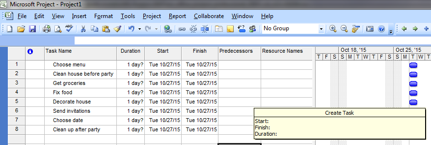
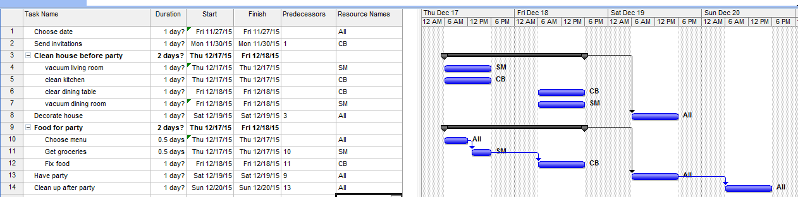

anchor:project-mgmt[]

=== Appendix: Project management

==== Project basics

IMPORTANT: As with other chapters in the later part of this book, we are going to introduce Project Mangement "on its own terms." We will then add additional context and critique in subsequent sections.

We are already doing work, using Scrum and Kanban for the most part. But there is interest in more formalized, traditional project management, so some of you go to training and learn the following basics.

Let's start with the most fundamental aspects of a project. You can start your understanding of a project by first thinking of a "to-do" list. However, rather than a miscellaneous list of errands, a project is a to-do list that is aimed at delivering some overall end result, with certain resources and within a time frame. So, in terms of your daily life, a random list of to-dos isn't a project, but if you are organizing your annual holiday party, that certainly would qualify as a project.

We could start with the following list:

|===
|Choose menu
|Clean house before party
|Get groceries
|Fix food
|Decorate house
|Send invitations
|Choose date
|Clean up after party
|===

One of the important characteristics of a project is that it is temporary. This project ends when we clean up after the party. Project management, however, takes things much further. There are a number of ways that the list above can be refined using project management techniques.

First, we should probably organize the list a little better. And the task "clean house" - do we understand precisely what we mean by that? Maybe we should break this down into sub-tasks.  Also, you may notice that there are "dependencies." For example, we can't send out invitations before we choose the date, nor can we fix the party food before we get groceries, which in turn depends on setting the menu.

Let's break out a tool. Introducing Microsoft Project:

We put our list in it. Then, we set up some sub-tasks and document the dependencies. Notice the bold headings:

* *Clean house before party*
* *Food for party*

and how they have indented "sub-tasks" underneath them.

These are all the things that need to be completed, for the overall major task to be considered complete. For example, we can't call the house clean if the dining room isn't vacuumed. Also notice that, to the right, we see certain tasks are linked by thin black arrows. We are not going to decorate the house until all the cleaning is done, and we need to get the food prepared before we have the party. As mentioned above, these are called dependencies.

This is just the tip of the iceberg.  Much more  can be tracked in a formal project management approach, such as:

* Cost of people's time - forecast and actual
* % complete of a given task
* Which sequence of tasks is the "critical path" - the sequence that must be done in order, that will take the longest time

PMBOK <<PMI2013>> defines the critical path as "The sequence of activities that represents the longest path through a project, which determines the shortest possible duration." In the above example, we have two major work areas: clean the house and prepare a menu. Note however that there are no dependencies between:

* vacuum living room
* clean kitchen
* clean dining table
* vacuum dining room

Really, they can be done in any order.

On the other hand, there is a clear set of dependencies between:

. Choose menu
. Get groceries
. Fix food

This means that the sub-activity "Food for party" is the critical path. If the menu is not determined on time, the grocery run can't happen, and the food will be fixed late or not at all.

A project manager is responsible for all of this and more. A critical concept is that of "deliverable." In this example, the deliverable is the outcome of each task:

* invitations sent by 11/30 by CB
* menu decided by 12/17 by all
* house cleaned by 12/18 by all
* food prepared for guests by 12/18 by CB

Notice that deliverables are defined by "what," "who,"  *and* "when.""

While it is the responsibility of each contributor to the project to "meet" their deliverables, the project manager checks in regularly with each of them as to whether they will in fact be able to do this. In larger, more complex projects, the project manager updates the project plan with the effort expended to date, and the estimated time to completion. Individual status reports are assembled ("rolled up") into an overall picture of project status, reported to executives with a high level assessment of whether the project is likely to meet its objectives of cost, scope, quality, and schedule.

anchor:PMBOK[]

==== The Project Management Body of Knowledge
The Project Management Body of Knowledge is sustained by the Project Management Institute. PMI describes itself as:

_the world's leading not-for-profit professional membership association for the project, program and portfolio management profession. Founded in 1969, PMI delivers value for more than 2.9 million professionals working in nearly every country in the world through global advocacy, collaboration, education and research. PMI advances careers, improves organizational success and further matures the profession of project management through its globally recognized standards, certifications, resources, tools, academic research, publications, professional development courses, and networking opportunities_ (from http://www.pmi.org/About-Us.aspx[www.pmi.org]).

The Project Management Body of Knowledge is articulated in a publication, _A Guide to the Project Management Body of Knowlege._ While this may seem to imply that the PMBOK and its guide are two different things, they are not -- it is one publication.

The PMBOK, as of the latest edition, consists of:

* 47 Project Management "processes," grouped into
* 5 Project Management process "groups" and
* 10 Project Management "knowledge areas"

The groups are the easiest to start with. They are:

* Initiating
* Planning
* Executing
* Monitoring and Controlling
* Closing

The PMBOK is clear that the "Process Groups are not project phases. In fact, it is possible that all Process Groups could be conducted within a phase." <<PMI2013>>, A1.3.

The Knowledge Areas are a different dimension, and consist of:

* Project Integration Management
* Project Scope Management
* Project Time Management
* Project Cost Management
* Project Quality Management
* Project Human Resource Management
* Project Communication Management
* Project Risk Management
* Project Procurement Management
* Project Stakeholder Management

Finally, the 47 project management "processes" include topics such as (selected items):

* Develop Project Charter
* Develop Project Management Plan
* Direct and Manage Project Work
* Perform Integrated Change Control

Each process is categorized by one Process Group and one Knowledge Area, resulting in a matrix. A full matrix is not presented here due to copyright concerns, but one can be seen http://www.focus-on-training.co.uk/blog/pmbok-process-groups-knowledge-areas[here].
