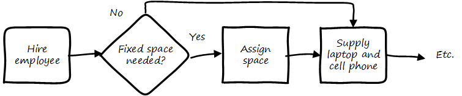

===== A deeper look at processes and functions
Processes cross functions in a repeatable way. You may have deep organizational functions such as

* Human Resource Management
* Facilities Management
* IT Asset Management
* Security Management
* Network Management

However, you have a value adding activity of bringing in a new employee that involved ALL of these functions:

. The HR department enters the employee in the HR system (including payroll).
. Either the HR department or the hiring manager requests space from Facilities Management.
. A workstation and smart phone are requested from IT Asset Management
. When those devices are received, Security authorizes them (and the employee) to enterprise systems (critically the enterprise directory)
. If a wired connection is needed, Network Management may be required to "turn  on" a port in the employee's location.

This is a deliberately older, traditional workflow. Modern organizations may accelerate things:

. HR enters a record
. All employees use common "hoteling" space, so the major Facilities concern is whether the space can accommodate the peak # of employees seen (e.g. at 10 AM on a Wednesday)
. Equipment is either BYOD (Bring Your Own Device) or is ordered from an authorized vendor and drop-shipped directly to the employee
. In either case, security must establish some control over the devices, so that organizational data remains secure. There are various approaches for this, even for devices owned by the employee.
. Networking in modern organizations is almost all wireless, but the employee still requires the appropriate credentials, likely provided by security. As with facilities, Networking's concerns now move to questions of capacity and availability of the overall infrastructure.

Notice however that even in the modern scenario, we have an end to end, repeatable value flow that crosses distinct domains of concern. The employee is not productive until all these steps are taken. Since the employee starts drawing payroll on hire, there is a substantial cost of delay for this entire process. A week's unproductive time could amount to $10,000 or more, wasted.

Such delays can easily happen when functional areas are focused just on their responsibility, and no one is concerned for the overall process. This is why Rummler and Brache chose the title _Improving Performance: How to Manage the White Space on the Organization Chart_ for their groundbreaking book on business process. The "white space" they are talking about is the spaces between the functions, also termed "silos" or "towers:"

You may notice that the cross functional process is named with an active verb, "Onboard." This is in contrast to the functional silos, which end in "management." This is deliberate and a well-established BPM best practice. "Onboard employee" is event-driven and countable; it has a clear beginning and end and therefore can be measured in various ways. "Human Resource Management", on the other hand, has no beginning or end; it is a steady-state set of organizational concerns and resources.

IMPORTANT: The idea that processes are active and countable, while functions are passive and ongoing, is critical to effective organizational design and performance management.

Finally, context is everything. Notice that this end to end process of "onboard employee" belongs to the overall supporting activity of Human Resource Management in terms of the value chain we started with:

There is a rich variety of ways to think about enterprises and their operations at the largest scale. We will return to the question of process context and value chain in the chapter section on process frameworks. For now, we will move to a more detailed level of process modeling, now that we have introduced certain key concepts.

===== Process modeling

If you page back through this book, you will see many graphics: some are pictures from real life, while others are conceptual. The practice of communicating concepts through graphical forms has a long history and great breadth of application. If you have access to the Microsoft product Visio, you can get a sense of this through looking at the various templates and solutions:

The idea that a box can represent an activity or objective, and can be linked in sequence to other boxes though lines, has been around since at least the 1920s. Many different visual languages have been developed over the years for various purposes. Some are highly formalized, others less so. The following definitions may help:

A *modeling language* is a set of concepts and definitions that describes a given problem space. Modeling languages can be formalized to different degrees of precision.

A *notation* is a specific set of visual symbols mapped onto a modeling language. One modeling language might have different notations; for example, Data Flow Diagrams have two notations but both communicate essentially the same language.

A *model* is a specific usage of a modeling language and notation to communicate some idea about a system. It may also be a verb, e.g. "I am going to *model* the system."

There are many different forms of modeling, extending far beyond IT and digital management. Scientists develop models of physical processes; financial analysts develop models of the stock market. Different aspects of a digital system might be modeled at different times:

* The process it is automating might be modeled as part of analysis
* Its data structures might be modeled somewhat later
* When the system is running under load, capacity analysts might model its consumption of compute and network resources and develop projections for when additional capacity might be needed

Process modeling is therefore only a subset, but an important one. Process analysis is one of most important activities in the broader area of business analysis and architecture, which in turn are key to xref:product-mgmt[product management] in general (as we briefly mentioned in Chapter 4).

There are many process modeling languages and notations:

* Generic flowcharting
* The IDEF family
* The Unified Modeling Language
* Business Process Modeling Notation

There are many references on these in the concluding chapter section. We will only discuss some of the more important concepts in this section:

* The IGOE foundation (Input/Guide/Output/Enabler)
* Ordering, conditionality, and synchronization
* Swimlanes

====== IGOE (Input/Guide/Output/Enabler)
A useful framewor for thinking about activities represented as icons is the IGOE approach <<BPTrends2013>>.

 insert Process Renewal Group cite

IGOE stands for:

* Inputs
* Guides
* Outputs
* Enablers

*Inputs* include the information or event stimulus that initiates the activity. They also include resources that will be consumed in the course of the activity.

*Guides* govern the process, setting constraints and expectations (e.g. current HR policies). They are not consumed.

*Outputs* include the final, value-added outcome of the activity, and also serve as a signal for downstream activities to commence.

*Enablers* support the process, without being immediately consumed. Examples include infrastructure and facilities support.

The IGOE approach is seen in the classic IDEF0 standard (the terms used there were Inputs, Controls, Outputs, Mechanisms). This is a form of *functional modeling* which is *not* event driven but rather is used to scope higher level interactions between areas.

The original intent of the IDEF0 standard was for a multi-level, decomposition approach, A high level scope would be elaborated thus:

However, there is not a clear sense of the events, since the primary objects are still the functions. There also is the temptation to insert extraneous information, as indicated in the line between Facilities Management and IT Asset Management labeled "Provides space for ??".

It is true that Facilities Management does provide space for the IT Asset Management Team (in fact, all of these functions provide services to each other), but to draw this would result in a "spaghetti" diagram with several dozen lines and not much explanatory power.

Purely functional modeling of this nature is therefore limited in usefulness, although it can be a good place to start.

====== Ordering, synchronization, and conditionality
Activities in process modeling, by contrast, emphasize active verbs:

* Hire
* Assign
* Supply
* Create
* Authorize

Multiple activities can be sequenced and this is often represented as a series of shapes connected by arrows:

Notice these activities align to the overall cross-functional flow we discussed above:

However, we encounter a complication. In order to describe this process accurately, we should note that some people do not have space assigned, if they are primarily telecommuting and/or working in "hoteling" space. We want to show a decision point, which in many notations is represented by a diamond.

Finally, this ordering is taking too long, because people are waiting for space to be assigned before doing anything else. This is a well understood problem; processes can branch and run in parallel (you may well be writing code that works this way; human processes also do this). In UML, the term is "fork" for when processes diverge to run in parallel, and "join" when they must again synchronize for the next activity to continue:

In the above diagram, we see that 3 activities (including the decision point) can commence independently when the employee is hired, but network access requires that the employee have both an entry in the enterprise directory, as well as their hardware supplied. The entire process is complete when their space, equipment, and access needs have been met.

====== Swimlanes
We made much of the fact that processes cross functions, and yet with our final diagram we have lost our view of this fact. We can re-introduce the functional boundaries through the use of swimlanes (pioneered by Rummler in <<Rummler1995>>):

Adding the swimlanes helps us understand the cross-functional handoffs, and also where certain activities will remain within the scope of one function. Another interesting, finer point is the question of the synch points. Observe the synch point in the Network Management swimlane. Its presence implies that the Network Management function must confirm that the employee has equipment and a directory in the enterprise directory.

You may notice that this diagram has been "rotated." The diagram was becoming too long if drawn left to right. UML Activity Diagrams frequently use a top-to-bottom approach. The meaning of the diagram is not changed.

====== A final caution on technique
The techniques briefly discussed here can be applied and combined in many different ways, and result in models of large scope and complexity. However there are crucial limitations to visual representations of complexity.

There are endless nuances and debates about BPM notations, methodology, and philosophy. Don't get caught up in it. Modeling should generate simple, clear artifacts that are useful by a broad audience, and it should not become an end in itself, or (in general) consume inordinate amounts of time. We will discuss this further in the chapter section on Agile.

With the above discussion, we have covered in a summary form the basics of business process modeling. In the next section on Agile and process management, we will discuss various process pitfalls and appropriate Agile and Lean responses.
