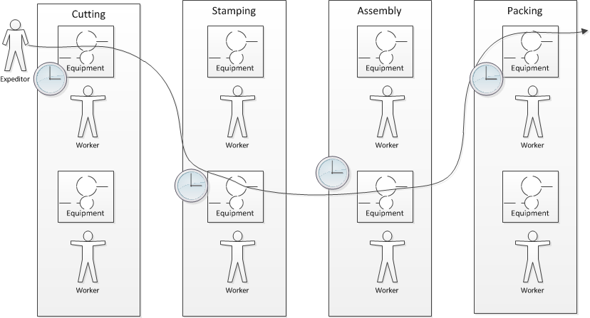

.Essay: The idea of PMDB and PIs
****
Originally published at http://www.lean4it.com/2014/06/in-search-of-the-pcmdb-and-pcis.html.

In search of the PMDB and PIs

As I was preparing chicken piccata last night, I had one of those flashes.

In the IT industry, why don't we care about process information the same way we care about configuration information?

We've had a 15-year conversation about CMDBs. It's a well known idea that all configuration data should be put in a repository, or short of that, should be seen as part of an federated system. Applications, servers, databases, files, queues, executables, services, racks, switches, etc, etc, etc should all be seen as Configuration Items, or "CIs."

But, if you ask ITSM advocates about processes, they will talk specifically about Incidents, Problems, Changes, Releases, etc as if they all are fundamentally different.

I think we need the concept of a Process Item - just as a specific Server and an Application can both be CIs, so can a specific Incident and a Change both be PIs. They could inhabit the same PMDB, or be federated in a common PMS. [Yes, I recognize the unfortunate acronym :-) Let's figure out better naming later.]

This in fact is how many actual implementations of IT management tools work. But at a framework level, it is NOT how people are educated in IT management - the education and mental model continues to be that Incidents, Changes and Problems are very distinct and at best cross-reference each other.

In the world of Process, we have a series of related terms that indicate a

"potentially recurring series of events with various complexity (parallelism, sequentially related or not, and so on)"

as the Oracle Communications Model states. Under this general heading we have:

* Program
* Project
* Release
* Change
* Service Request
* Incident
* Problem (and other Improvement Opportunity)

But (as I have pointed out elsewhere) the way these are currently implemented is too often as distinct queues of work with no coordination and understanding of aggregate demand. There is no awareness or concern when people who are critical to a Project also wind up handling high criticality Incidents.

I think there is much justification for promoting the ideas of Process Item and a unified PMDB as  industry guidance.

First, it aligns well with the growing interest in Kanban and limiting work in process. All these Process types compete for resources. If all are seen as fundamentally similar then it is possible to understand the aggregate demand.

My coverage as an analyst of the Professional Services Automation tool sector (e.g. Tigerpaw) suggests that this class of tooling is already moving in this direction.

There are complex dependencies between PIs just as with CIs - larger grained PIs such as Project may contain any number of smaller grained PI types such as Release, Change, and Request.

The above-mentioned Oracle Communications Model (which is now conformant with eTOM) requires that the PROCESS entity be used as the overarching parent for all process activity.

During one large program I was part of, all Releases, Project milesones, and Changes were consolidated into a single timeline view which was praised by senior executives as one of the best orienting mechanisms they had seen.
I have seen various attempts and interest along these lines, but always company or vendor specific. I wonder if the lack of a PI/PMDB concept in fact may be why the concept of CMDB has had such struggles.

People have often said to me, "Isn't the CMDB the basis of ERP for IT"?

My view is no, no more than the Bill of Materials is the basis for manufacturing ERP. The core of ERP systems is about process and execution, and that is what we are missing in large scale IT management. We've spent years struggling with the data-centric orientation the CMDB discussion gave us, while shortchanging the process and execution side of the work.

I realize the red flags that come up with any suggestion of a centralized system, which is why I am more in favor of seeing the PI concept as a logical interface. If all Process Items had some degree of overarching consistency, they could be exchanged and federated as part of execution activities, without requiring a monolithic centralized data store.

Thoughts?
****

===== Scheduling and execution

To understand how project management works across a functionally organized system, consider the internals of each functional area:

Each combination of worker and equipment can be considered a workstation in this simplified model. If there is concern for flow across the functional areas, one technique used in manufacturing is that of expediting. An individual in the role of  "expeditor" tracks the process across the work stations and ensures that any friction or blockages are overcome so that the entire process completes and value is delivered. This can be seen as a preliminary form of project management.

As the production line evolves, scheduling may be used as well: the assignment of work to each workstation (combination of worker and equipment) may have its timing and duration specified in advance. While this is not an optimal approach according to Lean philosophy (which emphasizes "pull" techniques), https://en.wikipedia.org/wiki/Scheduling_(production_processes)[production scheduling] is widely used in manufacturing.

NOTE: Production scheduling is a large topic in and of itself. It is part of the domain of interest of the professional organization, The American Production and Inventory Control Society (APICS).

IT systems development, when crossing functions, is rarely if ever considered as a simple end to end process that can run itself, with only a lightweight expeditor. Instead, since there is substantially increased complexity, a project paradigm is used across the functions. The project manager plays the role of expanded expeditor:

image::images/3_07-sw-w-resource.png[]

The above diagram, which you should study carefully, is a more detailed representation of the classic "waterfall" project. It still bears strong similarities to the idealized manufacturing model presented just previously. In particular, notice that the default model is that *the need for the resource is tightly bounded by the calendar*. In the above model, the following resource requirements are apparent:

. One Requirements analyst is needed between times A and B (e.g, from May 1 through 15).
. One Architect is needed between times B and C (e.g., from May 16 through 31)
. One Developer is needed between times C and D (e.g., from June 1 through 15)
. One Release Engineer is needed between times D and E (e.g., from June 15 through 30)

*This is a deliberately unworkable model for illustration.* (But the author can attest it has been tried...) Sometimes, the terms "mechanistic," "deterministic," or "linear" are used to describe waterfall project methods. This shows them at their extreme, insofar as they are essentially translations of a manufacturing model.

The basic problem: if the Developer is released from the project on June 15, and issues were to arise on June 20 with the release, flow would be interrupted and the system would not be delivered successfully.

Because of this, the project may retain some residual claim on all the engaged resources, but their utilization may be low or zero at certain points.

If we re-imagine the diagram with the different functional areas along the horizontal, we start to develop an understanding of the interrelatedness of product development. The following is one representation of the Rational Unified Process, an early depiction of this interrelatedness:

.Rational Unified Process footnote:[_Image credit By Dutchguilder - Own work, Public Domain, https://commons.wikimedia.org/w/index.php?curid=37249677, downloaded 2016-10-31, fair use]
image::images/3_07-development-iterative.png[Rational Unified Process, 493,,float="right"]

One interesting aspect of the diagram is that it shows just how difficult it can be to staff a project. Demand for given functional roles ebbs and flows unpredictably. The project manager is expected to manage the uncertain handoffs between the various functional areas, and anticipate resource requirements stemming from unexpected feedback demands. This is why "T-shaped" professionals (see Chapter 7) are desirable, because they can move from area to area in response to demand.

Ultimately, the reason classical production scheduling is inappropriate for delivering new IT functionality is that there is simply too much variability in xref:product-mgmt[product development] . (Again see Chapter 4 for further discussion of this.) However, this does not change the fact that some level of planning and estimation is needed. To what extent this more variable IT work can be quantitatively managed is an active area of discussion in the software, Agile, and related communities.
